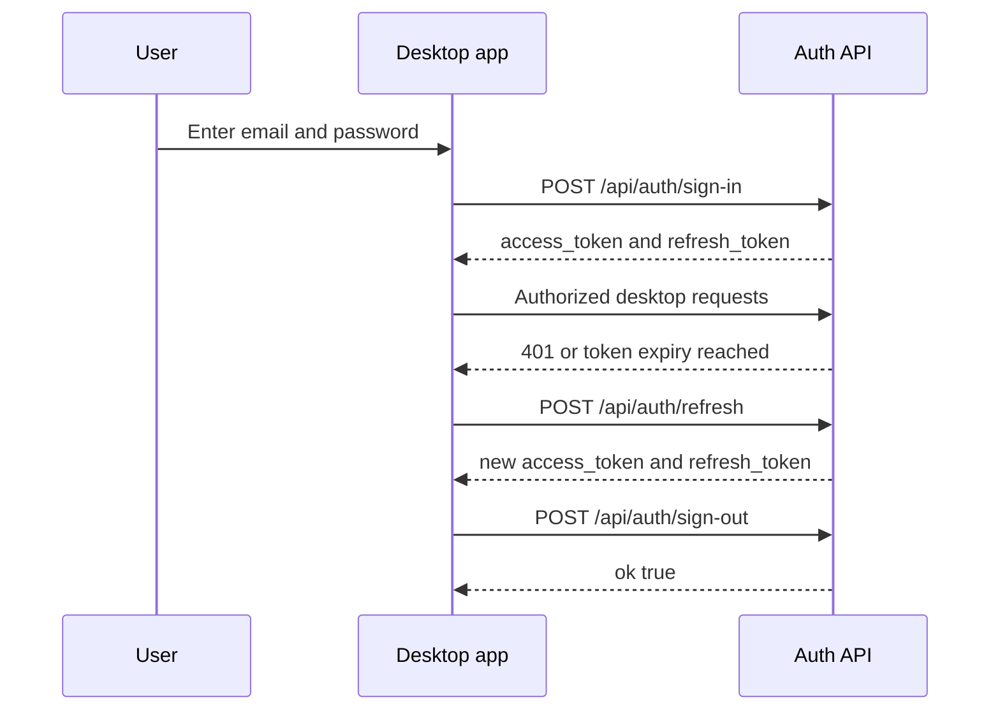

## Desktop-Clients authentifizieren

Verwenden Sie die Desktop-Auth-Endpunkte, um Benutzer anzumelden, Konten zu erstellen, abgelaufene Access-Token zu aktualisieren und Sitzungen zu widerrufen. Diese Routen sind für die Close-AI-Desktop-App und jeden Client ausgelegt, der sich mit Supabase-JWTs statt mit Browser-Cookies authentifiziert.

<Callout kind="info">

Alle Desktop-Auth-Routen unterstützen `OPTIONS`-Preflight-Anfragen und geben permissive CORS-Header zurück, einschließlich `Access-Control-Allow-Origin: *`. Jede API-Antwort verwendet dieselbe Envelope-Form: `success` plus entweder `data` oder `error`.

</Callout>

## Endpunktübersicht

| Methode | Pfad | Auth | Zweck |
| --- | --- | --- | --- |
| `POST` | `/api/auth/sign-in` | Keine | E-Mail und Passwort gegen Sitzungs-Token eintauschen |
| `POST` | `/api/auth/sign-up` | Keine | Neues Konto erstellen und optional eine Sitzung zurückgeben |
| `POST` | `/api/auth/sign-out` | Bearer JWT | Refresh-Token des aktuellen Benutzers global widerrufen |
| `POST` | `/api/auth/refresh` | Keine | Refresh-Token gegen ein neues Token-Paar eintauschen |
| `GET` | `/api/auth/callback` | Browser-Flow | OAuth-Callback-Handler |
| `GET` | `/api/auth/confirm` | Browser-Flow | E-Mail-Bestätigungs-Handler |

## Authentifizierungsmodell

Desktop-Clients authentifizieren sich, indem sie ein Supabase-Access-Token im `Authorization`-Header als Bearer-Token senden. Speichern Sie nach Anmeldung oder Aktualisierung sowohl `access_token` als auch `refresh_token` und verwenden Sie das Access-Token für geschützte Desktop-Routen.

`POST /api/auth/sign-out` führt eine globale Abmeldung durch. Dadurch werden alle Refresh-Token des Benutzers ungültig, nicht nur das Token des aktuellen Geräts.

## POST /api/auth/sign-in

Tauschen Sie eine E-Mail-Adresse und ein Passwort gegen ein Supabase-Sitzungs-Token-Paar.

### Anfragebeispiel

<Request tabs="cURL,JavaScript" default-tab="1">
```bash
curl -X POST "https://api.talkturo.com/api/auth/sign-in" \
  -H "Content-Type: application/json" \
  -d '{
    "email": "jane.chen@acme.co",
    "password": "DeskPass_73A9"
  }'
```

```javascript
const response = await fetch("https://api.talkturo.com/api/auth/sign-in", {
  method: "POST",
  headers: {
    "Content-Type": "application/json"
  },
  body: JSON.stringify({
    email: "jane.chen@acme.co",
    password: "DeskPass_73A9"
  })
});

const result = await response.json();
console.log(result);
```
</Request>

<Response tabs="200,401" default-tab="1">
```json
{
  "success": true,
  "data": {
    "access_token": "eyJhbGciOiJIUzI1NiIsInR5cCI6IkpXVCJ9.desktop_example_access",
    "refresh_token": "refresh_example_q9K2mL7xP4vN8cR1",
    "expires_in": 3600,
    "expires_at": 1735693200,
    "token_type": "bearer",
    "user": {
      "id": "9f3b6e2a-4d85-4d62-95de-f2ec7e4ac8b1",
      "email": "jane.chen@acme.co",
      "user_metadata": {
        "full_name": "Jane Chen"
      }
    }
  }
}
```

```json
{
  "success": false,
  "error": "Invalid login credentials"
}
```
</Response>

### Body-Parameter

<ParamField body="email" param-type="string" required="true">
E-Mail-Adresse für das Konto.
</ParamField>

<ParamField body="password" param-type="string" required="true">
Passwort für das Konto.
</ParamField>

### Felder der Erfolgsantwort

<ResponseField name="success" field-type="boolean" required="true">
Gibt `true` zurück, wenn die Anfrage erfolgreich ist.
</ResponseField>

<ResponseField name="data.access_token" field-type="string" required="true">
Kurzlebiges JWT, das im `Authorization`-Header für authentifizierte Desktop-Anfragen verwendet wird.
</ResponseField>

<ResponseField name="data.refresh_token" field-type="string" required="true">
Länger gültiges Token, um über `/api/auth/refresh` ein neues Access-Token zu erhalten.
</ResponseField>

<ResponseField name="data.expires_in" field-type="integer" required="true">
Lebensdauer des Access-Tokens in Sekunden.
</ResponseField>

<ResponseField name="data.expires_at" field-type="integer" required="true">
Unix-Zeitstempel, wann das Access-Token abläuft.
</ResponseField>

<ResponseField name="data.token_type" field-type="string" required="true">
Von Supabase zurückgegebener Token-Typ. Typischerweise `bearer`.
</ResponseField>

<ResponseField name="data.user" field-type="object" required="true">
Authentifizierter Benutzerdatensatz, der dem Token-Paar zugeordnet ist.
</ResponseField>

<ResponseField name="data.user.id" field-type="string" required="true">
Eindeutige Benutzerkennung.
</ResponseField>

<ResponseField name="data.user.email" field-type="string" required="true">
E-Mail-Adresse des authentifizierten Kontos.
</ResponseField>

<ResponseField name="data.user.user_metadata" field-type="object" required="true">
Von Supabase zurückgegebene Benutzermetadaten.
</ResponseField>

### Felder der Fehlerantwort

<ResponseField name="success" field-type="boolean" required="true">
Gibt `false` zurück, wenn die Authentifizierung fehlschlägt.
</ResponseField>

<ResponseField name="error" field-type="string" required="true">
Menschenlesbare Fehlermeldung. Ungültige Anmeldedaten geben HTTP `401` zurück.
</ResponseField>

## POST /api/auth/sign-up

Erstellen Sie ein neues Konto mit E-Mail-Adresse und Passwort. Je nach Einstellungen Ihres Supabase-Projekts gibt der Endpunkt entweder sofort eine vollständige Sitzung zurück oder ein Benutzerobjekt mit `needs_email_confirm` auf `true`.

### Body-Parameter

<ParamField body="email" param-type="string" required="true">
E-Mail-Adresse für das neue Konto.
</ParamField>

<ParamField body="password" param-type="string" required="true">
Passwort für das neue Konto.
</ParamField>

### Antwortverhalten

Wenn keine E-Mail-Bestätigung erforderlich ist, enthält die Antwort dieselben Token-Felder wie bei der Anmeldung sowie `needs_email_confirm: false`.

Wenn eine E-Mail-Bestätigung erforderlich ist, enthält die Antwort `needs_email_confirm: true` und ein `user`-Objekt, aber noch keine aktiven Sitzungs-Token.

### Felder der Erfolgsantwort

<ResponseField name="success" field-type="boolean" required="true">
Gibt `true` zurück, wenn das Konto erfolgreich erstellt wurde.
</ResponseField>

<ResponseField name="data.needs_email_confirm" field-type="boolean" required="true">
Gibt an, ob der Benutzer seine E-Mail bestätigen muss, bevor er eine Sitzung erhält oder verwenden kann.
</ResponseField>

<ResponseField name="data.access_token" field-type="string">
Wird zurückgegeben, wenn keine E-Mail-Bestätigung erforderlich ist.
</ResponseField>

<ResponseField name="data.refresh_token" field-type="string">
Wird zurückgegeben, wenn keine E-Mail-Bestätigung erforderlich ist.
</ResponseField>

<ResponseField name="data.expires_in" field-type="integer">
Wird zurückgegeben, wenn keine E-Mail-Bestätigung erforderlich ist.
</ResponseField>

<ResponseField name="data.expires_at" field-type="integer">
Wird zurückgegeben, wenn keine E-Mail-Bestätigung erforderlich ist.
</ResponseField>

<ResponseField name="data.token_type" field-type="string">
Wird zurückgegeben, wenn keine E-Mail-Bestätigung erforderlich ist.
</ResponseField>

<ResponseField name="data.user" field-type="object" required="true">
Neu erstellter Benutzerdatensatz.
</ResponseField>

<ResponseField name="data.user.id" field-type="string" required="true">
Eindeutige Benutzerkennung.
</ResponseField>

<ResponseField name="data.user.email" field-type="string" required="true">
E-Mail-Adresse des neuen Kontos.
</ResponseField>

<ResponseField name="data.user.user_metadata" field-type="object">
Von Supabase zurückgegebene Benutzermetadaten, sofern vorhanden.
</ResponseField>

## POST /api/auth/sign-out

Widerrufen Sie die Refresh-Token des aktuellen Benutzers global. Senden Sie das aktuelle Access-Token als Bearer-Token im `Authorization`-Header.

<Callout kind="info">

Dieser Endpunkt ruft `supabase.auth.signOut()` mit globalem Scope auf. Die Abmeldung von einem Desktop-Client macht alle Refresh-Token dieses Benutzers geräteübergreifend ungültig.

</Callout>

### Header

<ParamField header="Authorization" param-type="string" required="true">
Bearer-Access-Token in der Form `Bearer eyJ...`.
</ParamField>

### Felder der Erfolgsantwort

<ResponseField name="success" field-type="boolean" required="true">
Gibt `true` zurück, wenn die Abmeldung abgeschlossen ist.
</ResponseField>

<ResponseField name="data.ok" field-type="boolean" required="true">
Gibt `true` zurück, nachdem die globale Abmeldungsanfrage erfolgreich war.
</ResponseField>

## POST /api/auth/refresh

Tauschen Sie ein Refresh-Token gegen ein neues Access-Token und Refresh-Token-Paar. Verwenden Sie diesen Endpunkt, wenn das aktuelle Access-Token abläuft.

### Anfragebeispiel

<Request tabs="cURL,JavaScript" default-tab="1">
```bash
curl -X POST "https://api.talkturo.com/api/auth/refresh" \
  -H "Content-Type: application/json" \
  -d '{
    "refresh_token": "refresh_example_q9K2mL7xP4vN8cR1"
  }'
```

```javascript
const response = await fetch("https://api.talkturo.com/api/auth/refresh", {
  method: "POST",
  headers: {
    "Content-Type": "application/json"
  },
  body: JSON.stringify({
    refresh_token: "refresh_example_q9K2mL7xP4vN8cR1"
  })
});

const result = await response.json();
console.log(result);
```
</Request>

<Response tabs="200" default-tab="1">
```json
{
  "success": true,
  "data": {
    "access_token": "eyJhbGciOiJIUzI1NiIsInR5cCI6IkpXVCJ9.desktop_example_new_access",
    "refresh_token": "refresh_example_h3M8qT1vL6pW2nZ5",
    "expires_in": 3600,
    "expires_at": 1735696800,
    "token_type": "bearer",
    "user": {
      "id": "9f3b6e2a-4d85-4d62-95de-f2ec7e4ac8b1",
      "email": "jane.chen@acme.co",
      "user_metadata": {
        "full_name": "Jane Chen"
      }
    }
  }
}
```
</Response>

### Body-Parameter

<ParamField body="refresh_token" param-type="string" required="true">
Refresh-Token, das zuvor bei Anmeldung oder Registrierung zurückgegeben wurde.
</ParamField>

### Felder der Erfolgsantwort

<ResponseField name="success" field-type="boolean" required="true">
Gibt `true` zurück, wenn die Token-Aktualisierung erfolgreich ist.
</ResponseField>

<ResponseField name="data.access_token" field-type="string" required="true">
Neues Access-Token für nachfolgende authentifizierte Anfragen.
</ResponseField>

<ResponseField name="data.refresh_token" field-type="string" required="true">
Neues Refresh-Token. Ersetzen Sie das zuvor gespeicherte Refresh-Token nach einer erfolgreichen Aktualisierung.
</ResponseField>

<ResponseField name="data.expires_in" field-type="integer" required="true">
Lebensdauer des neuen Access-Tokens in Sekunden.
</ResponseField>

<ResponseField name="data.expires_at" field-type="integer" required="true">
Unix-Zeitstempel, wann das neue Access-Token abläuft.
</ResponseField>

<ResponseField name="data.token_type" field-type="string" required="true">
Von Supabase zurückgegebener Token-Typ.
</ResponseField>

<ResponseField name="data.user" field-type="object" required="true">
Authentifizierter Benutzer, der der aktualisierten Sitzung zugeordnet ist.
</ResponseField>

## Browser-Handler

Zwei verwandte Routen unterstützen browserbasierte Auth-Flows. Sie gehören zum Auth-System, sind aber keine Token-Austausch-Endpunkte für Desktop-Clients.

### GET /api/auth/callback

Verarbeitet den Supabase-OAuth-Callback in browserbasierten Anmelde-Flows.

### GET /api/auth/confirm

Verarbeitet die E-Mail-Bestätigung nach der Registrierung.

## Typischer Desktop-Token-Flow

Speichern Sie das Refresh-Token sicher und behandeln Sie das Access-Token als kurzlebig. Ein typischer Desktop-Client-Flow sieht so aus:



## Implementierungshinweise

Verwenden Sie den `Authorization`-Header nur bei Endpunkten, die ein Access-Token erfordern, z. B. Abmeldung und authentifizierte Desktop-Routen. Anmeldung, Registrierung und Aktualisierung akzeptieren alle JSON-Request-Bodies und erfordern keine bestehende Sitzung.

Ersetzen Sie bei erfolgreicher Aktualisierung beide gespeicherten Token. Die Antwort kann das Refresh-Token rotieren; die weitere Verwendung des alten Refresh-Tokens kann spätere Aktualisierungsversuche fehlschlagen lassen.
