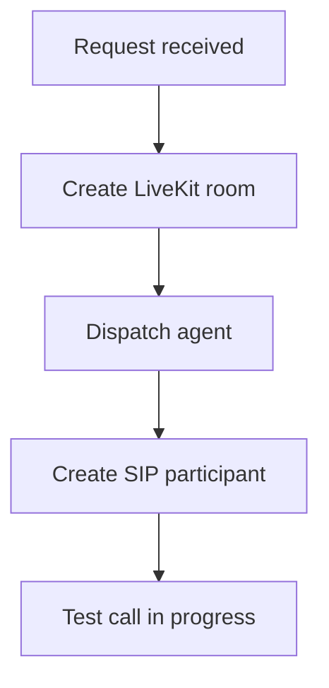

## Kontoweite Telefonieverwaltung

Verwalten Sie die Telefonieverbindung des Arbeitsbereichs auf Kontoebene, verbinden Sie einen verwalteten Carrier oder Ihr eigenes Twilio-Konto, validieren Sie Anmeldedaten neu und rufen Sie verfügbare SIP-Regionen sowie regulatorische Anforderungen ab.

<Callout kind="info">

Kontoweite Telefonie-Endpunkte erfordern Session-Cookie-Authentifizierung und verwenden die `enhanceRouteHandler`-Middleware.

</Callout>

### Endpunktübersicht auf Kontoebene

| Methode | Pfad | Zweck |
| --- | --- | --- |
| `GET` | `/api/telephony/account` | Telefonie-Carrier und BYOA-Status abrufen |
| `POST` | `/api/telephony/account` | Telefoniekonto verbinden, verwaltet oder BYOA |
| `PUT` | `/api/telephony/account` | BYOA-Anmeldedaten neu validieren |
| `DELETE` | `/api/telephony/account` | BYOA-Verbindung trennen |
| `GET` | `/api/telephony/regions` | Verfügbare SIP-Regionen auflisten |
| `GET` | `/api/telephony/regulatory` | Regulatorische Anforderungen abrufen |

### Telefoniekonto abrufen

`GET /api/telephony/account` gibt die Telefonie-Carrier-Konfiguration und den BYOA-Verbindungsstatus des Arbeitsbereichs zurück.

### Telefoniekonto verbinden

`POST /api/telephony/account` verbindet ein Telefoniekonto in einem von zwei Modi.

<Tabs>
  <Tab title="Verwalteter Carrier" icon="cloud">

  Verwenden Sie den Modus `managed`, um Talkturos verwalteten Carrier für den Arbeitsbereich zu verbinden.

<Request tabs="cURL,JavaScript" default-tab="1">
```bash
curl -X POST "https://app.talkturo.com/api/telephony/account" \
  -H "Content-Type: application/json" \
  -H "Cookie: sb-access-token=authenticated_session" \
  -d '{
    "mode": "managed",
    "account": "my-workspace"
  }'
```

```javascript
const response = await fetch("https://app.talkturo.com/api/telephony/account", {
  method: "POST",
  headers: {
    "Content-Type": "application/json",
  },
  credentials: "include",
  body: JSON.stringify({
    mode: "managed",
    account: "my-workspace",
  }),
});

const data = await response.json();
console.log(data);
```
</Request>

  </Tab>
  <Tab title="BYOA mit Twilio" icon="settings">

  Verwenden Sie den Modus `byoa`, um ein eigenes Twilio-Konto mit dem Arbeitsbereich zu verbinden.

<Request tabs="cURL,JavaScript" default-tab="1">
```bash
curl -X POST "https://app.talkturo.com/api/telephony/account" \
  -H "Content-Type: application/json" \
  -H "Cookie: sb-access-token=authenticated_session" \
  -d '{
    "mode": "byoa",
    "account": "my-workspace",
    "providerAccountSid": "ACexample9f3b2a7c1d4e6f8091a2b3c4d5e6f7",
    "apiKeySid": "SKexample1a2b3c4d5e6f7a8b9c0d1e2f3a4b5c",
    "apiKeySecret": "twilio_secret_example_7mN4pQ2xZ8kL",
    "label": "Mein Twilio-Konto"
  }'
```

```javascript
const response = await fetch("https://app.talkturo.com/api/telephony/account", {
  method: "POST",
  headers: {
    "Content-Type": "application/json",
  },
  credentials: "include",
  body: JSON.stringify({
    mode: "byoa",
    account: "my-workspace",
    providerAccountSid: "ACexample9f3b2a7c1d4e6f8091a2b3c4d5e6f7",
    apiKeySid: "SKexample1a2b3c4d5e6f7a8b9c0d1e2f3a4b5c",
    apiKeySecret: "twilio_secret_example_7mN4pQ2xZ8kL",
    label: "Mein Twilio-Konto",
  }),
});

const data = await response.json();
console.log(data);
```
</Request>

  </Tab>
</Tabs>

### BYOA-Anmeldedaten neu validieren

`PUT /api/telephony/account` validiert geänderte BYOA-Anmeldedaten erneut. Der Request-Body entspricht der Struktur des Verbindungsaufrufs mit `mode` gleich `byoa`.

### BYOA trennen

`DELETE /api/telephony/account` trennt gespeicherte BYOA-Anmeldedaten und entfernt die Verbindung des Arbeitsbereichs.

### Verfügbare Regionen auflisten

`GET /api/telephony/regions` gibt eine Liste verfügbarer SIP-Regionen und Verbindungen zurück.

### Regulatorische Anforderungen abrufen

`GET /api/telephony/regulatory` gibt regulatorische Bundle-Anforderungen für regulierte Länder und Nummerntypen zurück.

## Telefonie-Endpunkte

Verwalten Sie die Anrufkonfiguration eines Assistenten, zugewiesene Telefonnummern, ausgehende Testanrufe und Compliance-Vorlagen. Alle Telefonie-Routen sind auf einen einzelnen Assistenten beschränkt und erfordern eine authentifizierte Browser-Sitzung.

Basis-Pfad: `/api/assistants/[assistantId]/telephony`

### Endpunktübersicht

| Methode | Pfad | Beschreibung |
| --- | --- | --- |
| `POST` | `/telephony/test-call` | Startet einen ausgehenden SIP-Testanruf. Body: `accountSlug`, `fromNumber`, `toNumber` |
| `POST` | `/telephony/inbound` | Schaltet eingehende Telefonie ein oder aus |
| `POST` | `/telephony/outbound` | Schaltet ausgehende Telefonie ein oder aus |
| `POST` | `/telephony/settings` | Speichert die vollständigen Telefonie-Einstellungen |
| `GET` / `PATCH` | `/telephony/phone-numbers` | Listet Telefonnummern auf oder ersetzt Zuweisungen |
| `POST` | `/telephony/assign-phone-numbers` | Weist Telefonnummern zu |
| `GET` | `/telephony/compliance-templates` | Listet verfügbare Compliance-Vorlagen auf |

<Callout kind="info">

Zusätzlich steht `GET /api/assistant-phone-numbers` für eine kontoübergreifende Auflistung von Telefonnummern zur Verfügung, die Assistenten zugeordnet sind.

</Callout>

## Testanruf starten

`POST /telephony/test-call` startet einen ausgehenden SIP-Testanruf für einen Assistenten. Vor dem Start prüft der Endpunkt Guthaben, die Outbound-Konfiguration und ob die Ausgangsnummer aktiv und dem Assistenten zugewiesen ist.

<Request tabs="cURL,JavaScript" default-tab="1">
```bash
curl -X POST "https://app.talkturo.com/api/assistants/asst_7f3c2d91-5d8b-4f3e-a1a9-62fb3ec82d10/telephony/test-call" \
  -H "Content-Type: application/json" \
  -H "Cookie: sb-access-token=authenticated_session" \
  -d '{
    "accountSlug": "acme-support",
    "fromNumber": "+14155550120",
    "toNumber": "+14155550199"
  }'
```

```javascript
const response = await fetch(
  "https://app.talkturo.com/api/assistants/asst_7f3c2d91-5d8b-4f3e-a1a9-62fb3ec82d10/telephony/test-call",
  {
    method: "POST",
    headers: {
      "Content-Type": "application/json",
    },
    credentials: "include",
    body: JSON.stringify({
      accountSlug: "acme-support",
      fromNumber: "+14155550120",
      toNumber: "+14155550199",
    }),
  }
);

const data = await response.json();
console.log(data);
```
</Request>

<Response tabs="200,402">
```json
{
  "success": true,
  "roomName": "call_asst_7f3c2d91_20250115_184455",
  "sipCallId": "sip_2fd91c8b7a8e4d51",
  "message": "Test call started successfully"
}
```

```json
{
  "error": "Insufficient credits"
}
```
</Response>

### Request-Body

<ParamField body="accountSlug" param-type="string" required="true">
Der Account-Slug, der für die Mitgliedschafts- und Guthabenprüfung verwendet wird.
</ParamField>

<ParamField body="fromNumber" param-type="string" required="true">
Die aktive Telefonnummer des Assistenten, von der der Testanruf ausgeht.
</ParamField>

<ParamField body="toNumber" param-type="string" required="true">
Die Zieltelefonnummer, die für den Testanruf angerufen wird.
</ParamField>

### Antwortfelder

<ResponseField name="success" field-type="boolean" required="true">
`true`, wenn der Testanruf erfolgreich gestartet wurde.
</ResponseField>

<ResponseField name="roomName" field-type="string" required="true">
Der Name des LiveKit-Raums, der für den Anruf erstellt wurde.
</ResponseField>

<ResponseField name="sipCallId" field-type="string" required="true">
Die Kennung des erstellten SIP-Anrufteilnehmers.
</ResponseField>

<ResponseField name="message" field-type="string" required="true">
Eine menschenlesbare Bestätigung, dass der Testanruf gestartet wurde.
</ResponseField>

### Validierungsregeln vor dem Start

Der Endpunkt lehnt die Anfrage ab, wenn eine der erforderlichen Telefonie-Voraussetzungen fehlt. Diese Prüfungen laufen vor dem eigentlichen SIP-Aufbau.

- Das Konto muss genügend Guthaben für ausgehende Anrufe haben. Bei unzureichendem Guthaben gibt der Endpunkt `402` zurück.
- Für den Assistenten muss `outbound_enabled` aktiviert sein.
- Der Assistent muss eine gültige `livekit_outbound_trunk_id` haben.
- `fromNumber` muss aktiv und diesem Assistenten zugewiesen sein.
- Die aktuelle Browser-Sitzung muss Zugriff auf das angegebene Konto haben.

### Ausführungsablauf

Nach einer erfolgreichen Vorabprüfung führt der Testanruf-Endpunkt drei Schritte in fester Reihenfolge aus:



Wenn alle drei Schritte erfolgreich sind, enthält die Antwort `roomName` und `sipCallId`. Daran erkennen Sie, dass der Assistent bereitgestellt und der ausgehende Anruf initiiert wurde.

## POST inbound

`POST /telephony/inbound` schaltet eingehende Anrufe für einen Assistenten ein oder aus. Bei Aktivierung wird ein LiveKit Inbound-SIP-Trunk und eine Dispatch-Regel bereitgestellt. Bei Deaktivierung werden diese entfernt.

### Pfadparameter

<ParamField path="assistantId" param-type="string" required="true">
Assistant-UUID.
</ParamField>

### Body-Parameter

<ParamField body="accountSlug" param-type="string" required="true">
Der Workspace-Slug.
</ParamField>

<ParamField body="enabled" param-type="boolean" required="true">
Auf `true` setzen, um eingehende Anrufe zu aktivieren, oder auf `false`, um sie zu deaktivieren.
</ParamField>

<Callout kind="alert">

Wenn `enabled` auf `true` gesetzt ist, muss der Assistent mindestens eine aktive Telefonnummer zugewiesen haben. Die API gibt `400` zurück, wenn keine aktiven Nummern gefunden werden.

</Callout>

### Antwortfelder

<ResponseField name="success" field-type="boolean" required="true">
Gibt `true` zurück, wenn der Wechsel abgeschlossen ist.
</ResponseField>

<ResponseField name="assistant" field-type="object" required="true">
Aktualisierter Assistant-Datensatz.
</ResponseField>

<ResponseField name="assistant.inbound_enabled" field-type="boolean" required="true">
Aktueller Inbound-Status.
</ResponseField>

<ResponseField name="assistant.livekit_inbound_trunk_id" field-type="string">
LiveKit Inbound-Trunk-ID. `null` bei deaktiviertem Inbound.
</ResponseField>

<ResponseField name="assistant.livekit_dispatch_rule_id" field-type="string">
LiveKit Dispatch-Regel-ID. `null` bei deaktiviertem Inbound.
</ResponseField>

## POST outbound

`POST /telephony/outbound` schaltet ausgehende Anrufe für einen Assistenten ein oder aus. Bei Aktivierung wird ein LiveKit Outbound-SIP-Trunk bereitgestellt. Bei Deaktivierung wird dieser entfernt.

### Pfadparameter

<ParamField path="assistantId" param-type="string" required="true">
Assistant-UUID.
</ParamField>

### Body-Parameter

<ParamField body="accountSlug" param-type="string" required="true">
Der Workspace-Slug.
</ParamField>

<ParamField body="enabled" param-type="boolean" required="true">
Auf `true` setzen, um ausgehende Anrufe zu aktivieren, oder auf `false`, um sie zu deaktivieren.
</ParamField>

<Callout kind="alert">

Wenn `enabled` auf `true` gesetzt ist, muss der Assistent mindestens eine aktive Telefonnummer zugewiesen haben und die `telnyx_fqdn_connection_id` sowie die Outbound-Voice-Profile müssen konfiguriert sein. Die API gibt `400` zurück, wenn Voraussetzungen fehlen.

</Callout>

### Antwortfelder

<ResponseField name="success" field-type="boolean" required="true">
Gibt `true` zurück, wenn der Wechsel abgeschlossen ist.
</ResponseField>

<ResponseField name="assistant" field-type="object" required="true">
Aktualisierter Assistant-Datensatz.
</ResponseField>

<ResponseField name="assistant.outbound_enabled" field-type="boolean" required="true">
Aktueller Outbound-Status.
</ResponseField>

<ResponseField name="assistant.livekit_outbound_trunk_id" field-type="string">
LiveKit Outbound-Trunk-ID. `null` bei deaktiviertem Outbound.
</ResponseField>

## POST settings

`POST /telephony/settings` ist der Hauptendpunkt für Telefonie-Einstellungen. Er weist Telefonnummern zu, setzt die Telnyx-FQDN-Verbindung, aktiviert oder deaktiviert ein- und ausgehende Anrufe, stellt LiveKit-SIP-Trunks bereit und konfiguriert optional Anrufbeantworter-Erkennung und Compliance-Briefing.

### Pfadparameter

<ParamField path="assistantId" param-type="string" required="true">
Assistant-UUID.
</ParamField>

### Body-Parameter

<ParamField body="accountSlug" param-type="string" required="true">
Workspace-Slug.
</ParamField>

<ParamField body="phoneNumberIds" param-type="array" required="true">
Array von Telefonnummer-UUIDs, die dem Assistenten zugewiesen werden sollen.
</ParamField>

<ParamField body="inboundEnabled" param-type="boolean" required="true">
Schaltet eingehende Anrufe ein oder aus.
</ParamField>

<ParamField body="outboundEnabled" param-type="boolean" required="true">
Schaltet ausgehende Anrufe ein oder aus.
</ParamField>

<ParamField body="inboundCompanyId" param-type="string">
Unternehmen-UUID für Inbound-Routing. Zur Laufzeit erforderlich, wenn `inboundEnabled` auf `true` gesetzt ist.
</ParamField>

<ParamField body="telnyxConnectionId" param-type="string">
Telnyx-FQDN-Verbindungs-ID. Nullbar, da Twilio-basierte Assistenten sie nicht verwenden.
</ParamField>

<ParamField body="destinationCountry" param-type="string" enum="ae,au,br,ch,de,fr,gb,il,in,jp,sa,sg,us,za">
ISO-Ländercode für LiveKit-Outbound-Region-Pinning. Setzen Sie `null` für automatisches Routing.
</ParamField>

<ParamField body="voicemail" param-type="object">
Anrufbeantworter-Erkennungseinstellungen. Weglassen, um unverändert zu lassen.
</ParamField>

<ParamField body="voicemail.detectionEnabled" param-type="boolean">
Aktiviert die Anrufbeantworter-Erkennung.
</ParamField>

<ParamField body="voicemail.action" param-type="string">
Anrufbeantworter-Aktion mit maximal 40 Zeichen.
</ParamField>

<ParamField body="voicemail.message" param-type="string">
Anrufbeantworter-Nachrichtentext mit maximal 2000 Zeichen.
</ParamField>

<ParamField body="compliance" param-type="object">
Compliance-Briefing-Einstellungen. Weglassen, um unverändert zu lassen.
</ParamField>

<ParamField body="compliance.enabled" param-type="boolean">
Aktiviert das Compliance-Briefing.
</ParamField>

<ParamField body="compliance.templateId" param-type="string">
Compliance-Vorlagen-UUID.
</ParamField>

<ParamField body="compliance.briefingText" param-type="string">
Compliance-Briefing-Text mit maximal 2000 Zeichen.
</ParamField>

<ParamField body="compliance.language" param-type="string">
Briefing-Sprache mit maximal 20 Zeichen.
</ParamField>

<ParamField body="compliance.requireAck" param-type="boolean">
Legt fest, ob eine Bestätigung des Anrufers erforderlich ist.
</ParamField>

<ParamField body="compliance.fallbackPolicy" param-type="string" enum="retry,block,continue">
Fallback-Richtlinie bei fehlgeschlagener Bestätigung.
</ParamField>

<ParamField body="compliance.ackTimeoutSeconds" param-type="integer">
Bestätigungs-Timeout in Sekunden im Bereich von 3 bis 60.
</ParamField>

<Callout kind="info">

Wenn Compliance aktiviert ist, muss entweder `templateId` nicht `null` sein oder `briefingText` darf nicht leer sein. Die API validiert diese Querschnittsanforderung vor dem Speichern.

</Callout>

### Antwortfelder

<ResponseField name="success" field-type="boolean" required="true">
Gibt `true` zurück, wenn Einstellungen gespeichert sind.
</ResponseField>

<ResponseField name="assistant" field-type="object" required="true">
Aktualisierter Assistant-Datensatz mit `inbound_enabled`, `outbound_enabled`, `telnyx_fqdn_connection_id`, `inbound_company_id` und `destination_country`.
</ResponseField>

<ResponseField name="assignedActive" field-type="integer" required="true">
Anzahl aktiver Telefonnummern nach dem Speichern.
</ResponseField>

## GET und PATCH phone-numbers

`GET /telephony/phone-numbers` listet dem Assistenten verfügbare Telefonnummern auf. `PATCH /telephony/phone-numbers` ersetzt die Telefonnummer-Zuweisungen des Assistenten. Die `GET`-Methode gibt Nummern zurück, die aktiv und entweder nicht zugewiesen oder bereits diesem Assistenten zugewiesen sind.

<Callout kind="info">

Die `GET`- und `PATCH`-Methoden auf diesem Endpunkt unterstützen sowohl Session-Cookie- als auch API-Schlüssel-Authentifizierung. Alle anderen Telefonie-Routen auf dieser Seite erfordern ausschließlich Session-Cookie-Authentifizierung.

</Callout>

### Pfadparameter

<ParamField path="assistantId" param-type="string" required="true">
Assistant-UUID.
</ParamField>

### GET-Abfrageparameter

<ParamField query="accountSlug" param-type="string">
Optionale Konto-Slug-Überschreibung. Bei Verwendung von API-Schlüssel-Authentifizierung überschreibt dies das dem Schlüssel zugeordnete Konto.
</ParamField>

### PATCH-Body-Parameter

<ParamField body="accountSlug" param-type="string">
Optionale Konto-Slug-Überschreibung.
</ParamField>

<ParamField body="phoneNumberIds" param-type="array" required="true">
Array von Telefonnummer-UUIDs, die zugewiesen werden sollen. Ersetzt alle aktuellen Zuweisungen.
</ParamField>

<Callout kind="alert">

`PATCH` ersetzt alle aktuellen Telefonnummer-Zuweisungen. Geben Sie die vollständige Menge der UUIDs an, die zugewiesen werden sollen, nicht nur neue Hinzufügungen.

</Callout>

### GET-Antwortfelder

<ResponseField name="success" field-type="boolean" required="true">
Gibt `true` zurück.
</ResponseField>

<ResponseField name="numbers" field-type="array" required="true">
Array von Telefonnummer-Objekten. Jedes enthält `id`, `phone_number`, `status`, `is_trial`, `assistant_id`, `provider`, `accountKey`, `accountLabel` und `accountSid`.
</ResponseField>

### PATCH-Antwortfelder

<ResponseField name="success" field-type="boolean" required="true">
Gibt `true` zurück, wenn die Zuweisung abgeschlossen ist.
</ResponseField>

<ResponseField name="message" field-type="string" required="true">
Bestätigungsmeldung.
</ResponseField>

## Telefonnummern zuweisen

`POST /telephony/assign-phone-numbers` weist einem Assistenten Telefonnummern zu. Verwenden Sie diesen Endpunkt, nachdem die Nummern bereits vorhanden oder beschafft wurden.

### Wann Sie diesen Endpunkt verwenden sollten

Dieser Endpunkt trennt die Zuweisung bewusst von der allgemeinen Nummernverwaltung. Dadurch können Sie Nummern zunächst abrufen oder vorbereiten und sie erst danach gezielt einem Assistenten zuordnen.

Prüfen Sie nach einer erfolgreichen Zuweisung die Nummernliste des Assistenten erneut. Die aktualisierte Liste zeigt, ob die gewünschten Nummern jetzt mit dem Assistenten verknüpft sind.

## Compliance-Vorlagen auflisten

`GET /telephony/compliance-templates` listet die verfügbaren Compliance-Vorlagen für den Assistenten auf. Diese Vorlagen unterstützen telefoniespezifische Freigabe- und Registrierungsabläufe.

### Warum Compliance-Vorlagen wichtig sind

Einige Carrier- oder Regionenanforderungen verlangen zusätzliche Registrierungsdaten, bevor Nummern vollständig nutzbar sind. Mit den verfügbaren Vorlagen können Sie diese Anforderungen konsistent erfassen und im richtigen Format weiterverarbeiten.

Wenn Ihre Telefonie-Einrichtung von regulatorischen Anforderungen abhängt, rufen Sie die verfügbaren Vorlagen ab, bevor Sie Nummern kaufen oder aktivieren.

## Gemeinsame Integrationshinweise

Alle Telefonie-Endpunkte in diesem Abschnitt sind einem einzelnen Assistenten untergeordnet. Sie arbeiten immer unter dem Pfad `/api/assistants/[assistantId]/telephony`.

<ExpandableGroup>
  <Expandable title="Authentifizierung">

  Die `GET`- und `PATCH`-Methoden für Telefonnummern unterstützen zusätzlich API-Schlüssel-Authentifizierung. Alle anderen Telefonie-Routen erfordern Session-Cookie-Authentifizierung.

  </Expandable>

  <Expandable title="Geltungsbereich der Routen">

  Jede Anfrage bezieht sich auf genau einen Assistenten. Wenn Sie kontoweite Nummern abrufen möchten, verwenden Sie zusätzlich `GET /api/assistant-phone-numbers`.

  </Expandable>

  <Expandable title="Abhängigkeit von Testanrufen">

  Testanrufe hängen von Guthaben, aktivierter ausgehender Telefonie, einer gültigen Outbound-Trunk-Konfiguration und einer aktiven, zugewiesenen Ausgangsnummer ab.

  </Expandable>
</ExpandableGroup>

## Verwandter Telefonie-Kontext

Die Endpunkte auf dieser Seite decken die assistentenspezifische Telefoniekonfiguration ab. Verwandte Funktionen liegen in benachbarten API-Bereichen, insbesondere bei Telefonnummern und kontoweiten Zuordnungen.

<Columns cols={2}>
  <Card title="Telefonnummern im Konto verwalten" href="/de/api-reference/phone-numbers" icon="phone" cta="Zur Referenz" />
  <Card title="Assistenten verwalten" href="/de/api-reference/assistants" icon="users" cta="Zur Referenz" />
</Columns>