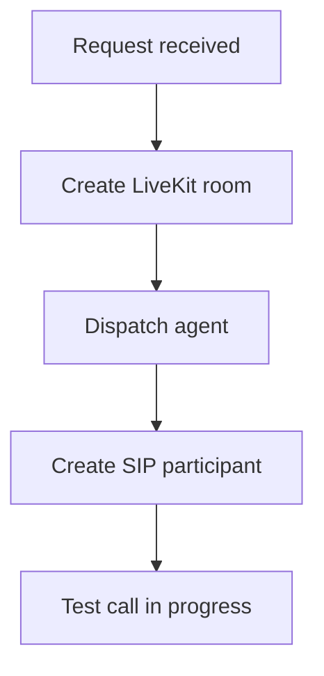

## Telefonie-Endpunkte

Verwalten Sie die Anrufkonfiguration eines Assistenten, zugewiesene Telefonnummern, ausgehende Testanrufe und Compliance-Vorlagen. Alle Telefonie-Routen sind auf einen einzelnen Assistenten beschränkt und erfordern eine authentifizierte Browser-Sitzung.

Basis-Pfad: `/api/assistants/[assistantId]/telephony`

### Endpunktübersicht

| Methode | Pfad | Beschreibung |
| --- | --- | --- |
| `POST` | `/telephony/test-call` | Startet einen ausgehenden SIP-Testanruf. Body: `accountSlug`, `fromNumber`, `toNumber` |
| `GET` / `POST` | `/telephony/inbound` | Liest oder konfiguriert eingehende Telefonie |
| `GET` / `POST` | `/telephony/outbound` | Liest oder konfiguriert ausgehende Telefonie |
| `GET` / `PATCH` | `/telephony/settings` | Liest oder aktualisiert die vollständigen Telefonie-Einstellungen |
| `GET` / `POST` | `/telephony/phone-numbers` | Listet Telefonnummern auf oder verwaltet sie |
| `POST` | `/telephony/assign-phone-numbers` | Weist Telefonnummern zu |
| `GET` | `/telephony/compliance-templates` | Listet verfügbare Compliance-Vorlagen auf |

<Callout kind="info">

Zusätzlich steht `GET /api/assistant-phone-numbers` für eine kontoübergreifende Auflistung von Telefonnummern zur Verfügung, die Assistenten zugeordnet sind.

</Callout>

## Testanruf starten

`POST /telephony/test-call` startet einen ausgehenden SIP-Testanruf für einen Assistenten. Vor dem Start prüft der Endpunkt Guthaben, die Outbound-Konfiguration und ob die Ausgangsnummer aktiv und dem Assistenten zugewiesen ist.

<Request tabs="cURL,JavaScript" default-tab="1">
```bash
curl -X POST "https://app.talkturo.com/api/assistants/asst_7f3c2d91-5d8b-4f3e-a1a9-62fb3ec82d10/telephony/test-call" \
  -H "Content-Type: application/json" \
  -H "Cookie: sb-access-token=authenticated_session" \
  -d '{
    "accountSlug": "acme-support",
    "fromNumber": "+14155550120",
    "toNumber": "+14155550199"
  }'
```

```javascript
const response = await fetch(
  "https://app.talkturo.com/api/assistants/asst_7f3c2d91-5d8b-4f3e-a1a9-62fb3ec82d10/telephony/test-call",
  {
    method: "POST",
    headers: {
      "Content-Type": "application/json",
    },
    credentials: "include",
    body: JSON.stringify({
      accountSlug: "acme-support",
      fromNumber: "+14155550120",
      toNumber: "+14155550199",
    }),
  }
);

const data = await response.json();
console.log(data);
```
</Request>

<Response tabs="200,402">
```json
{
  "success": true,
  "roomName": "call_asst_7f3c2d91_20250115_184455",
  "sipCallId": "sip_2fd91c8b7a8e4d51",
  "message": "Test call started successfully"
}
```

```json
{
  "error": "Insufficient credits"
}
```
</Response>

### Request-Body

<ParamField body="accountSlug" param-type="string" required="true">
Der Account-Slug, der für die Mitgliedschafts- und Guthabenprüfung verwendet wird.
</ParamField>

<ParamField body="fromNumber" param-type="string" required="true">
Die aktive Telefonnummer des Assistenten, von der der Testanruf ausgeht.
</ParamField>

<ParamField body="toNumber" param-type="string" required="true">
Die Zieltelefonnummer, die für den Testanruf angerufen wird.
</ParamField>

### Antwortfelder

<ResponseField name="success" field-type="boolean" required="true">
`true`, wenn der Testanruf erfolgreich gestartet wurde.
</ResponseField>

<ResponseField name="roomName" field-type="string" required="true">
Der Name des LiveKit-Raums, der für den Anruf erstellt wurde.
</ResponseField>

<ResponseField name="sipCallId" field-type="string" required="true">
Die Kennung des erstellten SIP-Anrufteilnehmers.
</ResponseField>

<ResponseField name="message" field-type="string" required="true">
Eine menschenlesbare Bestätigung, dass der Testanruf gestartet wurde.
</ResponseField>

### Validierungsregeln vor dem Start

Der Endpunkt lehnt die Anfrage ab, wenn eine der erforderlichen Telefonie-Voraussetzungen fehlt. Diese Prüfungen laufen vor dem eigentlichen SIP-Aufbau.

- Das Konto muss genügend Guthaben für ausgehende Anrufe haben. Bei unzureichendem Guthaben gibt der Endpunkt `402` zurück.
- Für den Assistenten muss `outbound_enabled` aktiviert sein.
- Der Assistent muss eine gültige `livekit_outbound_trunk_id` haben.
- `fromNumber` muss aktiv und diesem Assistenten zugewiesen sein.
- Die aktuelle Browser-Sitzung muss Zugriff auf das angegebene Konto haben.

### Ausführungsablauf

Nach einer erfolgreichen Vorabprüfung führt der Testanruf-Endpunkt drei Schritte in fester Reihenfolge aus:



Wenn alle drei Schritte erfolgreich sind, enthält die Antwort `roomName` und `sipCallId`. Daran erkennen Sie, dass der Assistent bereitgestellt und der ausgehende Anruf initiiert wurde.

## Eingehende Telefonie lesen oder konfigurieren

`GET /telephony/inbound` liest die aktuelle Konfiguration für eingehende Telefonie. `POST /telephony/inbound` erstellt oder aktualisiert die Inbound-Konfiguration für den Assistenten.

### Was dieser Endpunkt abdeckt

Mit der Inbound-Konfiguration steuern Sie, ob ein Assistent eingehende Anrufe annehmen kann und welche Telefonnummern dabei verwendet werden. Verwenden Sie `GET`, wenn Sie den aktuellen Zustand anzeigen möchten, und `POST`, wenn Sie Änderungen speichern möchten.

<Callout kind="tip">

Lesen Sie zuerst die aktuelle Konfiguration mit `GET /telephony/inbound`, bevor Sie Änderungen schreiben. So vermeiden Sie, dass bestehende Werte versehentlich überschrieben werden.

</Callout>

## Ausgehende Telefonie lesen oder konfigurieren

`GET /telephony/outbound` liest die aktuelle Konfiguration für ausgehende Telefonie. `POST /telephony/outbound` erstellt oder aktualisiert die Outbound-Konfiguration des Assistenten.

### Was dieser Endpunkt abdeckt

Mit der Outbound-Konfiguration legen Sie fest, ob ein Assistent ausgehende Anrufe initiieren darf und welche zugehörigen Einstellungen dafür verwendet werden. Der Testanruf-Endpunkt hängt direkt von dieser Konfiguration ab.

Wenn ausgehende Anrufe nicht aktiviert sind oder keine gültige Outbound-Trunk-Konfiguration vorhanden ist, schlägt `POST /telephony/test-call` bereits in der Vorprüfung fehl.

## Vollständige Telefonie-Einstellungen lesen oder aktualisieren

`GET /telephony/settings` gibt die vollständigen Telefonie-Einstellungen für den Assistenten zurück. `PATCH /telephony/settings` aktualisiert diese Einstellungen teilweise, ohne dass Sie den gesamten Datensatz erneut senden müssen.

### Wann Sie `settings` statt `inbound` oder `outbound` verwenden sollten

Verwenden Sie `settings`, wenn Sie die komplette Telefoniekonfiguration an einer Stelle prüfen oder mehrere zusammenhängende Werte auf einmal aktualisieren möchten. Für fokussierte Änderungen an nur eingehender oder nur ausgehender Telefonie bleiben `inbound` und `outbound` meist die klarere Wahl.

Diese Trennung hilft, einfache Oberflächen schlank zu halten und trotzdem einen Endpunkt für vollständige Konfigurationsansichten bereitzustellen.

## Telefonnummern für einen Assistenten auflisten oder verwalten

`GET /telephony/phone-numbers` listet die Telefonnummern eines Assistenten auf. `POST /telephony/phone-numbers` verwaltet Telefonnummern im Kontext dieses Assistenten.

### Typische Verwendung

Nutzen Sie diesen Endpunkt, wenn Sie im Kontext eines einzelnen Assistenten arbeiten und sehen möchten, welche Nummern aktuell verbunden sind. Für kontoübergreifende Listen steht zusätzlich `GET /api/assistant-phone-numbers` zur Verfügung.

Wenn Sie Nummern neu zuweisen möchten, verwenden Sie anschließend den separaten Zuweisungs-Endpunkt.

## Telefonnummern zuweisen

`POST /telephony/assign-phone-numbers` weist einem Assistenten Telefonnummern zu. Verwenden Sie diesen Endpunkt, nachdem die Nummern bereits vorhanden oder beschafft wurden.

### Wann Sie diesen Endpunkt verwenden sollten

Dieser Endpunkt trennt die Zuweisung bewusst von der allgemeinen Nummernverwaltung. Dadurch können Sie Nummern zunächst abrufen oder vorbereiten und sie erst danach gezielt einem Assistenten zuordnen.

Prüfen Sie nach einer erfolgreichen Zuweisung die Nummernliste des Assistenten erneut. Die aktualisierte Liste zeigt, ob die gewünschten Nummern jetzt mit dem Assistenten verknüpft sind.

## Compliance-Vorlagen auflisten

`GET /telephony/compliance-templates` listet die verfügbaren Compliance-Vorlagen für den Assistenten auf. Diese Vorlagen unterstützen telefoniespezifische Freigabe- und Registrierungsabläufe.

### Warum Compliance-Vorlagen wichtig sind

Einige Carrier- oder Regionenanforderungen verlangen zusätzliche Registrierungsdaten, bevor Nummern vollständig nutzbar sind. Mit den verfügbaren Vorlagen können Sie diese Anforderungen konsistent erfassen und im richtigen Format weiterverarbeiten.

Wenn Ihre Telefonie-Einrichtung von regulatorischen Anforderungen abhängt, rufen Sie die verfügbaren Vorlagen ab, bevor Sie Nummern kaufen oder aktivieren.

## Gemeinsame Integrationshinweise

Alle Telefonie-Endpunkte in diesem Abschnitt sind einem einzelnen Assistenten untergeordnet. Sie arbeiten immer unter dem Pfad `/api/assistants/[assistantId]/telephony`.

<ExpandableGroup>
  <Expandable title="Authentifizierung">

  Diese Routen erfordern eine authentifizierte Browser-Sitzung. Sie sind nicht als externe API-Key-Endpunkte für serverseitige Integrationen dokumentiert.

  </Expandable>

  <Expandable title="Geltungsbereich der Routen">

  Jede Anfrage bezieht sich auf genau einen Assistenten. Wenn Sie kontoweite Nummern abrufen möchten, verwenden Sie zusätzlich `GET /api/assistant-phone-numbers`.

  </Expandable>

  <Expandable title="Abhängigkeit von Testanrufen">

  Testanrufe hängen von Guthaben, aktivierter ausgehender Telefonie, einer gültigen Outbound-Trunk-Konfiguration und einer aktiven, zugewiesenen Ausgangsnummer ab.

  </Expandable>
</ExpandableGroup>

## Verwandter Telefonie-Kontext

Die Endpunkte auf dieser Seite decken die assistentenspezifische Telefoniekonfiguration ab. Verwandte Funktionen liegen in benachbarten API-Bereichen, insbesondere bei Telefonnummern und kontoweiten Zuordnungen.

<Columns cols={2}>
  <Card title="Telefonnummern im Konto verwalten" href="/de/api-reference/phone-numbers" icon="phone" cta="Zur Referenz" />
  <Card title="Assistenten verwalten" href="/de/api-reference/assistants" icon="users" cta="Zur Referenz" />
</Columns>