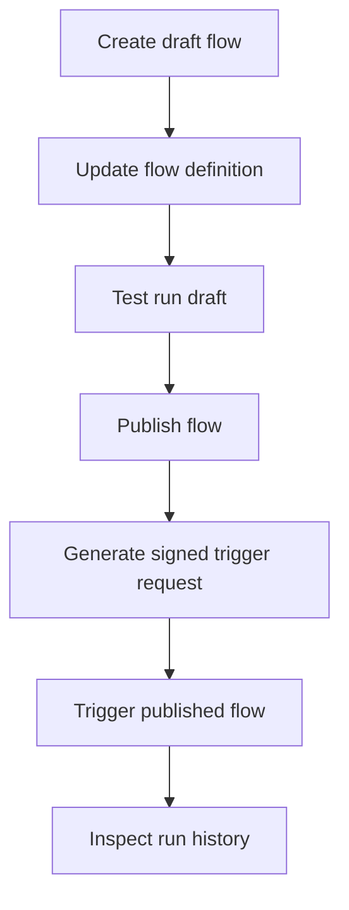

## TurboFlow-Endpunkte

Mit TurboFlow erstellen Sie visuelle Workflows, veröffentlichen unveränderliche Versionen und lösen veröffentlichte Flows aus Ihrer App oder Ihrem Sprachassistenten aus. Die meisten Endpunkte verwenden Sitzungs-Cookie-Authentifizierung aus der Talkturo-App, während der Trigger-Endpunkt HMAC-Authentifizierung nutzt, damit externe Systeme einen veröffentlichten Flow sicher aufrufen können.

<Callout kind="alert">

`POST /api/flow/{flowId}/trigger` verwendet **keine** Sitzungsauthentifizierung. Signieren Sie den rohen Request-Body mit SHA-256-HMAC unter Verwendung des `trigger_secret` der veröffentlichten Flow-Version und senden Sie den Digest im Header `X-Talkturo-Secret`.

</Callout>

<Callout kind="info">

Verwenden Sie den **Async-Modus** für Produktions-Workloads, die länger als wenige Sekunden laufen können. Fügen Sie `?sync=true` nur hinzu, wenn Sie die finale Ausgabe inline benötigen und der Flow innerhalb von etwa 30 Sekunden abschließen kann.

</Callout>

## Endpunktübersicht

| Methode | Pfad | Auth | Zweck |
| --- | --- | --- | --- |
| GET | `/api/flow` | Sitzungs-Cookie | Flows auflisten |
| POST | `/api/flow` | Sitzungs-Cookie | Flow erstellen |
| GET | `/api/flow/manifest` | Keine (öffentlich) | Connector-Manifest abrufen |
| GET | `/api/flow/{flowId}` | Sitzungs-Cookie | Flow abrufen |
| PATCH | `/api/flow/{flowId}` | Sitzungs-Cookie | Flow aktualisieren |
| DELETE | `/api/flow/{flowId}` | Sitzungs-Cookie | Flow archivieren |
| POST | `/api/flow/{flowId}/publish` | Sitzungs-Cookie | Neue Flow-Version veröffentlichen |
| GET | `/api/flow/{flowId}/runs` | Sitzungs-Cookie | Flow-Läufe auflisten |
| POST | `/api/flow/{flowId}/test-run` | Sitzungs-Cookie | Flow im Testmodus ausführen |
| POST | `/api/flow/{flowId}/test-run/node` | Sitzungs-Cookie | Einzelnen Node im Testmodus ausführen |
| GET | `/api/flow/{flowId}/tool-schema` | Sitzungs-Cookie | Tool-Schema für einen Flow abrufen |
| POST | `/api/flow/{flowId}/trigger` | HMAC | Veröffentlichten Flow auslösen |
| GET | `/api/flow/{flowId}/webhook-test` | Sitzungs-Cookie | Webhook-Testdetails abrufen |
| POST | `/api/flow/{flowId}/webhook-test` | Sitzungs-Cookie | Webhook-Test senden |
| GET | `/api/flow/integrations` | Sitzungs-Cookie | Integrationen auflisten |
| POST | `/api/flow/integrations` | Sitzungs-Cookie | Integration verbinden |
| DELETE | `/api/flow/integrations` | Sitzungs-Cookie | Integration trennen |
| GET | `/api/flow/integrations/{integrationId}` | Sitzungs-Cookie | Integration abrufen |
| DELETE | `/api/flow/integrations/{integrationId}` | Sitzungs-Cookie | Integration löschen |
| GET | `/api/flow/integrations/{integrationId}/options` | Sitzungs-Cookie | Dynamische Integrationsoptionen abrufen |
| POST | `/api/flow/integrations/oauth/authorize` | Sitzungs-Cookie | OAuth-Autorisierung starten |
| GET | `/api/flow/integrations/oauth/callback` | OAuth-State-Cookie | OAuth-Autorisierung abschließen |
| POST | `/api/flow/integrations/webhooks/{provider}` | HMAC | Provider-Webhooks empfangen |
| GET | `/api/flow/integrations/webhooks/meta` | Meta-Verifizierung | Meta-Webhook verifizieren |
| POST | `/api/flow/integrations/webhooks/meta` | HMAC | Meta-Lead-Events empfangen |
| GET | `/api/flow/secrets` | Sitzungs-Cookie | Secrets auflisten |
| POST | `/api/flow/secrets` | Sitzungs-Cookie | Secret erstellen |
| DELETE | `/api/flow/secrets` | Sitzungs-Cookie | Secret löschen |
| GET | `/api/flow/secrets/{secretId}` | Sitzungs-Cookie | Secret abrufen |
| DELETE | `/api/flow/secrets/{secretId}` | Sitzungs-Cookie | Secret per ID löschen |
| GET | `/api/flow/secrets/providers` | Sitzungs-Cookie | Secret-Provider auflisten |
| GET | `/api/flow/tools` | Sitzungs-Cookie | Tools und Connectoren auflisten |
| GET | `/api/flow/ai/robert` | Sitzungs-Cookie | AI-Builder-Stream öffnen |
| POST | `/api/flow/ai/robert` | Sitzungs-Cookie | AI-Builder-Anfrage senden |
| POST | `/api/flow/ai/robert-batch` | Sitzungs-Cookie | Batch-AI-Builder-Anfrage senden |
| POST | `/api/flow/ai/describe-parameter` | Sitzungs-Cookie | Parameterbeschreibung erzeugen |
| POST | `/api/flow/ai/describe-tool` | Sitzungs-Cookie | Tool-Beschreibung erzeugen |

## Authentifizierung

Die meisten TurboFlow-Endpunkte sind für die Flow-Verwaltung innerhalb des Produkts ausgelegt. Rufen Sie sie aus einer bei Talkturo authentifizierten Browser-Sitzung auf oder aus einem Backend, das ein gültiges Sitzungs-Cookie weiterleiten kann.

### Sitzungsauthentifizierte Endpunkte

Verwenden Sie Sitzungsauth für:

- Flow-CRUD
- Veröffentlichen
- Testläufe
- Laufhistorie
- Integrationen
- Secrets
- Manifest und Tools
- AI-Builder-Endpunkte

Wenn Ihre Anfrage keiner gültigen Talkturo-Sitzung zugeordnet ist, scheitern diese Endpunkte, bevor die Geschäftslogik ausgeführt wird.

### HMAC-authentifizierter Trigger-Endpunkt

Verwenden Sie HMAC-Auth für `POST /api/flow/{flowId}/trigger`. Dieser Endpunkt ist für externe Aufrufer und die Ausführung veröffentlichter Runtimes gedacht.

So erstellen Sie die Signatur:

<Steps>
  <Step title="Exakten Request-Body serialisieren" icon="code">

  Erstellen Sie den JSON-Request-Body genau so, wie er über das Netzwerk gesendet wird. Die Signatur muss die rohen Body-Bytes verwenden, nicht ein erneut serialisiertes Objekt.

  </Step>
  <Step title="SHA-256-HMAC-Digest berechnen" icon="shield">

  Verwenden Sie das `trigger_secret` der veröffentlichten Flow-Version als HMAC-Schlüssel und den rohen Request-Body als Nachricht.

  </Step>
  <Step title="Digest im Header senden" icon="arrow-right">

  Fügen Sie den berechneten Digest dem Header `X-Talkturo-Secret` hinzu und senden Sie die Anfrage an `/api/flow/{flowId}/trigger`.

  </Step>
</Steps>

<CodeGroup tabs="Node.js,Python,cURL">

```javascript
import crypto from "crypto";

const flowId = "flow_72c9f2ab";
const triggerSecret = "tfsec_example_1k9n3d7s4h2m8q";
const body = JSON.stringify({
  params: {
    caller_name: "Jane Chen",
    booking_id: "bk_9d31a8f4",
    priority: "high"
  },
  context: {
    assistant_id: "asst_4f0c8b21"
  }
});

const signature = crypto
  .createHmac("sha256", triggerSecret)
  .update(body)
  .digest("hex");

const response = await fetch(
  `https://app.talkturo.com/api/flow/${flowId}/trigger?sync=true`,
  {
    method: "POST",
    headers: {
      "Content-Type": "application/json",
      "X-Talkturo-Secret": signature
    },
    body
  }
);

const data = await response.json();
console.log(response.status, data);
```

```python
import hashlib
import hmac
import json
import requests

flow_id = "flow_72c9f2ab"
trigger_secret = "tfsec_example_1k9n3d7s4h2m8q"

payload = {
    "params": {
        "caller_name": "Jane Chen",
        "booking_id": "bk_9d31a8f4",
        "priority": "high"
    },
    "context": {
        "assistant_id": "asst_4f0c8b21"
    }
}

body = json.dumps(payload, separators=(",", ":"))
signature = hmac.new(
    trigger_secret.encode("utf-8"),
    body.encode("utf-8"),
    hashlib.sha256
).hexdigest()

response = requests.post(
    f"https://app.talkturo.com/api/flow/{flow_id}/trigger?sync=true",
    headers={
        "Content-Type": "application/json",
        "X-Talkturo-Secret": signature,
    },
    data=body,
)

print(response.status_code, response.json())
```

```bash
BODY='{"params":{"caller_name":"Jane Chen","booking_id":"bk_9d31a8f4","priority":"high"},"context":{"assistant_id":"asst_4f0c8b21"}}'
SECRET='tfsec_example_1k9n3d7s4h2m8q'
SIGNATURE=$(printf '%s' "$BODY" | openssl dgst -sha256 -hmac "$SECRET" -hex | sed 's/^.* //')

curl -X POST "https://app.talkturo.com/api/flow/flow_72c9f2ab/trigger?sync=true" \
  -H "Content-Type: application/json" \
  -H "X-Talkturo-Secret: $SIGNATURE" \
  -d "$BODY"
```

</CodeGroup>

## Flows erstellen und verwalten

Mit diesen Endpunkten erstellen Sie Entwurfs-Flows, rufen bestehende Definitionen ab, aktualisieren sie und archivieren sie, wenn sie nicht mehr benötigt werden.

### Flows auflisten

`GET /api/flow`

Gibt die Flows zurück, die im Kontext der aktuellen authentifizierten Sitzung verfügbar sind.

<Response>
```json
{
  "flows": [
    {
      "id": "flow_72c9f2ab",
      "name": "Inbound booking qualification",
      "status": "draft"
    },
    {
      "id": "flow_a11c38de",
      "name": "Lead routing",
      "status": "published"
    }
  ]
}
```
</Response>

### Flow erstellen

`POST /api/flow`

Erstellt einen neuen Entwurfs-Flow.

<Request>
```json
{
  "name": "Inbound booking qualification"
}
```
</Request>

<Response>
```json
{
  "id": "flow_72c9f2ab",
  "name": "Inbound booking qualification",
  "status": "draft"
}
```
</Response>

### Flow abrufen, aktualisieren oder archivieren

`GET /api/flow/{flowId}` ruft die aktuelle Flow-Definition ab. `PATCH /api/flow/{flowId}` aktualisiert den Entwurf. `DELETE /api/flow/{flowId}` archiviert den Flow.

#### Pfadparameter

<ParamField path="flowId" param-type="string" required="true">
Eindeutige Kennung des Flows.
</ParamField>

#### Aktualisierungsverhalten

Verwenden Sie `PATCH /api/flow/{flowId}`, um Metadaten oder Struktur des Entwurfs zu ändern. Das Veröffentlichen erzeugt eine ausführbare Version; das Aktualisieren des Entwurfs wirkt sich nicht auf bereits veröffentlichte Versionen aus, bis Sie erneut veröffentlichen.

#### Archivierungsverhalten

Verwenden Sie `DELETE /api/flow/{flowId}`, um einen Flow zu archivieren. Behandeln Sie dies als Verwaltungsoperation, nicht als Runtime-Stoppmechanismus für bereits abgeschlossene Läufe.

## Flow veröffentlichen

`POST /api/flow/{flowId}/publish`

Das Veröffentlichen erzeugt eine neue ausführbare Version des Flows. Trigger-Anfragen werden gegen eine veröffentlichte Version ausgeführt, nicht gegen einen unveröffentlichten Entwurf.

#### Pfadparameter

<ParamField path="flowId" param-type="string" required="true">
Kennung des zu veröffentlichenden Flows.
</ParamField>

#### Was das Veröffentlichen ändert

- Erzeugt einen versionierten Runtime-Snapshot
- Macht den Flow über den Trigger-Endpunkt auslösbar
- Ordnet die Runtime-Ausführung der veröffentlichten Version zu
- Ermöglicht HMAC-basierte externe Aufrufe über das `trigger_secret` der Version

<Callout kind="info">

Wenn Sie einen Flow nach dem Veröffentlichen aktualisieren, veröffentlichen Sie erneut, bevor Sie erwarten, dass Trigger-Aufrufe die neue Logik verwenden.

</Callout>

## Veröffentlichten Flow auslösen

`POST /api/flow/{flowId}/trigger`

Dies ist der Runtime-Einstiegspunkt für TurboFlow. Er führt einen veröffentlichten Flow mit vom Aufrufer gelieferten Parametern und optionalem Ausführungskontext aus.

### Query-Parameter

<ParamField query="sync" param-type="boolean" required="false">
Setzen Sie den Wert auf `true`, um inline auf das Flow-Ergebnis zu warten. Wenn weggelassen, gibt der Endpunkt sofort eine `run_id` zurück und verarbeitet den Flow asynchron.
</ParamField>

### Header

<ParamField header="X-Talkturo-Secret" param-type="string" required="true">
SHA-256-HMAC-Digest des rohen Request-Bodys unter Verwendung des `trigger_secret` der veröffentlichten Flow-Version.
</ParamField>

<ParamField header="Content-Type" param-type="string" required="true">
Auf `application/json` setzen.
</ParamField>

### Request-Body

<ParamField body="params" param-type="object" required="true">
Key-Value-Eingabe, die zur Laufzeit in den Flow übergeben wird. Die akzeptierten Schlüssel hängen vom Flow-Design und von einem dem Flow zugeordneten Trigger- oder Tool-Schema ab.
</ParamField>

<ParamField body="context" param-type="object" required="false">
Optionales Runtime-Kontextobjekt.
</ParamField>

<ParamField body="assistant_id" param-type="string" required="false" show-location="false">
Optionale Assistentenkennung innerhalb von `context`. Verwenden Sie sie, wenn der Flow-Lauf einem bestimmten Assistentenkontext zugeordnet werden soll.
</ParamField>

### Async-Trigger-Beispiel

Der Async-Modus gibt sofort eine Laufkennung zurück. Verwenden Sie ihn, wenn der Aufrufer Ergebnisse später abfragen oder beobachten kann.

<Request tabs="cURL" default-tab="1">
```bash
BODY='{"params":{"caller_name":"Jane Chen","booking_id":"bk_9d31a8f4","priority":"high"},"context":{"assistant_id":"asst_4f0c8b21"}}'
SECRET='tfsec_example_1k9n3d7s4h2m8q'
SIGNATURE=$(printf '%s' "$BODY" | openssl dgst -sha256 -hmac "$SECRET" -hex | sed 's/^.* //')

curl -i -X POST "https://app.talkturo.com/api/flow/flow_72c9f2ab/trigger" \
  -H "Content-Type: application/json" \
  -H "X-Talkturo-Secret: $SIGNATURE" \
  -d "$BODY"
```
</Request>

<Response tabs="202" default-tab="1">
```json
{
  "ok": true,
  "run_id": "3cc7b81c-4f11-4f20-a7d3-6181a93f4b65"
}
```
</Response>

#### Async-Antwortfelder

<ResponseField name="ok" field-type="boolean" required="true">
Gibt `true` zurück, wenn die Trigger-Anfrage zur Ausführung angenommen wird.
</ResponseField>

<ResponseField name="run_id" field-type="string" required="true">
Eindeutige Kennung für den erstellten Flow-Lauf.
</ResponseField>

### Sync-Trigger-Beispiel

Der Sync-Modus wartet bis zu etwa 30 Sekunden auf den Abschluss des Flows und gibt die finale Ausgabe inline zurück.

<Request tabs="cURL" default-tab="1">
```bash
BODY='{"params":{"caller_name":"Jane Chen","booking_id":"bk_9d31a8f4","priority":"high"},"context":{"assistant_id":"asst_4f0c8b21"}}'
SECRET='tfsec_example_1k9n3d7s4h2m8q'
SIGNATURE=$(printf '%s' "$BODY" | openssl dgst -sha256 -hmac "$SECRET" -hex | sed 's/^.* //')

curl -i -X POST "https://app.talkturo.com/api/flow/flow_72c9f2ab/trigger?sync=true" \
  -H "Content-Type: application/json" \
  -H "X-Talkturo-Secret: $SIGNATURE" \
  -d "$BODY"
```
</Request>

<Response tabs="200,500" default-tab="1">
```json
{
  "ok": true,
  "run_id": "3cc7b81c-4f11-4f20-a7d3-6181a93f4b65",
  "output": {
    "qualification": "accepted",
    "scheduled_callback": true,
    "assigned_queue": "priority-bookings"
  }
}
```

```json
{
  "ok": false,
  "run_id": "3cc7b81c-4f11-4f20-a7d3-6181a93f4b65",
  "error": "Webhook node returned a 500 response",
  "failed_node": "notify_crm",
  "partial_output": {
    "qualification": "accepted"
  }
}
```
</Response>

#### Sync-Antwortfelder

<ResponseField name="ok" field-type="boolean" required="true">
Gibt an, ob der Flow im Sync-Modus erfolgreich abgeschlossen wurde.
</ResponseField>

<ResponseField name="run_id" field-type="string" required="true">
Eindeutige Kennung für den Flow-Lauf.
</ResponseField>

<ResponseField name="output" field-type="object" required="false">
Finale Flow-Ausgabe, wenn der Lauf innerhalb des Sync-Wartefensters erfolgreich abgeschlossen wird.
</ResponseField>

<ResponseField name="error" field-type="string" required="false">
Übergeordneter Ausführungsfehler, wenn die Sync-Ausführung fehlschlägt.
</ResponseField>

<ResponseField name="failed_node" field-type="string" required="false">
Kennung des Nodes, der während der Ausführung fehlgeschlagen ist.
</ResponseField>

<ResponseField name="partial_output" field-type="object" required="false">
Jede Ausgabe, die vor dem Fehler erzeugt wurde.
</ResponseField>

### Sync oder Async wählen

<Tabs>
  <Tab title="Async-Modus" icon="zap">

  Der Async-Modus ist die sicherere Standardeinstellung für Produktionsaufrufer. Die API gibt `202` mit einer `run_id` zurück und bindet das Timeout-Budget Ihres Aufrufers nicht an die Flow-Laufzeit.

  Verwenden Sie den Async-Modus, wenn:

  - Der Flow externe Systeme aufrufen kann
  - Der Aufrufer ohne das finale Ergebnis fortfahren kann
  - Sie Retries, Batching oder queuebasierte Orchestrierung erwarten

  </Tab>
  <Tab title="Sync-Modus" icon="terminal">

  Der Sync-Modus ist nützlich, wenn der Aufrufer die Ausgabe sofort benötigt und der Flow üblicherweise innerhalb von etwa 30 Sekunden fertig wird.

  Verwenden Sie den Sync-Modus, wenn:

  - Sie die finale `output` in derselben Anfrage benötigen
  - Der Flow kurz und vorhersehbar ist
  - Der Aufrufer TurboFlow als Request-Response-Service behandelt

  </Tab>
</Tabs>

## Flow vor dem Veröffentlichen testen

TurboFlow bietet Test-Endpunkte, um Entwurfsverhalten zu validieren, ohne den veröffentlichten Trigger-Pfad zu verwenden.

### Gesamten Flow im Testmodus ausführen

`POST /api/flow/{flowId}/test-run`

Führt den Flow im Testmodus aus. Verwenden Sie dies beim Erstellen eines Entwurfs oder beim Validieren von Änderungen vor dem Veröffentlichen.

#### Pfadparameter

<ParamField path="flowId" param-type="string" required="true">
Kennung des zu testenden Flows.
</ParamField>

### Einzelnen Node im Testmodus ausführen

`POST /api/flow/{flowId}/test-run/node`

Führt einen Node isoliert aus. Nutzen Sie ihn, um Tool-Konfiguration, Eingabe-Mapping oder Branch-Logik zu debuggen, ohne den gesamten Graphen auszuführen.

#### Pfadparameter

<ParamField path="flowId" param-type="string" required="true">
Kennung des Flows, der den Node enthält.
</ParamField>

<Callout kind="info">

Verwenden Sie Test-Run-Endpunkte während der Flow-Entwicklung. Verwenden Sie den Trigger-Endpunkt erst nach dem Veröffentlichen, wenn Sie Runtime-Verhalten wünschen, das externe Produktionsaufrufer widerspiegelt.

</Callout>

## Laufhistorie prüfen

`GET /api/flow/{flowId}/runs`

Gibt historische Ausführungen für einen Flow zurück. Nutzen Sie die Laufhistorie, um Produktionstrigger zu prüfen, Fehler zu untersuchen und externe Ereignisse mit TurboFlow-Ausführungen zu korrelieren.

### Pfadparameter

<ParamField path="flowId" param-type="string" required="true">
Kennung des Flows, dessen Läufe Sie prüfen möchten.
</ParamField>

### Wofür die Laufhistorie dient

- Prüfen, ob Async-Trigger-Anfragen angenommen und ausgeführt wurden
- Fehlgeschlagene Läufe nach Sync- oder Async-Ausführung untersuchen
- Runtime-Verhalten einer veröffentlichten Flow-Version prüfen
- Eine `run_id` aus der Trigger-Antwort mit gespeicherten Ausführungsdatensätzen korrelieren

## Manifest und Tools

Diese Endpunkte helfen Ihnen zu erkennen, womit TurboFlow verbunden werden kann und wie ein bestimmter Flow Tool-Verhalten exponiert.

### Connector-Manifest abrufen

`GET /api/flow/manifest`

Gibt das Connector-Manifest zurück, das der Workflow-Builder verwendet. Nutzen Sie es, um verfügbare Integrationsfähigkeiten und von der Plattform exponierte Tool-Definitionen zu prüfen.

### Verfügbare Tools auflisten

`GET /api/flow/tools`

Gibt die Connectoren und Tools zurück, die dem aktuellen Konto und der Umgebung zur Verfügung stehen.

### Flow-Tool-Schema abrufen

`GET /api/flow/{flowId}/tool-schema`

Gibt Tool-Schema-Informationen für einen bestimmten Flow zurück.

<ParamField path="flowId" param-type="string" required="true">
Kennung des Flows, dessen Tool-Schema Sie abrufen möchten.
</ParamField>

## Integrationen verwalten

TurboFlow-Integrationen ermöglichen Flows die Verbindung zu externen Providern und das Abrufen providerspezifischer Konfigurationsoptionen.

### Integrations-Endpunkte

- `GET /api/flow/integrations`
- `POST /api/flow/integrations`
- `DELETE /api/flow/integrations`
- `GET /api/flow/integrations/{integrationId}`
- `DELETE /api/flow/integrations/{integrationId}`
- `GET /api/flow/integrations/{integrationId}/options`

### OAuth-Flow

Verwenden Sie die OAuth-Endpunkte, wenn eine Integration delegierten Zugriff erfordert.

<Steps>
  <Step title="Autorisierung starten" icon="external-link">

  Senden Sie `POST /api/flow/integrations/oauth/authorize` mit dem Provider, einem Label und dem Account-Slug.

  <ParamField body="provider" param-type="string" required="true">
  Kennung des Integrationsproviders.
  </ParamField>

  <ParamField body="label" param-type="string" required="true">
  Menschenlesbares Label für die Verbindung.
  </ParamField>

  <ParamField body="account_slug" param-type="string" required="true">
  Account-Slug, dem die Integration gehört.
  </ParamField>

  </Step>
  <Step title="Provider-Consent-Flow abschließen" icon="check-circle">

  Der Autorisierungsendpunkt erzeugt einen zufälligen OAuth-State, speichert einen SHA-256-Hash dieses States mit dem Anfragekontext in httpOnly-Cookies und leitet zur Consent-Seite des Providers weiter.

  </Step>
  <Step title="Callback verarbeiten" icon="arrow-right">

  Der Provider kehrt zu `GET /api/flow/integrations/oauth/callback` zurück, wo Talkturo das State-Cookie validiert und den Autorisierungscode gegen Token eintauscht.

  </Step>
</Steps>

### Provider-Webhooks

TurboFlow stellt außerdem eingehende Webhook-Handler für unterstützte Provider bereit.

- `POST /api/flow/integrations/webhooks/{provider}` empfängt Provider-Webhook-Zustellungen für unterstützte Integrationen wie Cal.com, Calendly und Slack.
- `GET /api/flow/integrations/webhooks/meta` verarbeitet die Verifizierung für die Meta-Webhook-Einrichtung.
- `POST /api/flow/integrations/webhooks/meta` empfängt Meta-Lead-Ads-Webhook-Events.

## Secrets verwalten

Secrets speichern verschlüsselte Anmeldedaten und Provider-Konfigurationen, die von Flows und Integrationen verwendet werden.

### Secret-Endpunkte

- `GET /api/flow/secrets`
- `POST /api/flow/secrets`
- `DELETE /api/flow/secrets`
- `GET /api/flow/secrets/{secretId}`
- `DELETE /api/flow/secrets/{secretId}`
- `GET /api/flow/secrets/providers`

### Pfadparameter

<ParamField path="secretId" param-type="string" required="true">
Kennung des Secrets für Detail- oder Löschoperationen.
</ParamField>

### Secret-Provider

`GET /api/flow/secrets/providers` listet die verfügbaren Secret-Provider auf, die TurboFlow für verschlüsselte Secret-Speicherung und Verbindungsverwaltung nutzen kann.

## AI-Builder-Endpunkte verwenden

Die AI-Builder-Endpunkte helfen dabei, Flow-Definitionen aus Anweisungen in natürlicher Sprache zu erzeugen oder zu verfeinern.

### Streaming-Builder-Endpunkt

`GET /api/flow/ai/robert` und `POST /api/flow/ai/robert`

Verwenden Sie diese Endpunkte für KI-gestütztes Flow-Building mit Streaming-Verhalten. Die Route unterstützt sowohl `GET` als auch `POST`.

### Verwandte AI-Endpunkte

- `POST /api/flow/ai/robert-batch` für Batch-AI-Flow-Building
- `POST /api/flow/ai/describe-parameter` zum Erzeugen einer Flow-Parameterbeschreibung
- `POST /api/flow/ai/describe-tool` zum Erzeugen einer Tool-Beschreibung

<ExpandableGroup>
  <Expandable title="Wann AI-Builder- vs. Test-Run-Endpunkte" default-open="false">

  Verwenden Sie AI-Builder-Endpunkte, um Flow-Struktur aus Anweisungen zu erzeugen oder zu ändern. Verwenden Sie Test-Run-Endpunkte, wenn die Flow-Struktur bereits existiert und Sie das Ausführungsverhalten validieren müssen.

  </Expandable>
  <Expandable title="Wann Manifest- oder Tools-Endpunkte" default-open="false">

  Verwenden Sie `/api/flow/manifest`, wenn Sie Connector-Metadaten auf Builder-Ebene benötigen. Verwenden Sie `/api/flow/tools`, wenn Sie die Tools für den aktuellen authentifizierten Kontext brauchen. Verwenden Sie `/api/flow/{flowId}/tool-schema`, wenn Sie Schemadetails für einen bestimmten Flow benötigen.

  </Expandable>
</ExpandableGroup>

## Typischer Workflow

Diese Sequenz zeigt, wie der Hauptlebenszyklus von der Entwurfserstellung bis zur externen Ausführung zusammenhängt.



## Verwandte Endpunkte

<Columns cols={2}>
  <Card title="Assistenten-API" href="/de/api-reference/assistants" icon="users" cta="Referenz öffnen">
  Verbinden Sie Assistenten mit workflowgesteuertem Verhalten.
  </Card>
  <Card title="Credits-API" href="/de/api-reference/credits" icon="bar-chart" cta="Referenz öffnen">
  Prüfen Sie die Credit-Nutzung des Kontos, die Runtime-Operationen beeinflussen kann.
  </Card>
</Columns>
