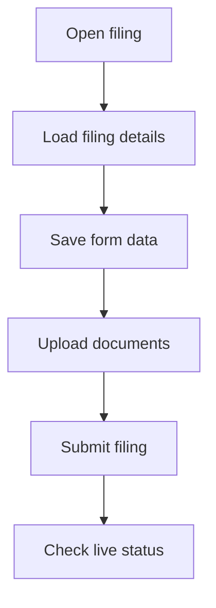

## Verifizierungen verwalten

Die Verifizierungsendpunkte steuern regulatorische Einreichungen für Telefonnummern: Entwürfe eröffnen, Formulardaten speichern, Dokumente hochladen, Einreichungen absenden und den Live-Status abrufen. Alle Endpunkte in diesem Bereich verwenden Authentifizierung über Session-Cookies.

<Callout kind="info">

Verwenden Sie diese API zusammen mit [Telefonnummern](/de/api-reference/phone-numbers) und der [Übersicht](/de/api-reference/overview), wenn Sie den vollständigen Ablauf für Nummern und Compliance dokumentieren oder integrieren.

</Callout>

<Columns cols={2}>
  <Card
    title="Telefonnummern"
    href="/de/api-reference/phone-numbers"
    icon="phone"
    cta="Zur Referenz"
  />
  <Card
    title="Übersicht"
    href="/de/api-reference/overview"
    icon="book-open"
    cta="Zur Übersicht"
  />
</Columns>

## Authentifizierung und gemeinsame Regeln

Alle Verifizierungsendpunkte erwarten eine gültige angemeldete Sitzung. Wenn keine gültige Session vorhanden ist, gibt die API `401 Unauthorized` zurück.

<Callout kind="tip">

`bundleSid` muss dem Format `BU...` entsprechen, und `documentSid` dem Format `RD...`. Ungültige IDs führen je nach Endpunkt zu `400 Bad Request`.

</Callout>

## Einreichung eröffnen oder fortsetzen

`POST /api/verifications/filings` eröffnet eine neue Einreichung oder setzt einen passenden Entwurf fort. Wenn `resubmitOf` gesetzt ist, erstellt der Endpunkt eine neue Korrektur-Einreichung auf Basis einer vorherigen abgelehnten Einreichung.

<Request>
```bash
curl -X POST "https://api.talkturo.com/api/verifications/filings" \
  -H "Content-Type: application/json" \
  -H "Cookie: sb-access-token=sess_example_9xmk7q2r" \
  -d '{
    "account": "acme-support",
    "carrier": "twilio",
    "country": "DE",
    "numberType": "local"
  }'
```
</Request>

<Response>
```json
{
  "success": true,
  "bundleSid": "BU4c0b87c35a7d47d5a1e6f7d9c2a4b8e1",
  "resumed": false
}
```
</Response>

### Request-Body

<ParamField body="account" param-type="string" required="true">
Workspace-Slug, für den die Einreichung geöffnet oder fortgesetzt wird.
</ParamField>

<ParamField body="carrier" param-type="string" required="false">
Optionaler Carrier-Override.
</ParamField>

<ParamField body="country" param-type="string" required="true">
Zweistelliger Ländercode nach ISO 3166-1 alpha-2. Der Wert wird intern normalisiert.
</ParamField>

<ParamField body="numberType" param-type="string" required="false" enum="local,toll-free,mobile,national">
Nummerntyp der Einreichung. Standardwert ist `local`.
</ParamField>

<ParamField body="resubmitOf" param-type="string" required="false">
Bundle-SID einer früheren Einreichung, die im Korrektur- und Neuübermittlungsablauf erneut eröffnet werden soll.
</ParamField>

### Response-Felder

<ResponseField name="success" field-type="boolean" required="true">
`true`, wenn die Einreichung erfolgreich geöffnet oder fortgesetzt wurde.
</ResponseField>

<ResponseField name="bundleSid" field-type="string" required="true">
SID der Einreichung.
</ResponseField>

<ResponseField name="resumed" field-type="boolean" required="true">
`true`, wenn ein vorhandener Entwurf fortgesetzt wurde, andernfalls `false`.
</ResponseField>

### Statuscodes

| Status | Bedeutung |
|---|---|
| `200` | Einreichung wurde geöffnet oder fortgesetzt |
| `401` | Keine gültige Session |
| `403` | Zugriff auf den Workspace nicht erlaubt |
| `404` | Workspace oder Kontext nicht gefunden |
| `502` | Carrier konnte nicht erreicht werden |

## Einreichungsdetails abrufen

`GET /api/verifications/filings/{bundleSid}` lädt eine bestehende Einreichung und die dazugehörigen regulatorischen Anforderungen. Verwenden Sie diesen Endpunkt, um den aktuellen Stand eines Entwurfs und die benötigten Felder oder Dokumente anzuzeigen.

<Request>
```bash
curl "https://api.talkturo.com/api/verifications/filings/BU4c0b87c35a7d47d5a1e6f7d9c2a4b8e1?account=acme-support&country=DE&numberType=local" \
  -H "Cookie: sb-access-token=sess_example_9xmk7q2r"
```
</Request>

<Response>
```json
{
  "success": true,
  "filing": {
    "sid": "BU4c0b87c35a7d47d5a1e6f7d9c2a4b8e1",
    "status": "draft",
    "documents": []
  },
  "requirements": {
    "name": "de-local-business",
    "fields": [
      {
        "name": "business_name",
        "type": "string",
        "required": true
      }
    ]
  }
}
```
</Response>

### Pfadparameter

<ParamField path="bundleSid" param-type="string" required="true">
SID der Einreichung, die geladen werden soll.
</ParamField>

### Query-Parameter

<ParamField query="account" param-type="string" required="true">
Workspace-Slug der Einreichung.
</ParamField>

<ParamField query="carrier" param-type="string" required="false">
Optionaler Carrier-Override.
</ParamField>

<ParamField query="country" param-type="string" required="true">
Zweistelliger Ländercode, der zum Laden der passenden regulatorischen Anforderungen verwendet wird.
</ParamField>

<ParamField query="numberType" param-type="string" required="false" enum="local,toll-free,mobile,national">
Nummerntyp der Einreichung.
</ParamField>

### Response-Felder

<ResponseField name="success" field-type="boolean" required="true">
`true`, wenn die Einreichung erfolgreich geladen wurde.
</ResponseField>

<ResponseField name="filing" field-type="object" required="true">
Die Einreichung mit Status, Formularinformationen, Dokumenten und weiteren Carrier-Daten.
</ResponseField>

<ResponseField name="requirements" field-type="object" required="true">
Die aktuell vom Carrier geladenen regulatorischen Anforderungen für Land und Nummerntyp.
</ResponseField>

### Statuscodes

| Status | Bedeutung |
|---|---|
| `200` | Einreichung und Anforderungen wurden geladen |
| `400` | Ungültige `bundleSid` |
| `401` | Keine gültige Session |
| `404` | Einreichung nicht gefunden |

## Formulardaten speichern

`PATCH /api/verifications/filings/{bundleSid}` speichert Formularantworten in einem Entwurf. Verwenden Sie diesen Endpunkt für Zwischenspeicherungen, bevor Sie die Einreichung absenden.

<Request>
```bash
curl -X PATCH "https://api.talkturo.com/api/verifications/filings/BU4c0b87c35a7d47d5a1e6f7d9c2a4b8e1" \
  -H "Content-Type: application/json" \
  -H "Cookie: sb-access-token=sess_example_9xmk7q2r" \
  -d '{
    "account": "acme-support",
    "carrier": "twilio",
    "formData": {
      "business_name": "Acme GmbH",
      "business_registration_number": "HRB 123456"
    }
  }'
```
</Request>

<Response>
```json
{
  "success": true
}
```
</Response>

### Pfadparameter

<ParamField path="bundleSid" param-type="string" required="true">
SID der Einreichung, die aktualisiert werden soll.
</ParamField>

### Request-Body

<ParamField body="account" param-type="string" required="true">
Workspace-Slug der Einreichung.
</ParamField>

<ParamField body="carrier" param-type="string" required="false">
Optionaler Carrier-Override.
</ParamField>

<ParamField body="formData" param-type="object" required="true">
Freiform-Schlüssel-Wert-Paare mit den aktuellen Formularantworten.
</ParamField>

### Response-Felder

<ResponseField name="success" field-type="boolean" required="true">
`true`, wenn die Formulardaten erfolgreich gespeichert wurden.
</ResponseField>

### Statuscodes

| Status | Bedeutung |
|---|---|
| `200` | Formulardaten wurden gespeichert |
| `400` | Ungültige `bundleSid` oder ungültiger Request-Body |
| `401` | Keine gültige Session |
| `409` | Entwurf konnte nicht gespeichert werden |

## Einreichung verwerfen

`DELETE /api/verifications/filings/{bundleSid}` löscht einen verwerfbaren Entwurf. Verwenden Sie diesen Endpunkt, wenn Sie einen begonnenen Filing-Prozess vollständig abbrechen möchten.

<Request>
```bash
curl -X DELETE "https://api.talkturo.com/api/verifications/filings/BU4c0b87c35a7d47d5a1e6f7d9c2a4b8e1?account=acme-support&carrier=twilio" \
  -H "Cookie: sb-access-token=sess_example_9xmk7q2r"
```
</Request>

<Response>
```json
{
  "success": true
}
```
</Response>

### Pfadparameter

<ParamField path="bundleSid" param-type="string" required="true">
SID der Einreichung, die verworfen werden soll.
</ParamField>

### Query-Parameter

<ParamField query="account" param-type="string" required="true">
Workspace-Slug der Einreichung.
</ParamField>

<ParamField query="carrier" param-type="string" required="false">
Optionaler Carrier-Override.
</ParamField>

### Response-Felder

<ResponseField name="success" field-type="boolean" required="true">
`true`, wenn die Einreichung erfolgreich verworfen wurde.
</ResponseField>

### Statuscodes

| Status | Bedeutung |
|---|---|
| `200` | Einreichung wurde verworfen |
| `400` | Ungültige `bundleSid` |
| `401` | Keine gültige Session |
| `409` | Einreichung konnte nicht verworfen werden |

## Dokument hochladen

`POST /api/verifications/filings/{bundleSid}/documents` lädt ein Dokument direkt zum Carrier hoch. Talkturo speichert die Datei nicht lokal.

<Callout kind="info">

Unterstützt werden `PDF`, `JPEG`, `PNG`, `HEIC` und `WebP`. Die maximale Dateigröße beträgt 20 MB.

</Callout>

<Request>
```bash
curl -X POST "https://api.talkturo.com/api/verifications/filings/BU4c0b87c35a7d47d5a1e6f7d9c2a4b8e1/documents" \
  -H "Cookie: sb-access-token=sess_example_9xmk7q2r" \
  -F "file=@./trade-register.pdf" \
  -F "requirement=business_registration_proof" \
  -F "type=registration_document" \
  -F "account=acme-support" \
  -F "carrier=twilio"
```
</Request>

<Response>
```json
{
  "success": true,
  "documents": [
    {
      "sid": "RD3d2c19f97d634e8ab7f31f52c8b3a6de",
      "type": "registration_document"
    }
  ]
}
```
</Response>

### Pfadparameter

<ParamField path="bundleSid" param-type="string" required="true">
SID der Einreichung, zu der das Dokument hochgeladen wird.
</ParamField>

### Multipart-Felder

<ParamField body="file" param-type="file" required="true">
Datei, die hochgeladen werden soll. Der Endpunkt akzeptiert nur echte Datei-Uploads per `multipart/form-data`.
</ParamField>

<ParamField body="requirement" param-type="string" required="true">
Nichtleerer Bezeichner der regulatorischen Anforderung, die mit diesem Dokument erfüllt werden soll.
</ParamField>

<ParamField body="type" param-type="string" required="true">
Nichtleerer Dokumenttyp.
</ParamField>

<ParamField body="account" param-type="string" required="true">
Workspace-Slug der Einreichung.
</ParamField>

<ParamField body="carrier" param-type="string" required="false">
Optionaler Carrier-Override.
</ParamField>

### Response-Felder

<ResponseField name="success" field-type="boolean" required="true">
`true`, wenn das Dokument erfolgreich hochgeladen wurde.
</ResponseField>

<ResponseField name="documents" field-type="array" required="true">
Aktualisierte Liste der Dokumente, die mit der Einreichung verknüpft sind.
</ResponseField>

### Statuscodes

| Status | Bedeutung |
|---|---|
| `200` | Dokument wurde hochgeladen |
| `400` | Datei fehlt, Feld fehlt, Datei ist zu groß oder Dateityp ist nicht erlaubt |
| `401` | Keine gültige Session |
| `502` | Carrier hat den Upload abgelehnt |

## Dokument entfernen

`DELETE /api/verifications/filings/{bundleSid}/documents` entfernt ein vorhandenes Dokument aus einer Einreichung.

<Request>
```bash
curl -X DELETE "https://api.talkturo.com/api/verifications/filings/BU4c0b87c35a7d47d5a1e6f7d9c2a4b8e1/documents?account=acme-support&carrier=twilio&documentSid=RD3d2c19f97d634e8ab7f31f52c8b3a6de" \
  -H "Cookie: sb-access-token=sess_example_9xmk7q2r"
```
</Request>

<Response>
```json
{
  "success": true,
  "documents": []
}
```
</Response>

### Pfadparameter

<ParamField path="bundleSid" param-type="string" required="true">
SID der Einreichung, aus der das Dokument entfernt werden soll.
</ParamField>

### Query-Parameter

<ParamField query="account" param-type="string" required="true">
Workspace-Slug der Einreichung.
</ParamField>

<ParamField query="carrier" param-type="string" required="false">
Optionaler Carrier-Override.
</ParamField>

<ParamField query="documentSid" param-type="string" required="true">
SID des Dokuments, das entfernt werden soll.
</ParamField>

### Response-Felder

<ResponseField name="success" field-type="boolean" required="true">
`true`, wenn das Dokument erfolgreich entfernt wurde.
</ResponseField>

<ResponseField name="documents" field-type="array" required="true">
Aktualisierte Dokumentliste der Einreichung.
</ResponseField>

### Statuscodes

| Status | Bedeutung |
|---|---|
| `200` | Dokument wurde entfernt |
| `400` | Ungültige oder fehlende `bundleSid` oder `documentSid` |
| `401` | Keine gültige Session |
| `409` | Dokument konnte nicht entfernt werden |

## Einreichung zur Prüfung einreichen

`POST /api/verifications/filings/{bundleSid}/submit` startet die Prüfung einer Einreichung. Vor der eigentlichen Übermittlung führt der Carrier eine sofortige Evaluation durch.

<Request>
```bash
curl -X POST "https://api.talkturo.com/api/verifications/filings/BU4c0b87c35a7d47d5a1e6f7d9c2a4b8e1/submit" \
  -H "Content-Type: application/json" \
  -H "Cookie: sb-access-token=sess_example_9xmk7q2r" \
  -d '{
    "account": "acme-support",
    "carrier": "twilio",
    "formData": {
      "business_name": "Acme GmbH",
      "business_registration_number": "HRB 123456"
    }
  }'
```
</Request>

<Response tabs="200,422">
```json
{
  "success": true,
  "bundleSid": "BU4c0b87c35a7d47d5a1e6f7d9c2a4b8e1"
}
```

```json
{
  "error": "Some requirements failed evaluation",
  "failures": [
    {
      "requirement": "business_registration_proof",
      "message": "Document is missing"
    }
  ]
}
```
</Response>

### Pfadparameter

<ParamField path="bundleSid" param-type="string" required="true">
SID der Einreichung, die zur Prüfung eingereicht werden soll.
</ParamField>

### Request-Body

<ParamField body="account" param-type="string" required="true">
Workspace-Slug der Einreichung.
</ParamField>

<ParamField body="carrier" param-type="string" required="false">
Optionaler Carrier-Override.
</ParamField>

<ParamField body="formData" param-type="object" required="false">
Aktuelle Formularwerte, die zur Evaluation an den Carrier weitergegeben werden. Die Daten werden lokal nicht gespeichert.
</ParamField>

### Response-Felder

<ResponseField name="success" field-type="boolean" required="false">
Bei erfolgreicher Einreichung `true`.
</ResponseField>

<ResponseField name="bundleSid" field-type="string" required="false">
SID der erfolgreich eingereichten Einreichung.
</ResponseField>

<ResponseField name="error" field-type="string" required="false">
Fehlermeldung, wenn die Vorab-Evaluation fehlschlägt.
</ResponseField>

<ResponseField name="failures" field-type="array" required="false">
Liste der Anforderungen, die die Vorab-Evaluation nicht bestanden haben. In diesem Fall bleibt der Entwurf unverändert.
</ResponseField>

### Statuscodes

| Status | Bedeutung |
|---|---|
| `200` | Einreichung wurde zur Prüfung eingereicht |
| `400` | Ungültige `bundleSid` oder ungültiger Request-Body |
| `401` | Keine gültige Session |
| `422` | Vorab-Evaluation ist fehlgeschlagen; Entwurf wurde nicht verändert |

## Live-Verifizierungsstatus abrufen

`GET /api/verifications/live` lädt den aktuellen Live-Status der Verifizierungen eines Workspace direkt vom Carrier. Der Endpunkt liest keine lokalen Tabellen für diese Statusansicht.

<Request>
```bash
curl "https://api.talkturo.com/api/verifications/live?account=acme-support" \
  -H "Cookie: sb-access-token=sess_example_9xmk7q2r"
```
</Request>

<Response>
```json
{
  "success": true,
  "bundles": [
    {
      "sid": "BU7f8a3a5610f94e8e8d8d5d0b31a9f4c2",
      "status": "approved",
      "country": "DE",
      "numberType": "local"
    }
  ]
}
```
</Response>

### Query-Parameter

<ParamField query="account" param-type="string" required="true">
Workspace-Slug, dessen Live-Verifizierungsstatus geladen werden soll.
</ParamField>

### Response-Felder

<ResponseField name="success" field-type="boolean" required="true">
`true`, wenn der Live-Status erfolgreich geladen wurde.
</ResponseField>

<ResponseField name="bundles" field-type="array" required="false">
Live-Bundle-Daten des Workspace. Die genaue Struktur entspricht der aktuellen Ansicht aus dem Carrier-System.
</ResponseField>

### Statuscodes

| Status | Bedeutung |
|---|---|
| `200` | Live-Status wurde geladen |
| `400` | `account` fehlt |
| `401` | Keine gültige Session |
| `403` | Kein Zugriff auf den Workspace |
| `404` | Workspace nicht gefunden |

## Typischer Ablauf

Die meisten Integrationen durchlaufen denselben Ablauf: Entwurf eröffnen, Anforderungen laden, Formular speichern, Dokumente hochladen und dann absenden. Der Live-Endpunkt ergänzt diesen Ablauf später um die Statusabfrage produktiver Einreichungen.



## Verwandte Ressourcen

<Columns cols={2}>
  <Card
    title="Telefonnummern"
    href="/de/api-reference/phone-numbers"
    icon="phone"
    cta="Mehr erfahren"
  />
  <Card
    title="API-Übersicht"
    href="/de/api-reference/overview"
    icon="book-open"
    cta="Zur Referenz"
  />
</Columns>