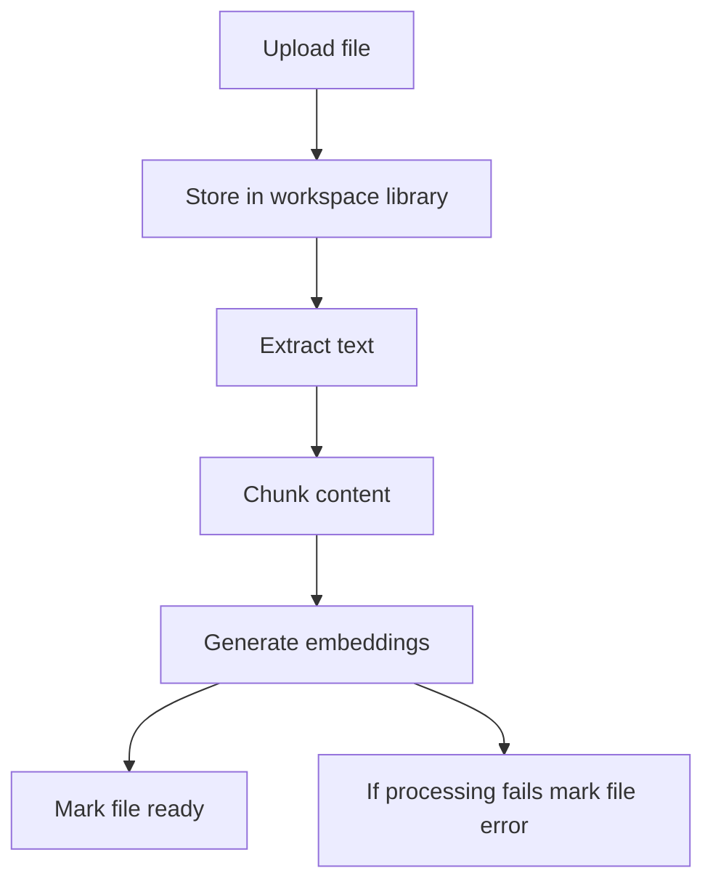

## Assistenten dokumentgestützte Antworten während Anrufen geben

Mit der Wissensdatenbank können Ihre Assistenten während eines laufenden Anrufs Fakten aus hochgeladenen Dokumenten abrufen. Statt jede Preisregel, Rückerstattungsrichtlinie, jedes Produktdetail oder jede FAQ in den System-Prompt zu zwingen, speichern Sie diese Informationen in Dokumenten und lassen den Assistenten die relevanten Passagen bei Bedarf abrufen.

Dateien leben auf Workspace-Ebene, sodass Sie ein Dokument einmal hochladen und an einen oder mehrere Assistenten anhängen können. So bleiben gemeinsame Informationen zentral verwaltet, während jeder Assistent nur die Dateien verwendet, die Sie ihm anhängen.

<Callout kind="info">

Assistenten können nur Dateien mit dem Status `ready` verwenden. Dateien im Status `processing` werden noch in chunks aufgeteilt und mit embeddings verarbeitet, und Dateien im Status `error` benötigen Aufmerksamkeit, bevor sie Fragen während Anrufen beantworten können.

</Callout>

## Dokumente hochladen

Laden Sie Dokumente zuerst in die Workspace-Bibliothek hoch und hängen Sie die verarbeiteten Dateien dann an die Assistenten an, die sie verwenden sollen. Talkturo akzeptiert PDF-, DOCX-, TXT- und andere textbasierte Dateiformate über die Upload-API der Wissensdatenbank.

<Callout kind="alert">

Das Speicherkontingent gilt auf Workspace-Ebene und hängt von Ihrem Tarif ab. Wenn Uploads nicht mehr funktionieren oder neue Dateien nicht in der Bibliothek erscheinen, prüfen Sie vor einem erneuten Versuch Ihren verfügbaren Speicher.

</Callout>

<Steps>
  <Step title="Datei hochladen" icon="upload">

Senden Sie eine Multipart-Upload-Anfrage an `POST /api/kb/files`.

```bash
curl -X POST "https://api.talkturo.com/api/kb/files" \
  -H "Authorization: Bearer tk_example_9xmk7q2r" \
  -F "file=@acme-pricing-guide.pdf"
```

Ein erfolgreicher Upload erstellt einen dateibezogenen Datensatz auf Workspace-Ebene. Die Datei wird in Ihrer Workspace-Bibliothek gespeichert und kann später an mehrere Assistenten angehängt werden.

  </Step>

  <Step title="Auf Abschluss der Verarbeitung warten" icon="check-circle">

Nach dem Upload verarbeitet Talkturo die Datei im Hintergrund. In dieser Phase extrahiert das System Text, teilt den Inhalt in chunks auf und erzeugt embeddings für semantisches retrieval.

Prüfen Sie den Dateistatus mit `GET /api/kb/files` oder `GET /api/kb/files/[fileId]`. Erfolg sieht so aus, dass die Datei von `processing` zu `ready` wechselt.

  </Step>

  <Step title="Datei an einen Assistenten anhängen" icon="users">

Sobald die Datei bereit ist, hängen Sie sie an den Assistenten an, der sie während Anrufen verwenden soll.

```bash
curl -X POST "https://api.talkturo.com/api/assistants/asst_7f3k2m/knowledge-base" \
  -H "Authorization: Bearer tk_example_9xmk7q2r" \
  -H "Content-Type: application/json" \
  -d '{
    "file_id": "kbfile_82a91d"
  }'
```

Wenn das Anhängen erfolgreich ist, kann der Assistent während Live-Gesprächen relevante Passagen aus dieser Datei abrufen.

  </Step>
</Steps>

## Die Verarbeitungspipeline verstehen

Jede hochgeladene Datei durchläuft dieselbe retrieval-Pipeline, bevor Assistenten sie verwenden können. Diese Pipeline bereitet das Dokument für die semantische Suche vor, statt es als rohen Anhang zu speichern.



Die Hintergrundverarbeitung läuft asynchron über einen cron-gesteuerten Job. Das bedeutet, dass Uploads in der Regel abgeschlossen sind, bevor die Datei durchsuchbar ist, daher ist die Statusverfolgung in jedem produktiven Workflow wichtig.

### Dateistatus

Eine Datei bewegt sich durch einen dieser Status:

- **`processing`** — Talkturo extrahiert Text, teilt Inhalte in chunks auf oder erzeugt embeddings.
- **`ready`** — Die Datei ist vollständig verarbeitet und Assistenten können sie während Anrufen verwenden.
- **`error`** — Die Verarbeitung ist fehlgeschlagen und die Datei ist erst wieder nutzbar, wenn Sie sie neu verarbeiten oder ersetzen.

### Datei-Metadaten

Jeder Dateidatensatz enthält operative Details, mit denen Sie den Zustand der Verarbeitung und die Bereitschaft für retrieval prüfen können.

<ParamField body="filename" param-type="string" required="true" show-location="false">
Der ursprüngliche Dateiname, wie er in die Workspace-Bibliothek hochgeladen wurde.
</ParamField>

<ParamField body="mime_type" param-type="string" required="true" show-location="false">
Der erkannte MIME-Typ der hochgeladenen Datei.
</ParamField>

<ParamField body="size" param-type="integer" required="true" show-location="false">
Die Dateigröße in Byte.
</ParamField>

<ParamField body="status" param-type="string" required="true" show-location="false">
Der aktuelle Verarbeitungsstatus. Erwartete Werte sind `processing`, `ready` oder `error`.
</ParamField>

<ParamField body="character_count" param-type="integer" required="false" show-location="false">
Die Anzahl der aus dem Dokument extrahierten Zeichen nach der Verarbeitung.
</ParamField>

<ParamField body="chunk_count" param-type="integer" required="false" show-location="false">
Die Anzahl der retrieval-chunks, die aus dem Dokument erstellt wurden.
</ParamField>

### Datei neu verarbeiten

Verarbeiten Sie eine Datei neu, wenn sich der Quellinhalt geändert hat oder wenn eine Datei im Status `error` endet. Die Neuverarbeitung startet chunking und embeddings erneut, damit die semantische Suche den neuesten Stand des Dokuments widerspiegelt.

<Request>
```bash
curl -X POST "https://api.talkturo.com/api/kb/files/kbfile_82a91d/reprocess" \
  -H "Authorization: Bearer tk_example_9xmk7q2r"
```
</Request>

<Response tabs="200,409" default-tab="1">
```json
{
  "id": "kbfile_82a91d",
  "status": "processing",
  "message": "File queued for reprocessing"
}
```

```json
{
  "error": "File is already processing"
}
```
</Response>

## Dateien in der Workspace-Bibliothek verwalten

Verwenden Sie die Workspace-Bibliothek, um Quelldokumente zu prüfen, herunterzuladen, zu entfernen und neu zu verarbeiten. Das Löschen einer Datei entfernt sie aus der gemeinsamen Bibliothek, nicht nur von einem einzelnen Assistenten.

### Verfügbare Dateiverwaltungs-Endpunkte

<ParamField body="GET /api/kb/files" param-type="endpoint" required="true" show-location="false">
Listet Wissensdatenbank-Dateien im aktuellen Workspace auf.
</ParamField>

<ParamField body="GET /api/kb/files/[fileId]" param-type="endpoint" required="true" show-location="false">
Gibt Details zu einer einzelnen Wissensdatenbank-Datei zurück.
</ParamField>

<ParamField body="GET /api/kb/files/[fileId]/download" param-type="endpoint" required="true" show-location="false">
Lädt die ursprünglich hochgeladene Datei herunter.
</ParamField>

<ParamField body="DELETE /api/kb/files/[fileId]" param-type="endpoint" required="true" show-location="false">
Löscht eine Datei aus der Workspace-Bibliothek.
</ParamField>

<ParamField body="POST /api/kb/files/[fileId]/reprocess" param-type="endpoint" required="true" show-location="false">
Stellt die Datei für einen weiteren Verarbeitungsdurchlauf in die Warteschlange.
</ParamField>

### Einzelne Datei prüfen

Verwenden Sie den Detail-Endpunkt der Datei, wenn Sie Status, Zeichenanzahl oder chunk-Anzahl für ein einzelnes Dokument prüfen müssen.

<Request>
```bash
curl -X GET "https://api.talkturo.com/api/kb/files/kbfile_82a91d" \
  -H "Authorization: Bearer tk_example_9xmk7q2r"
```
</Request>

<Response>
```json
{
  "id": "kbfile_82a91d",
  "filename": "acme-pricing-guide.pdf",
  "mime_type": "application/pdf",
  "size": 248193,
  "status": "ready",
  "character_count": 18342,
  "chunk_count": 27
}
```
</Response>

## Dokumente semantisch durchsuchen

Mit der semantischen Suche kann Talkturo relevante Passagen finden, auch wenn die Formulierung des Anrufers nicht exakt mit dem Quelldokument übereinstimmt. Das ist die retrieval-Ebene, auf die sich Assistenten für RAG-basierte Antworten während Anrufen verlassen.

Verwenden Sie `GET /api/kb/search`, um zu testen, was das System für eine Frage voraussichtlich abrufen wird. Das ist nützlich, wenn Sie die Dokumentqualität validieren möchten, bevor Sie Dateien an produktive Assistenten anhängen.

<Request>
```bash
curl -G "https://api.talkturo.com/api/kb/search" \
  -H "Authorization: Bearer tk_example_9xmk7q2r" \
  --data-urlencode "q=What is the annual plan discount?" \
  --data-urlencode "limit=3"
```
</Request>

<Response>
```json
{
  "results": [
    {
      "file_id": "kbfile_82a91d",
      "filename": "acme-pricing-guide.pdf",
      "content": "Customers who choose annual billing receive a 12 percent discount compared to month-to-month pricing.",
      "score": 0.92
    },
    {
      "file_id": "kbfile_17db44",
      "filename": "billing-faq.txt",
      "content": "Annual subscriptions are billed upfront and include a discounted rate.",
      "score": 0.87
    }
  ]
}
```
</Response>

### Wie gute Suchergebnisse aussehen

Starke Suchergebnisse haben meist drei Merkmale:

- Sie stammen aus dem Dokument, das Sie erwartet haben.
- Der zurückgegebene chunk enthält genau den Fakt, den der Assistent zitieren oder paraphrasieren soll.
- Die obersten Ergebnisse sind konsistent statt widersprüchlich.

Wenn Suchergebnisse vage oder irrelevant sind, überarbeiten Sie die Quelldokumente, bevor Sie sich in Anrufen darauf verlassen. Kleinere, stärker fokussierte Dateien liefern meist bessere retrieval-Ergebnisse als eine große Datei, die viele nicht zusammenhängende Themen abdeckt.

## Dokumente an Assistenten anhängen

Wenn Sie eine Datei anhängen, erhält ein Assistent Zugriff auf den verarbeiteten Inhalt dieser Datei. Die zugrunde liegende Datei bleibt in der Workspace-Bibliothek, sodass das Abhängen von einem Assistenten sie weder von anderen Assistenten entfernt noch aus dem Speicher löscht.

### Bereite Datei anhängen

Verwenden Sie `POST /api/assistants/[id]/knowledge-base` mit einer `file_id` im Request-Body.

<Request>
```bash
curl -X POST "https://api.talkturo.com/api/assistants/asst_7f3k2m/knowledge-base" \
  -H "Authorization: Bearer tk_example_9xmk7q2r" \
  -H "Content-Type: application/json" \
  -d '{
    "file_id": "kbfile_82a91d"
  }'
```
</Request>

<Response tabs="200,400" default-tab="1">
```json
{
  "assistant_id": "asst_7f3k2m",
  "file_id": "kbfile_82a91d",
  "attached": true
}
```

```json
{
  "error": "File is not ready"
}
```
</Response>

Das Anhängen ist idempotent. Wenn Sie dieselbe Datei erneut an denselben Assistenten senden, gibt Talkturo Erfolg zurück, ohne ein doppeltes Attachment zu erzeugen.

### Angehängte Dateien auflisten

Verwenden Sie `GET /api/assistants/[id]/knowledge-base`, um zu sehen, auf welche Dokumente ein Assistent während Anrufen zugreifen kann.

<Request>
```bash
curl -X GET "https://api.talkturo.com/api/assistants/asst_7f3k2m/knowledge-base" \
  -H "Authorization: Bearer tk_example_9xmk7q2r"
```
</Request>

<Response>
```json
{
  "assistant_id": "asst_7f3k2m",
  "files": [
    {
      "file_id": "kbfile_82a91d",
      "filename": "acme-pricing-guide.pdf",
      "status": "ready"
    },
    {
      "file_id": "kbfile_17db44",
      "filename": "billing-faq.txt",
      "status": "ready"
    }
  ]
}
```
</Response>

### Datei abhängen

Verwenden Sie `DELETE /api/assistants/[id]/knowledge-base/[fileId]`, um eine Datei von einem Assistenten zu entfernen.

<Request>
```bash
curl -X DELETE "https://api.talkturo.com/api/assistants/asst_7f3k2m/knowledge-base/kbfile_82a91d" \
  -H "Authorization: Bearer tk_example_9xmk7q2r"
```
</Request>

<Response>
```json
{
  "assistant_id": "asst_7f3k2m",
  "file_id": "kbfile_82a91d",
  "detached": true
}
```
</Response>

<Callout kind="tip">

Hängen Sie eine Datei ab, wenn ein Assistent sie nicht mehr verwenden soll, aber löschen Sie die Datei nur, wenn kein Assistent im Workspace sie noch benötigt.

</Callout>

## Best Practices für bessere Anrufantworten

Gutes retrieval beginnt mit gutem Quellmaterial. Der Assistent kann nur zitieren oder zusammenfassen, was Ihre Dokumente tatsächlich enthalten.

- **Laden Sie fokussierte Dokumente hoch.** Trennen Sie Preis-, Richtlinien-, Implementierungs- und FAQ-Inhalte, statt alles in einer langen Datei zu kombinieren.
- **Halten Sie Dokumente aktuell.** Wenn sich eine Richtlinie oder Preisregel ändert, laden Sie die neue Version hoch und verarbeiten Sie sie neu, bevor Sie sich in der Produktion auf den Assistenten verlassen.
- **Verwenden Sie die Wissensdatenbank für Fakten.** Speichern Sie hier sachliches Referenzmaterial wie Preise, Berechtigungsregeln, Rückerstattungsrichtlinien und Fakten zur Einwandbehandlung. Halten Sie Ton, Gesprächsstil und Persona-Anweisungen in der Assistentenkonfiguration.
- **Prüfen Sie den Status vor dem Go-live.** Bestätigen Sie, dass angehängte Dateien `ready` sind, bevor Sie echte Anrufe an den Assistenten weiterleiten.
- **Testen Sie retrieval mit der Suche.** Führen Sie einige echte Kundenfragen über `GET /api/kb/search` aus und prüfen Sie die zurückgegebenen chunks.

## Verwandte Seiten

<Columns cols={2}>
  <Card
    title="Assistentenübersicht"
    href="/assistants/overview"
    icon="users"
    cta="Seite öffnen"
  />
  <Card
    title="Assistentenkonfiguration"
    href="/assistants/configuration"
    icon="settings"
    cta="Seite öffnen"
  />
</Columns>