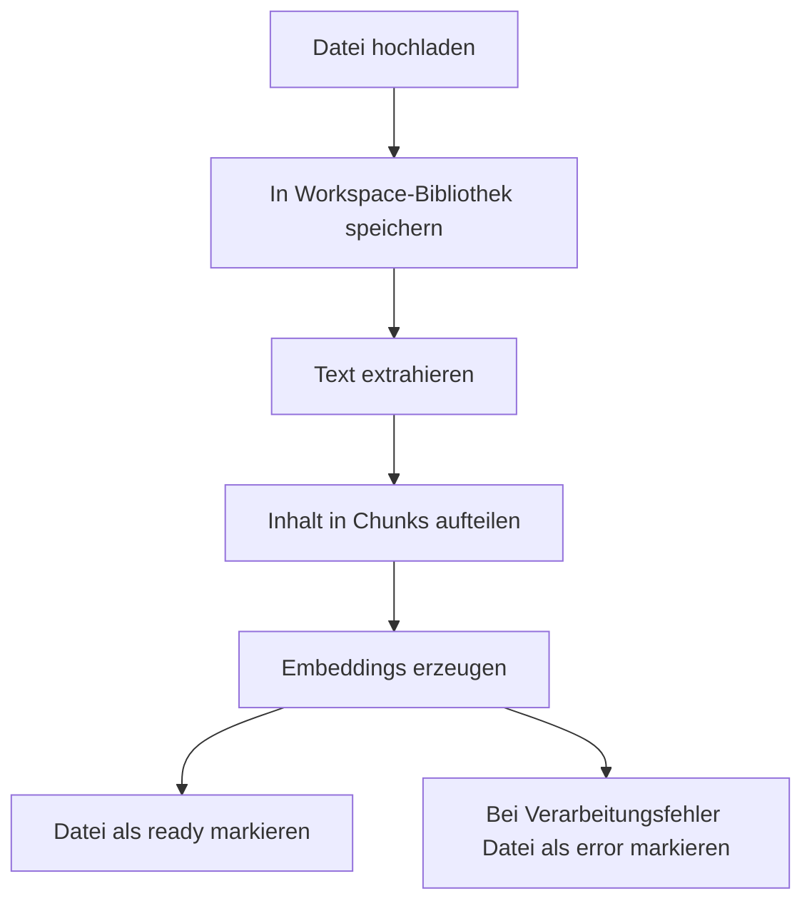

## Gib Assistenten während Anrufen dokumentgestützte Antworten

Mit der Wissensdatenbank können deine Assistenten Fakten aus hochgeladenen Dokumenten abrufen, während ein Anruf läuft. Statt jede Preisregel, Rückerstattungsrichtlinie, Produktangabe oder FAQ in den System Prompt zu packen, speicherst du diese Informationen in Dokumenten und lässt den Assistenten die relevanten Passagen bei Bedarf abrufen.

Dateien leben auf Workspace-Ebene. Du kannst also ein Dokument einmal hochladen und es einem oder mehreren Assistenten zuweisen. So bleiben gemeinsame Informationen zentral verwaltet, während jeder Assistent nur die Dateien nutzt, die du ihm zuweist.

<Callout kind="info">

Assistenten können nur Dateien mit dem Status `ready` verwenden. Dateien im Status `processing` werden noch in Chunks aufgeteilt und mit Embeddings verarbeitet, und Dateien im Status `error` brauchen Aufmerksamkeit, bevor sie Fragen während Anrufen beantworten können.

</Callout>

## Dokumente hochladen

Lade Dokumente zuerst in die Workspace-Bibliothek hoch und hänge die verarbeiteten Dateien dann an die Assistenten an, die sie verwenden sollen. Talkturo akzeptiert PDF-, DOCX-, TXT- und andere textbasierte Dateiformate über die Upload-API der Wissensdatenbank.

<Callout kind="alert">

Das Speicherlimit gilt auf Workspace-Ebene und hängt von deinem Tarif ab. Wenn Uploads nicht mehr funktionieren oder neue Dateien nicht in der Bibliothek erscheinen, prüfe vor einem erneuten Versuch den verfügbaren Speicher.

</Callout>

<Steps>
  <Step title="Eine Datei hochladen" icon="upload">

Sende eine Multipart-Upload-Anfrage an `POST /api/kb/files`.

```bash
curl -X POST "https://api.talkturo.com/api/kb/files" \
  -H "Authorization: Bearer tk_example_9xmk7q2r" \
  -F "file=@acme-pricing-guide.pdf"
```

Ein erfolgreicher Upload erstellt einen dateibasierten Datensatz auf Workspace-Ebene. Die Datei wird in deiner Workspace-Bibliothek gespeichert und kann später an mehrere Assistenten angehängt werden.

  </Step>

  <Step title="Warte, bis die Verarbeitung abgeschlossen ist" icon="check-circle">

Nach dem Upload verarbeitet Talkturo die Datei im Hintergrund. In dieser Phase extrahiert das System Text, teilt den Inhalt in Chunks auf und erzeugt Embeddings für semantisches Retrieval.

Prüfe den Dateistatus mit `GET /api/kb/files` oder `GET /api/kb/files/[fileId]`. Erfolg sieht so aus, dass die Datei von `processing` zu `ready` wechselt.

  </Step>

  <Step title="Hänge die Datei an einen Assistenten an" icon="users">

Sobald die Datei bereit ist, hänge sie an den Assistenten an, der sie während Anrufen verwenden soll.

```bash
curl -X POST "https://api.talkturo.com/api/assistants/asst_7f3k2m/knowledge-base" \
  -H "Authorization: Bearer tk_example_9xmk7q2r" \
  -H "Content-Type: application/json" \
  -d '{
    "file_id": "kbfile_82a91d"
  }'
```

Wenn das Anhängen erfolgreich ist, kann der Assistent während Live-Gesprächen relevante Passagen aus dieser Datei abrufen.

  </Step>
</Steps>

## Verstehe die Verarbeitungspipeline

Jede hochgeladene Datei durchläuft dieselbe Retrieval-Pipeline, bevor Assistenten sie verwenden können. Diese Pipeline bereitet das Dokument für die semantische Suche vor, statt es als rohen Anhang zu speichern.



Die Hintergrundverarbeitung läuft asynchron über einen Cron-gesteuerten Job. Uploads geben deshalb meist eine Antwort zurück, bevor die Datei durchsuchbar ist. Statusverfolgung ist in jedem produktiven Workflow wichtig.

### Dateistatus

Eine Datei durchläuft einen dieser Status:

- **`processing`** — Talkturo extrahiert Text, erstellt Chunks oder erzeugt Embeddings.
- **`ready`** — Die Datei ist fertig verarbeitet und Assistenten können sie während Anrufen verwenden.
- **`error`** — Die Verarbeitung ist fehlgeschlagen und die Datei ist erst wieder nutzbar, wenn du sie erneut verarbeitest oder ersetzt.

### Dateimetadaten

Jeder Dateidatensatz enthält operative Details, mit denen du den Zustand der Verarbeitung und die Bereitschaft für Retrieval prüfen kannst.

<ParamField body="filename" param-type="string" required="true" show-location="false">
Der ursprüngliche Dateiname, mit dem die Datei in die Workspace-Bibliothek hochgeladen wurde.
</ParamField>

<ParamField body="mime_type" param-type="string" required="true" show-location="false">
Der erkannte MIME-Typ der hochgeladenen Datei.
</ParamField>

<ParamField body="size" param-type="integer" required="true" show-location="false">
Die Dateigröße in Byte.
</ParamField>

<ParamField body="status" param-type="string" required="true" show-location="false">
Der aktuelle Verarbeitungsstatus. Erwartete Werte sind `processing`, `ready` oder `error`.
</ParamField>

<ParamField body="character_count" param-type="integer" required="false" show-location="false">
Die Anzahl der aus dem Dokument extrahierten Zeichen nach der Verarbeitung.
</ParamField>

<ParamField body="chunk_count" param-type="integer" required="false" show-location="false">
Die Anzahl der Retrieval-Chunks, die aus dem Dokument erstellt wurden.
</ParamField>

### Eine Datei erneut verarbeiten

Verarbeite eine Datei erneut, wenn sich der Quellinhalt geändert hat oder wenn eine Datei im Status `error` endet. Durch die erneute Verarbeitung werden Chunking und Embeddings erneut ausgeführt, damit die semantische Suche den neuesten Dokumentstand widerspiegelt.

<Request>
```bash
curl -X POST "https://api.talkturo.com/api/kb/files/kbfile_82a91d/reprocess" \
  -H "Authorization: Bearer tk_example_9xmk7q2r"
```
</Request>

<Response tabs="200,409" default-tab="1">
```json
{
  "id": "kbfile_82a91d",
  "status": "processing",
  "message": "File queued for reprocessing"
}
```

```json
{
  "error": "File is already processing"
}
```
</Response>

## Verwalte Dateien in der Workspace-Bibliothek

Verwende die Workspace-Bibliothek, um Quelldokumente zu prüfen, herunterzuladen, zu entfernen und erneut zu verarbeiten. Wenn du eine Datei löschst, entfernst du sie aus der gemeinsamen Bibliothek, nicht nur von einem einzelnen Assistenten.

### Verfügbare Endpunkte zur Dateiverwaltung

<ParamField body="GET /api/kb/files" param-type="endpoint" required="true" show-location="false">
Listet Dateien der Wissensdatenbank im aktuellen Workspace auf.
</ParamField>

<ParamField body="GET /api/kb/files/[fileId]" param-type="endpoint" required="true" show-location="false">
Gibt Details für eine einzelne Datei der Wissensdatenbank zurück.
</ParamField>

<ParamField body="GET /api/kb/files/[fileId]/download" param-type="endpoint" required="true" show-location="false">
Lädt die ursprünglich hochgeladene Datei herunter.
</ParamField>

<ParamField body="DELETE /api/kb/files/[fileId]" param-type="endpoint" required="true" show-location="false">
Löscht eine Datei aus der Workspace-Bibliothek.
</ParamField>

<ParamField body="POST /api/kb/files/[fileId]/reprocess" param-type="endpoint" required="true" show-location="false">
Stellt die Datei für einen weiteren Verarbeitungslauf in die Warteschlange.
</ParamField>

### Eine einzelne Datei prüfen

Verwende den Detail-Endpunkt der Datei, wenn du Status, Zeichenanzahl oder Chunk-Anzahl für ein einzelnes Dokument prüfen musst.

<Request>
```bash
curl -X GET "https://api.talkturo.com/api/kb/files/kbfile_82a91d" \
  -H "Authorization: Bearer tk_example_9xmk7q2r"
```
</Request>

<Response>
```json
{
  "id": "kbfile_82a91d",
  "filename": "acme-pricing-guide.pdf",
  "mime_type": "application/pdf",
  "size": 248193,
  "status": "ready",
  "character_count": 18342,
  "chunk_count": 27
}
```
</Response>

## Durchsuche Dokumente semantisch

Semantische Suche ermöglicht es Talkturo, relevante Passagen zu finden, auch wenn die Formulierung des Anrufers nicht exakt mit dem Quelldokument übereinstimmt. Das ist die Retrieval-Schicht, auf die sich Assistenten für RAG-basierte Antworten während Anrufen verlassen.

Verwende `GET /api/kb/search`, um zu testen, was das System für eine Frage voraussichtlich abrufen wird. Das ist nützlich, wenn du die Qualität von Dokumenten prüfen willst, bevor du Dateien an produktive Assistenten anhängst.

<Request>
```bash
curl -G "https://api.talkturo.com/api/kb/search" \
  -H "Authorization: Bearer tk_example_9xmk7q2r" \
  --data-urlencode "q=What is the annual plan discount?" \
  --data-urlencode "limit=3"
```
</Request>

<Response>
```json
{
  "results": [
    {
      "file_id": "kbfile_82a91d",
      "filename": "acme-pricing-guide.pdf",
      "content": "Customers who choose annual billing receive a 12 percent discount compared to month-to-month pricing.",
      "score": 0.92
    },
    {
      "file_id": "kbfile_17db44",
      "filename": "billing-faq.txt",
      "content": "Annual subscriptions are billed upfront and include a discounted rate.",
      "score": 0.87
    }
  ]
}
```
</Response>

### So sehen gute Suchergebnisse aus

Starke Suchergebnisse haben meist drei Eigenschaften:

- Sie stammen aus dem Dokument, das du erwartet hast.
- Der zurückgegebene Chunk enthält genau den Fakt, den der Assistent zitieren oder paraphrasieren soll.
- Die obersten Ergebnisse sind konsistent statt widersprüchlich.

Wenn Suchergebnisse vage oder irrelevant sind, überarbeite die Quelldokumente, bevor du dich in Anrufen darauf verlässt. Kleinere, stärker fokussierte Dateien liefern meist bessere Retrieval-Ergebnisse als eine große Datei mit vielen nicht zusammenhängenden Themen.

## Hänge Dokumente an Assistenten an

Wenn du eine Datei anhängst, erhält ein einzelner Assistent Zugriff auf den verarbeiteten Inhalt dieser Datei. Die zugrunde liegende Datei bleibt in der Workspace-Bibliothek. Wenn du sie von einem Assistenten löst, wird sie also weder von anderen Assistenten entfernt noch aus dem Speicher gelöscht.

### Eine bereite Datei anhängen

Verwende `POST /api/assistants/[id]/knowledge-base` mit einer `file_id` im Request-Body.

<Request>
```bash
curl -X POST "https://api.talkturo.com/api/assistants/asst_7f3k2m/knowledge-base" \
  -H "Authorization: Bearer tk_example_9xmk7q2r" \
  -H "Content-Type: application/json" \
  -d '{
    "file_id": "kbfile_82a91d"
  }'
```
</Request>

<Response tabs="200,400" default-tab="1">
```json
{
  "assistant_id": "asst_7f3k2m",
  "file_id": "kbfile_82a91d",
  "attached": true
}
```

```json
{
  "error": "File is not ready"
}
```
</Response>

Das Anhängen ist idempotent. Wenn du dieselbe Datei noch einmal an denselben Assistenten sendest, gibt Talkturo Erfolg zurück, ohne eine doppelte Zuordnung zu erstellen.

### Angehängte Dateien auflisten

Verwende `GET /api/assistants/[id]/knowledge-base`, um zu sehen, auf welche Dokumente ein Assistent während Anrufen zugreifen kann.

<Request>
```bash
curl -X GET "https://api.talkturo.com/api/assistants/asst_7f3k2m/knowledge-base" \
  -H "Authorization: Bearer tk_example_9xmk7q2r"
```
</Request>

<Response>
```json
{
  "assistant_id": "asst_7f3k2m",
  "files": [
    {
      "file_id": "kbfile_82a91d",
      "filename": "acme-pricing-guide.pdf",
      "status": "ready"
    },
    {
      "file_id": "kbfile_17db44",
      "filename": "billing-faq.txt",
      "status": "ready"
    }
  ]
}
```
</Response>

### Eine Datei lösen

Verwende `DELETE /api/assistants/[id]/knowledge-base/[fileId]`, um eine einzelne Datei von einem einzelnen Assistenten zu entfernen.

<Request>
```bash
curl -X DELETE "https://api.talkturo.com/api/assistants/asst_7f3k2m/knowledge-base/kbfile_82a91d" \
  -H "Authorization: Bearer tk_example_9xmk7q2r"
```
</Request>

<Response>
```json
{
  "assistant_id": "asst_7f3k2m",
  "file_id": "kbfile_82a91d",
  "detached": true
}
```
</Response>

<Callout kind="tip">

Löse eine Datei von einem Assistenten, wenn er sie nicht mehr verwenden soll. Lösche die Datei nur dann, wenn kein Assistent im Workspace sie noch benötigt.

</Callout>

## Best Practices für bessere Antworten in Anrufen

Gutes Retrieval beginnt mit gutem Quellmaterial. Der Assistent kann nur zitieren oder zusammenfassen, was deine Dokumente tatsächlich enthalten.

- **Lade fokussierte Dokumente hoch.** Trenne Preis-, Richtlinien-, Implementierungs- und FAQ-Inhalte, statt alles in einer einzigen langen Datei zu kombinieren.
- **Halte Dokumente aktuell.** Wenn sich eine Richtlinie oder Preisregel ändert, lade die neue Version hoch und verarbeite sie erneut, bevor du dich in der Produktion auf den Assistenten verlässt.
- **Nutze die Wissensdatenbank für Fakten.** Speichere hier sachliche Referenzinhalte wie Preise, Berechtigungsregeln, Rückerstattungsrichtlinien und Fakten zur Einwandbehandlung. Halte Ton, Gesprächsstil und Persona-Anweisungen in der Konfiguration des Assistenten.
- **Prüfe den Status vor dem Livegang.** Bestätige, dass angehängte Dateien `ready` sind, bevor du echte Anrufe an den Assistenten leitest.
- **Teste Retrieval mit der Suche.** Führe einige echte Kundenfragen über `GET /api/kb/search` aus und prüfe die zurückgegebenen Chunks.

## Verwandte Seiten

<Columns cols={2}>
  <Card
    title="Assistentenübersicht"
    href="/de/assistants/overview"
    icon="users"
    cta="Seite öffnen"
  />
  <Card
    title="Assistentenkonfiguration"
    href="/de/assistants/configuration"
    icon="settings"
    cta="Seite öffnen"
  />
</Columns>