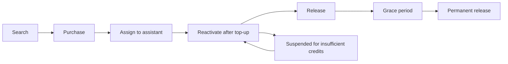

## Assistenten mit dem Telefonnetz verbinden

Talkturo verbindet KI-Sprachassistenten über carrier-gestützte Telefonieanbieter mit echten Telefonnetzen. Telefonnummern bilden die Brücke zwischen Ihren Assistenten und dem öffentlichen Telefonsystem. Deshalb verwalten Sie sie auf Workspace-Ebene, bevor Sie sie einzelnen Assistenten zuweisen.

<Callout kind="info">

Die Verfügbarkeit von Telefonie, Nummerntypen und regulatorische Anforderungen unterscheiden sich je nach Land.

</Callout>

## Einen Telefonie-Anbieter wählen

Talkturo unterstützt verwaltete Telefonie über Telnyx und Twilio und kann auch mit Ihrem eigenen verbundenen Telefonie-Konto arbeiten.

| Anbieter | Rolle in Talkturo | Am besten geeignet für | Hinweise |
|---|---|---|---|
| Telnyx | Primärer Anbieter für SIP-Trunking, Nummernkauf und regulatorische Compliance-Workflows | Die meisten Workspaces mit verwalteter Telefonie | Unterstützt Nummernkauf, SIP-Trunking und Regulatory Bundles |
| Twilio | Sekundärer Anbieter für Nummernkauf und SIP-Trunking | Teams, die Twilio bevorzugen | Wird als alternativer verwalteter Carrier verwendet |
| Bring your own account | Verbinden Sie Ihr eigenes Telefonie-Konto | Teams mit bestehenden Carrier-Verträgen | Kaufverhalten, Abrechnung und Trial-Berechtigung können abweichen |

### Verwaltete Konten und Bring your own account

Ein verwaltetes Konto hält Suche, Kauf und Zuweisung von Telefonnummern innerhalb von Talkturo. Bring your own account ist besser geeignet, wenn Sie bereits Ihr eigenes Carrier-Konto betreiben.

## Telefonnummern suchen und kaufen

Unterstützte Filter für die Nummernsuche sind:

- **Land** für den Markt, in dem Sie eine Nummer benötigen
- **Vorwahl** wenn Sie in einer bestimmten Region lokal präsent sein möchten
- **Nummerntyp** wie local, toll-free oder mobile

Nachdem Sie eine Nummer gefunden haben, können Sie sie für den aktuellen Workspace kaufen. Neue Nummern in verwalteten Konten enthalten eine 14-tägige kostenlose Testphase.

### Nummerntypen

- **Local**-Nummern helfen Ihnen, in einer Stadt oder Region geografische Präsenz aufzubauen.
- **Toll-free**-Nummern eignen sich gut für einen breiten eingehenden Zugang.
- **Mobile**-Nummern können in einigen Märkten verfügbar sein.

## Nummern Assistenten zuweisen

Die Zuweisung einer Telefonnummer steuert, ob der Assistent diese Telefoniekonfiguration verwenden kann für:

- **Inbound calling**, damit der Assistent eingehende Anrufe beantwortet
- **Outbound calling**, damit der Assistent ausgehende Anrufe tätigt
- **Regionale Verarbeitung**, damit Talkturo Anrufe über das ausgewählte SIP-Zielland routet

### Destination countries for outbound handling

| Country code | Country |
|---|---|
| US | United States |
| GB | United Kingdom |
| DE | Germany |
| FR | France |
| AU | Australia |
| BR | Brazil |
| CH | Switzerland |
| IL | Israel |
| IN | India |
| JP | Japan |
| SA | Saudi Arabia |
| SG | Singapore |
| AE | United Arab Emirates |
| ZA | South Africa |

## Telefonie für einen Assistenten konfigurieren

### Eingehende Einstellungen

<ParamField body="inbound calling" param-type="boolean" required="false" show-location="false">
Aktivieren Sie diese Einstellung, damit der Assistent eingehende Anrufe beantworten kann.
</ParamField>

<ParamField body="inbound company selection" param-type="string" required="false" show-location="false">
Wählen Sie das Unternehmen oder die Telefonie-Entität aus, die der Assistent für eingehende Anrufe verwenden soll.
</ParamField>

### Ausgehende Einstellungen

<ParamField body="outbound calling" param-type="boolean" required="false" show-location="false">
Aktivieren Sie diese Einstellung, damit der Assistent ausgehende Anrufe tätigen kann.
</ParamField>

<ParamField body="destination country" param-type="string" required="false" show-location="false" enum="US,GB,DE,FR,AU,BR,CH,IL,IN,JP,SA,SG,AE,ZA">
Wählen Sie das LiveKit SIP trunk destination country aus, das für die Verarbeitung ausgehender Anrufe verwendet wird.
</ParamField>

<ParamField body="test call" param-type="action" required="false" show-location="false">
Führen Sie einen ausgehenden Testanruf aus, um zu prüfen, ob Assistent, Routing und Telefonkonfiguration wie erwartet funktionieren.
</ParamField>

### Voicemail-Erkennung

<ParamField body="voicemail detection" param-type="boolean" required="false" show-location="false">
Standardmäßig aktiviert. Erkennt, wenn ein ausgehender Anruf bei einer Voicemail landet.
</ParamField>

<ParamField body="voicemail action" param-type="string" required="false" show-location="false" enum="leave message,hang up">
Wählen Sie aus, ob der Assistent eine Voicemail-Nachricht hinterlässt oder auflegt, wenn Voicemail erkannt wird.
</ParamField>

### Einstellungen für die Anbieteranbindung

<ParamField body="SIP trunk or FQDN connection" param-type="string" required="false" show-location="false">
Wählen Sie die SIP trunk oder FQDN connection aus, die der Assistent verwendet. Verfügbar für Telnyx-basierte Kontokonfigurationen.
</ParamField>

## Compliance- und KYC-Anforderungen erfüllen

<Callout kind="alert">

In bestimmten Regionen ist eine regulatorische Compliance-Prüfung erforderlich, bevor Sie Telefonnummern kaufen oder verwenden können.

</Callout>

### KYC und regulierte Märkte

Know Your Customer-Prüfungen sind in einigen regulierten Märkten für den Kauf von Telefonnummern erforderlich.

### Regulatory Bundles und Verlängerung

Talkturo unterstützt die Verwaltung von Regulatory Bundles für Märkte, die fortlaufende Compliance-Nachweise erfordern.

### Compliance-Hinweise bei Assistenten

<ParamField body="compliance briefing enabled" param-type="boolean" required="false" show-location="false">
Schaltet das Verhalten für Compliance-Hinweise beim Assistenten ein oder aus.
</ParamField>

<ParamField body="template" param-type="string" required="false" show-location="false">
Wählen Sie eine Disclosure-Vorlage aus, wenn Ihr Workspace standardisierte Compliance-Sprache verwendet.
</ParamField>

<ParamField body="custom text" param-type="string" required="false" show-location="false">
Geben Sie assistentenspezifischen Disclosure-Text an.
</ParamField>

<ParamField body="require acknowledgement" param-type="boolean" required="false" show-location="false">
Verlangen Sie, dass die angerufene Partei die Disclosure bestätigt, bevor der Assistent fortfährt.
</ParamField>

<ParamField body="fallback policy" param-type="string" required="false" show-location="false" enum="continue,retry,block">
Legen Sie fest, wie sich der Assistent verhält, wenn der Compliance-Hinweis nicht erfolgreich abgeschlossen werden kann.
</ParamField>

<Callout kind="danger">

Compliance-Anforderungen sind von der jeweiligen Rechtsordnung abhängig. Prüfen Sie Ihre Anrufflüsse gemeinsam mit Ihrem Rechts- oder Compliance-Team, bevor Sie in einem regulierten Markt live gehen.

</Callout>

## Den Lebenszyklus von Telefonnummern verfolgen

### Suche

### Kauf

### Zuweisung an einen Assistenten

### Aktive Nutzung

### Sperrung und Reaktivierung

### Freigabe und Schonfrist

<Callout kind="info">

Eine freigegebene Nummer ist nicht immer sofort endgültig weg. Die Schonfrist schützt vor versehentlicher Freigabe.

</Callout>

## Ihre Einrichtung planen

<Steps>
  <Step title="Telefoniemodell wählen" icon="settings">

  Entscheiden Sie, ob Sie eine verwaltete Anbieter-Konfiguration oder Bring your own account verwenden möchten.

  </Step>
  <Step title="Nummern für jeden Markt kaufen" icon="phone">

  Suchen Sie nach Land, Vorwahl und Nummerntyp.

  </Step>
  <Step title="Nummern Assistenten zuweisen" icon="users">

  Verbinden Sie jede Nummer mit dem Assistenten, der damit Anrufe annehmen oder tätigen soll.

  </Step>
  <Step title="Routing und Voicemail-Verhalten testen" icon="play-circle">

  Führen Sie vor dem Start einer Kampagne einen Testanruf aus.

  </Step>
</Steps>

## Verwandte Seiten

<Columns cols={2}>
  <Card title="Assistentenkonfiguration" href="/assistants/configuration" icon="settings" cta="Anleitung öffnen" />
  <Card title="Abrechnung" href="/billing" icon="credit-card" cta="Credits prüfen" />
</Columns>