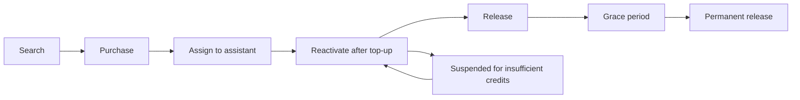

## Verbinde Assistenten mit dem Telefonnetz

Talkturo verbindet AI-Sprachassistenten über carrier-gestützte Telefonieanbieter mit echten Telefonnetzen. Telefonnummern sind die Brücke zwischen deinen Assistenten und dem öffentlichen Telefonsystem. Deshalb verwaltest du sie auf Workspace-Ebene, bevor du sie einzelnen Assistenten zuweist.

Innerhalb jedes Workspace kannst du nach verfügbaren Nummern suchen, sie kaufen, Assistenten zuweisen und wieder freigeben, wenn du sie nicht mehr brauchst. Du steuerst außerdem, ob ein Assistent eingehende Anrufe annehmen, ausgehende Anrufe tätigen darf und welche Telefonie-Region diese Anrufe verarbeitet.

<Callout kind="info">

Die Verfügbarkeit von Telefonie, Nummerntypen und regulatorische Anforderungen unterscheiden sich je nach Land. Eine Nummer, die in einer Region oder für einen Kontotyp verfügbar ist, ist in einer anderen möglicherweise nicht verfügbar.

</Callout>

## Wähle einen Telefonieanbieter

Talkturo unterstützt verwaltete Telefonie über Telnyx und Twilio und kann auch mit deinem eigenen verbundenen Telefonie-Konto arbeiten. Telnyx ist der primäre Anbieter für Nummernkauf, SIP-Trunking und Compliance-Workflows.

| Anbieter | Rolle in Talkturo | Am besten geeignet für | Hinweise |
|---|---|---|---|
| Telnyx | Primärer Anbieter für SIP-Trunking, Nummernkauf und regulatorische Compliance-Workflows | Die meisten Workspaces mit verwalteter Telefonie | Unterstützt Nummernkauf, SIP-Trunking, Regulatory Bundles und Verbindungsoptionen auf Kontoebene |
| Twilio | Sekundärer Anbieter für Nummernkauf und SIP-Trunking | Teams, die Twilio als alternativen Carrier bevorzugen | Wird als alternativer verwalteter Carrier für die Telefonie-Infrastruktur verwendet |
| Bring your own account | Verbinde dein eigenes Telefonie-Konto, statt ein verwaltetes Konto zu nutzen | Teams mit bestehenden Carrier-Verträgen oder individuellen Telefonieanforderungen | Kaufverhalten, Abrechnung und Trial-Berechtigung können sich von verwalteten Konten unterscheiden |

### Verwaltete Konten und Bring your own account

Ein verwaltetes Konto hält Telefonsuche, Kauf und Zuweisung innerhalb von Talkturo. Das ist die einfachste Einrichtung, wenn Talkturo den zentralen Telefonie-Workflow für deinen Workspace übernehmen soll.

Bring your own account ist besser geeignet, wenn du bereits ein eigenes Carrier-Konto betreibst und Talkturo diese bestehende Einrichtung verwenden soll. In diesem Modell gelten einige Vorteile verwalteter Konten, einschließlich des Trial-Verhaltens für neue Nummern, nicht.

## Suche nach Telefonnummern und kaufe sie

Die Verwaltung von Telefonnummern beginnt mit der Suche. Du kannst nach verfügbaren Nummern nach Land, Vorwahl und Nummerntyp suchen, damit deine Abdeckung und Anruferidentität zu den Märkten passen, die du bedienst.

Unterstützte Suchfilter für Telefonnummern sind:

- **Land** für den Markt, in dem du eine Nummer brauchst
- **Vorwahl**, wenn du eine lokale Präsenz in einer bestimmten Region willst
- **Nummerntyp** wie lokal, gebührenfrei oder mobil

Nachdem du eine Nummer gefunden hast, kannst du sie in den aktuellen Workspace kaufen und für die Zuweisung an Assistenten verfügbar machen. Neue Nummern in verwalteten Konten enthalten einen kostenlosen 14-tägigen Trial, während Nummern aus Bring-your-own-account-Setups diesen Vorteil nicht haben.

<Callout kind="tip">

Telefonnummern verbrauchen nach dem Kauf monatlich Guthaben. Prüfe aktive Nummern regelmäßig, damit du kein ungenutztes Inventar in deinem Workspace behältst.

</Callout>

### Nummerntypen

Welcher Nummerntyp am besten passt, hängt davon ab, wie deine Kunden mit deinem Assistenten interagieren sollen.

- **Lokale** Nummern helfen dir, in einer Stadt oder Region eine geografische Präsenz aufzubauen.
- **Gebührenfreie** Nummern eignen sich gut für breiten eingehenden Zugang, wenn die lokale Identität weniger wichtig ist.
- **Mobile** Nummern können in einigen Märkten für Workflows verfügbar sein, die eine mobilartige Nummernpräsenz brauchen.

## Weise Nummern Assistenten zu

Jeder Assistent kann eine oder mehrere Telefonnummern haben. So kannst du verschiedene Kampagnen, Regionen oder Anrufflüsse unterstützen, ohne für jede Nummer einen separaten Assistenten zu erstellen.

Eine Telefonnummernzuweisung steuert, ob der Assistent diese Telefonie-Konfiguration verwenden kann für:

- **Eingehende Anrufe**, damit der Assistent eingehende Anrufe beantwortet
- **Ausgehende Anrufe**, damit der Assistent ausgehende Anrufe tätigen kann
- **Regionale Verarbeitung**, damit Talkturo Anrufe über das ausgewählte SIP-Zielland weiterleitet

### Zielländer für die ausgehende Verarbeitung

Wenn du ausgehende Anrufe aktivierst, wählst du die Verarbeitungsregion, die als Zielland für den LiveKit-SIP-Trunk dient.

| Ländercode | Land |
|---|---|
| US | Vereinigte Staaten |
| GB | Vereinigtes Königreich |
| DE | Deutschland |
| FR | Frankreich |
| AU | Australien |
| BR | Brasilien |
| CH | Schweiz |
| IL | Israel |
| IN | Indien |
| JP | Japan |
| SA | Saudi-Arabien |
| SG | Singapur |
| AE | Vereinigte Arabische Emirate |
| ZA | Südafrika |

<Callout kind="info">

Wähle das Zielland, das zu der Telefonie-Region passt, die du für ausgehende Anrufe verwenden willst. Die Länderauswahl beeinflusst, wie Anrufe weitergeleitet werden und welche Telefonie-Ressourcen der Assistent verwendet.

</Callout>

## Konfiguriere Telefonie für einen Assistenten

Die Telefonieeinstellungen eines Assistenten steuern, wie sich ein Assistent verhält, sobald in deinem Workspace Nummern verfügbar sind. Diese Einstellungen kombinieren Nummernzuweisung, Routing, Voicemail-Verhalten und anbieterspezifische Verbindungsoptionen.

### Einstellungen für eingehende Anrufe

Verwende die Einstellungen für eingehende Anrufe, wenn ein Assistent Anrufe von gekauften oder zugewiesenen Nummern empfangen soll.

<ParamField body="inbound calling" param-type="boolean" required="false" show-location="false">
Aktiviere diese Einstellung, damit der Assistent eingehende Anrufe beantworten kann.
</ParamField>

<ParamField body="inbound company selection" param-type="string" required="false" show-location="false">
Wähle das Unternehmen oder die Telefonie-Entität aus, die der Assistent für eingehende Anrufe verwenden soll, wenn diese Auswahl in deinem Workspace verfügbar ist.
</ParamField>

### Einstellungen für ausgehende Anrufe

Verwende die Einstellungen für ausgehende Anrufe, wenn ein Assistent Anrufe bei Interessenten oder Kunden tätigen soll.

<ParamField body="outbound calling" param-type="boolean" required="false" show-location="false">
Aktiviere diese Einstellung, damit der Assistent ausgehende Anrufe tätigen kann.
</ParamField>

<ParamField body="destination country" param-type="string" required="false" show-location="false" enum="US,GB,DE,FR,AU,BR,CH,IL,IN,JP,SA,SG,AE,ZA">
Wähle das Zielland des LiveKit-SIP-Trunks aus, das zur Verarbeitung ausgehender Anrufe verwendet wird.
</ParamField>

<ParamField body="test call" param-type="action" required="false" show-location="false">
Führe einen ausgehenden Testanruf aus, um zu prüfen, dass Assistent, Routing und Telefonkonfiguration wie erwartet funktionieren, bevor du den Assistenten in Produktion verwendest.
</ParamField>

### Voicemail-Erkennung

Die Voicemail-Erkennung ist für ausgehende Anrufe standardmäßig aktiviert. Sie hilft dem Assistenten zu entscheiden, was zu tun ist, wenn ein Anruf bei einem Anrufbeantworter statt bei einer echten Person landet.

<ParamField body="voicemail detection" param-type="boolean" required="false" show-location="false">
Standardmäßig aktiviert. Erkennt, wenn ein ausgehender Anruf bei einer Voicemail landet.
</ParamField>

<ParamField body="voicemail action" param-type="string" required="false" show-location="false" enum="leave message,hang up">
Lege fest, ob der Assistent eine Voicemail-Nachricht hinterlässt oder auflegt, wenn Voicemail erkannt wird.
</ParamField>

### Einstellungen für die Anbieter-Verbindung

Einige Telefonieeinstellungen hängen vom Anbieter-Konto ab, das mit deinem Workspace verbunden ist.

<ParamField body="SIP trunk or FQDN connection" param-type="string" required="false" show-location="false">
Wähle die SIP-Trunk- oder FQDN-Verbindung aus, die der Assistent verwendet. Diese Option ist für Telnyx-basierte Kontokonfigurationen verfügbar.
</ParamField>

## Erfülle Compliance- und KYC-Anforderungen

Telefonie-Regeln hängen von den Ländern ab, in denen du Nummern kaufst und Anrufe tätigst. In einigen Regionen sind Identitätsprüfung, Regulatory Bundles oder bestimmte Anrufhinweise erforderlich, bevor eine Nummer aktiviert und verwendet werden kann.

<Callout kind="alert">

In bestimmten Regionen musst du die regulatorische Compliance-Prüfung abschließen, bevor du Telefonnummern kaufen oder verwenden kannst. Wenn ein Markt reguliert ist, schließe die erforderlichen Verifizierungsschritte ab, bevor du davon ausgehst, dass Nummern nutzbar werden.

</Callout>

### KYC und regulierte Märkte

KYC-Verifizierung ist in einigen regulierten Märkten für den Kauf von Telefonnummern erforderlich. Diese Verifizierung gilt typischerweise dann, wenn lokale Telekommunikationsregeln einen Nachweis über Unternehmensidentität, Adresse oder Verwendungszweck verlangen.

Wenn ein Kauf blockiert oder verzögert wird, ist die häufigste Ursache unvollständige Compliance-Information für die Zielregion. Schließe zuerst die erforderlichen KYC- oder Regulatory-Bundle-Schritte ab und versuche den Kauf dann erneut.

### Regulatory Bundles und Verlängerung

Talkturo unterstützt die Verwaltung von Regulatory Bundles für Märkte, die fortlaufende Compliance-Nachweise verlangen. Diese Bundles können sich automatisch verlängern, damit bestehende Nummern ohne manuellen Aufwand bei jedem Verlängerungszyklus nutzbar bleiben.

Diese Automatisierung verringert das Risiko, dass eine Nummer unbrauchbar wird, weil ein erforderliches Bundle abgelaufen ist. Du solltest den Compliance-Status trotzdem prüfen, wenn du in einen neuen Markt expandierst.

### Compliance-Briefings in Assistenten

Assistenten können vor oder während eines Anrufflusses ein Compliance-Briefing enthalten, wenn Offenlegungen erforderlich sind. Mit diesen Einstellungen standardisierst du rechtlich erforderliche Formulierungen über mehrere Assistenten hinweg.

<ParamField body="compliance briefing enabled" param-type="boolean" required="false" show-location="false">
Schaltet das Verhalten für das Compliance-Briefing des Assistenten ein oder aus.
</ParamField>

<ParamField body="template" param-type="string" required="false" show-location="false">
Wähle eine Offenlegungsvorlage aus, wenn dein Workspace standardisierte Compliance-Sprache für regulierte Anrufe verwendet.
</ParamField>

<ParamField body="custom text" param-type="string" required="false" show-location="false">
Gib assistentenspezifischen Offenlegungstext an, wenn die Standardvorlage nicht zum Anruffluss passt.
</ParamField>

<ParamField body="require acknowledgement" param-type="boolean" required="false" show-location="false">
Verlange, dass die angerufene Partei die Offenlegung bestätigt, bevor der Assistent fortfährt.
</ParamField>

<ParamField body="fallback policy" param-type="string" required="false" show-location="false" enum="continue,retry,block">
Lege fest, wie sich der Assistent verhält, wenn das Compliance-Briefing nicht erfolgreich abgeschlossen werden kann.
</ParamField>

<Callout kind="danger">

Compliance-Anforderungen sind je nach Rechtsraum unterschiedlich. Prüfe deine Anrufflüsse, Offenlegungstexte und Bestätigungsanforderungen gemeinsam mit deinem Rechts- oder Compliance-Team, bevor du in einem regulierten Markt live gehst.

</Callout>

## Verstehe den Lebenszyklus einer Telefonnummer

Telefonnummern durchlaufen in Talkturo einen vorhersehbaren Lebenszyklus. Wenn du diesen Lebenszyklus verstehst, kannst du Kosten besser steuern, Unterbrechungen vermeiden und ungenutzte Nummern sicher freigeben.

### Suche

Beginne mit der Suche nach einer Nummer, die zu deinem Zielland, deiner Vorwahl und deinem gewünschten Nummerntyp passt. Die Verfügbarkeit hängt vom Bestand des Anbieters und von regionalen Vorschriften ab.

### Kauf

Kaufe die ausgewählte Nummer in den Workspace. In verwalteten Konten beginnen berechtigte neue Nummern mit einem kostenlosen 14-tägigen Trial, aber der Verbrauch von monatlichem Guthaben bleibt wichtig, sobald der Trial endet.

### Zuweisung an einen Assistenten

Nach dem Kauf weist du die Nummer je nach Design deines Anrufflusses einem oder mehreren Assistenten zu. Bei der Zuweisung legst du auch fest, ob der Assistent die Nummer für eingehende, ausgehende oder beide Arten von Anrufen verwendet.

### Aktive Nutzung

Eine aktive Nummer steht für Live-Telefonie mit eingehenden und ausgehenden Anrufen entsprechend der Assistentenkonfiguration zur Verfügung. In dieser Phase solltest du Nutzung und Workspace-Guthaben überwachen, damit aktive Nummern nicht unterbrochen werden.

### Sperrung und Reaktivierung

Wenn im Workspace nicht genug Guthaben verfügbar ist, können Nummern gesperrt werden. Gesperrte Nummern können wieder in Betrieb genommen werden, nachdem du den Workspace aufgeladen und den Guthabenmangel behoben hast.

### Freigabe und Schonfrist

Wenn du eine Nummer nicht mehr brauchst, gib sie frei, statt sie unbegrenzt aktiv zu lassen. Freigegebene Nummern wechseln in eine Schonfrist, bevor sie dauerhaft aufgegeben werden. Das gibt dir ein kurzes Zeitfenster, um einen versehentlichen Verlust zu vermeiden.

<Callout kind="info">

Eine freigegebene Nummer ist nicht immer sofort weg. Die Schonfrist schützt vor versehentlicher Freigabe, aber sobald die dauerhafte Freigabe erfolgt ist, solltest du davon ausgehen, dass die Nummer möglicherweise nicht mehr wiederhergestellt werden kann.

</Callout>

## Plane deine Einrichtung

Eine praktische Telefonie-Einrichtung folgt meist demselben Muster: Wähle ein Anbietermodell, kaufe die benötigten Nummern für jede Region, weise sie Assistenten zu und validiere dann das Verhalten für eingehende und ausgehende Anrufe mit Testanrufen.

<Steps>
  <Step title="Wähle dein Telefonie-Modell" icon="settings">

  Entscheide, ob du eine verwaltete Anbieter-Einrichtung oder Bring your own account verwenden willst. Verwaltete Konten halten Nummernkauf und Compliance-Workflows innerhalb von Talkturo.

  </Step>
  <Step title="Kaufe Nummern für jeden Markt" icon="phone">

  Suche nach Land, Vorwahl und Nummerntyp und kaufe dann die Nummern, die zu deinem Abdeckungsplan passen. Wenn du in regulierten Märkten arbeitest, schließe die Compliance-Schritte vor dem Kauf ab.

  </Step>
  <Step title="Weise Nummern Assistenten zu" icon="users">

  Verbinde jede Nummer mit dem Assistenten, der damit Anrufe annehmen oder tätigen soll. Aktiviere eingehende, ausgehende oder beide Arten von Anrufen abhängig vom Workflow, den du aufbaust.

  </Step>
  <Step title="Teste Routing und Voicemail-Verhalten" icon="play-circle">

  Führe vor dem Start einer Kampagne einen Testanruf aus. Bestätige, dass ausgehendes Routing, das Annehmen eingehender Anrufe, Voicemail-Erkennung und jedes Compliance-Briefing wie erwartet funktionieren.

  </Step>
</Steps>

## Verwandte Seiten

<Columns cols={2}>
  <Card
    title="Assistentenkonfiguration"
    href="/assistants/configuration"
    icon="settings"
    cta="Anleitung öffnen"
  />
  <Card
    title="Abrechnung"
    href="/billing"
    icon="credit-card"
    cta="Guthaben prüfen"
  />
</Columns>