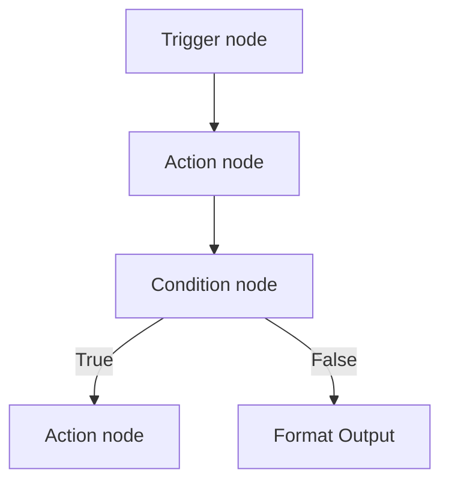

## Erstelle Automatisierungen auf einem visuellen Canvas

TurboFlow ist Talkturos Workflow-Automatisierungs-Engine, mit der du Sprachassistenten mit externen Diensten verbindest. Du baust Flows auf einem Drag-and-drop-Canvas, veröffentlichst sie, wenn sie bereit sind, und führst sie über Webhooks, Integrationsereignisse oder Live-Unterhaltungen mit Assistenten aus.

Ein TurboFlow-Flow beginnt mit einem Trigger und läuft dann durch Action- und Logic-Nodes weiter. Jeder Node empfängt Daten aus früheren Schritten, verarbeitet sie und gibt die Ausgabe an den nächsten Teil des Flows weiter.

<Callout kind="info">

Veröffentlichte Flows sind aktiv. Nicht veröffentlichte Flows bleiben im Entwurfsmodus, damit du Struktur, Einstellungen und Ausdrücke ändern kannst, ohne den Produktivverkehr zu beeinflussen.

</Callout>

## So funktioniert TurboFlow

TurboFlow modelliert Automatisierung als Node-Graph. Du platzierst Nodes auf dem Canvas, verbindest sie über Kanten, konfigurierst jeden Node und testest den Flow dann mit Beispieldaten, bevor du ihn veröffentlichst.

Die Engine führt Nodes in Abhängigkeitsreihenfolge aus. Das bedeutet, dass TurboFlow immer zuerst vorgelagerte Eingaben auflöst, bevor nachgelagerte Schritte ausgeführt werden. Dadurch können spätere Nodes auf Ausgaben früherer Nodes über Ausdrucksvorlagen wie `{{trigger.body.email}}` oder `{{http_request.response.status}}` verweisen.

### Was du im Builder machst

- **Nodes hinzufügen** für Trigger, Actions und Logik
- **Nodes verbinden**, um die Ausführungsreihenfolge festzulegen
- **Einstellungen konfigurieren** für jeden Node
- **Daten zuordnen** mit `{{ }}`-Ausdrücken, die auf frühere Node-Ausgaben verweisen
- **Testläufe ausführen** für den Flow mit Beispiel-Payloads
- **Veröffentlichen**, damit der Flow aufrufbar wird

### Wo Flows starten können

TurboFlow unterstützt drei Einstiegspfade:

- **Externe Webhooks**, die an einen Flow-Endpunkt gesendet werden
- **Integrationsereignisse** aus verbundenen Diensten wie Cal.com, Calendly, Slack oder Meta Lead Ads
- **Tool-Aufrufe des Assistenten**, die von einem AI-Assistenten während einer Live-Unterhaltung ausgelöst werden

<Callout kind="tip">

Testläufe sind der schnellste Weg, um Ausdrücke, Verzweigungen und nachgelagerte Actions zu prüfen, bevor du einen Flow veröffentlichst.

</Callout>

## Verstehe die Flow-Struktur

Ein TurboFlow-Flow ist ein gerichteter azyklischer Graph, also ein DAG. In der Praxis bedeutet das, dass sich der Flow vorwärts durch verbundene Nodes bewegt und nicht auf zirkuläre Ausführung angewiesen ist.

### Jeder Flow beginnt mit genau einem Trigger

Jeder Flow hat genau einen Trigger-Node. Der Trigger ist der Einstiegspunkt für eingehende Daten und definiert, wie der Workflow beginnt.

Nach dem Trigger fügst du Action- und Logic-Nodes hinzu, um Daten zu transformieren, externe Systeme aufzurufen oder die Ausführung zu verzweigen. TurboFlow berechnet die Ausführungsreihenfolge aus dem Graph selbst und nicht aus der Position der Nodes auf dem Canvas.

### Die Ausführung folgt Abhängigkeiten, nicht dem Layout

TurboFlow verwendet eine topologische Sortierung, um die Ausführungsreihenfolge zu bestimmen. Wenn ein Node von der Ausgabe eines anderen Nodes abhängt, führt TurboFlow zuerst den vorgelagerten Node aus, auch wenn die Nodes auf dem Canvas anders angeordnet sind.

Dieses Modell hält Datenverweise vorhersagbar. Wenn du einen Ausdruck wie `{{condition.result}}` verwendest, weiß TurboFlow bereits, dass der Condition-Node abgeschlossen sein muss, bevor abhängige Nodes ausgeführt werden können.

### Condition-Nodes erzeugen aktive und inaktive Zweige

Condition-Nodes teilen den Graphen in True- und False-Pfade auf. Während der Ausführung bleibt nur der Pfad aktiv, der zur Bedingung passt.

Nachgelagerte Nodes auf dem nicht passenden Zweig werden übersprungen. Wenn eine Condition als false ausgewertet wird, wird jeder Node inaktiv, der ausschließlich vom True-Zweig abhängt.

## Node-Typen

TurboFlow gruppiert Nodes in drei Kategorien.

<Columns cols={3}>
  <Card title="Trigger-Nodes" href="/turboflow/triggers-actions" icon="zap" cta="Trigger-Details anzeigen">
    Starte einen Flow über einen Webhook, ein Integrationsereignis oder einen Tool-Aufruf des Assistenten.
  </Card>
  <Card title="Action-Nodes" href="/turboflow/triggers-actions" icon="play-circle" cta="Action-Details anzeigen">
    Sende Anfragen, aktualisiere Datensätze, rufe Kontakte an und forme Ausgaben für nachgelagerte Schritte.
  </Card>
  <Card title="Logic-Nodes" href="/turboflow/triggers-actions" icon="settings" cta="Logikdetails anzeigen">
    Werte Conditions aus und verzweige die Ausführung anhand von Vergleichen.
  </Card>
</Columns>

### Trigger-Nodes

- **`webhook_trigger`** — universeller Einstiegspunkt für externe Anfragen und Tool-Aufrufe des Assistenten
- **Integration-Trigger** — ereignisbasierte Trigger für verbundene Dienste wie Cal.com, Calendly, Slack und Meta

### Action-Nodes

- **HTTP request** — externe APIs aufrufen
- **Upsert CRM Contact** — einen Kontakt erstellen oder aktualisieren
- **Call Contact** — einen ausgehenden Kontaktanruf starten
- **Format Output** — Daten für nachgelagerte Schritte aufbereiten

### Logic-Nodes

- **Condition** — If- oder Else-Verzweigung mit Vergleichsoperatoren ausführen

## Integrationen und Verbindungen

TurboFlow verwendet Verbindungen auf Workspace-Ebene für OAuth-basierte Integrationen.

<Columns cols={3}>
  <Card title="Cal.com" href="/integrations" icon="calendar" cta="Integrationen anzeigen">
    Empfange Buchungsereignisse und führe Terminplanungs-Actions aus.
  </Card>
  <Card title="Calendly" href="/integrations" icon="calendar" cta="Integrationen anzeigen">
    Starte Flows aus Invitee-Ereignissen und erstelle Terminplanungs-Automatisierungen.
  </Card>
  <Card title="Gmail" href="/integrations" icon="mail" cta="Integrationen anzeigen">
    Sende E-Mails aus Workflow-Schritten.
  </Card>
  <Card title="HubSpot" href="/integrations" icon="database" cta="Integrationen anzeigen">
    Erstelle Kontakte und Deals aus Workflow-Daten.
  </Card>
  <Card title="Slack" href="/integrations" icon="messages-square" cta="Integrationen anzeigen">
    Sende Nachrichten und empfange ereignisbasierte Trigger.
  </Card>
  <Card title="Meta" href="/integrations" icon="users" cta="Integrationen anzeigen">
    Löse Flows aus Facebook- und Instagram-Lead-Ads aus.
  </Card>
</Columns>

## Erstelle mit Robert AI Assistant

Robert ist der AI-Assistent, der in den Workflow-Builder integriert ist. Du beschreibst die Automatisierung in natürlicher Sprache, und Robert hilft dir, diese Anforderung in Flow-Schritte zu übersetzen.

## Bewahre Zugangsdaten im Secrets Manager auf

Secrets Manager speichert verschlüsselte Zugangsdaten auf Workspace-Ebene. TurboFlow verwendet diese Secrets für HTTP request-Nodes und Integrationsverbindungen.

<Callout kind="alert">

Platziere keine rohen API-Schlüssel direkt in Ausdrücken oder Node-Textfeldern, wenn ein Secret oder eine verwaltete Verbindung verfügbar ist.

</Callout>

## Hänge Flows an Assistenten an

Veröffentlichte Flows können als aufrufbare Tools an Assistenten angehängt werden.

<Callout kind="success">

Verwende mit Assistenten verbundene Flows, wenn der Assistent in Echtzeit Daten abrufen oder eine Action ausführen muss.

</Callout>

## Kenne die Flow-Limits

| Limit | Wert |
|---|---:|
| Maximale Nodes pro Flow | 100 |
| Maximale Kanten pro Flow | 200 |
| Maximale Schleifeniterationen | 100 |
| Maximale Graph-Tiefe | 50 |

## Verwandte Seiten

<Columns cols={3}>
  <Card title="Trigger und Actions" href="/turboflow/triggers-actions" icon="code" cta="Referenz öffnen" />
  <Card title="Integrationen" href="/integrations" icon="cloud" cta="Verbindungen verwalten" />
  <Card title="Assistenten-Konfiguration" href="/assistants/configuration" icon="settings" cta="Assistenten konfigurieren" />
</Columns>