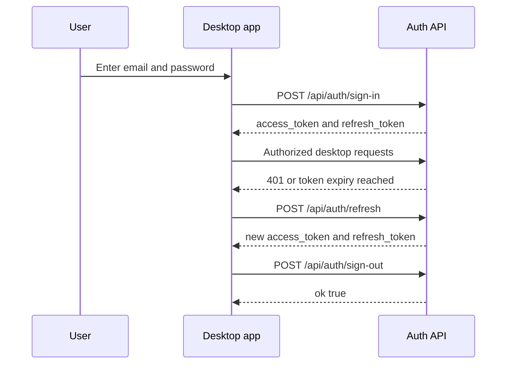

## Authenticate desktop clients

Use the desktop auth endpoints to sign users in, create accounts, refresh expired access tokens, and revoke sessions. These routes are designed for the Close AI desktop app and any client that authenticates with Supabase JWTs instead of browser cookies.

<Callout kind="info">

All desktop auth routes support `OPTIONS` preflight requests and return permissive CORS headers, including `Access-Control-Allow-Origin: *`. Every API response uses the same envelope shape: `success` plus either `data` or `error`.

</Callout>

## Endpoint summary

| Method | Path | Auth | Purpose |
| --- | --- | --- | --- |
| `POST` | `/api/auth/sign-in` | None | Exchange an email and password for session tokens |
| `POST` | `/api/auth/sign-up` | None | Create a new account and optionally return a session |
| `POST` | `/api/auth/sign-out` | Bearer JWT | Revoke the current user's refresh tokens globally |
| `POST` | `/api/auth/refresh` | None | Exchange a refresh token for a new token pair |
| `GET` | `/api/auth/callback` | Browser flow | OAuth callback handler |
| `GET` | `/api/auth/confirm` | Browser flow | Email confirmation handler |

## Authentication model

Desktop clients authenticate by sending a Supabase access token in the `Authorization` header as a Bearer token. After sign-in or refresh, store both the `access_token` and `refresh_token`, then use the access token on protected desktop routes.

`POST /api/auth/sign-out` performs a global sign-out. That invalidates all refresh tokens for the user, not only the token held by the current device.

## POST /api/auth/sign-in

Exchange an email address and password for a Supabase session token pair.

### Request example

<Request tabs="cURL,JavaScript" default-tab="1">
```bash
curl -X POST "https://api.talkturo.com/api/auth/sign-in" \
  -H "Content-Type: application/json" \
  -d '{
    "email": "jane.chen@acme.co",
    "password": "DeskPass_73A9"
  }'
```

```javascript
const response = await fetch("https://api.talkturo.com/api/auth/sign-in", {
  method: "POST",
  headers: {
    "Content-Type": "application/json"
  },
  body: JSON.stringify({
    email: "jane.chen@acme.co",
    password: "DeskPass_73A9"
  })
});

const result = await response.json();
console.log(result);
```
</Request>

<Response tabs="200,401" default-tab="1">
```json
{
  "success": true,
  "data": {
    "access_token": "eyJhbGciOiJIUzI1NiIsInR5cCI6IkpXVCJ9.desktop_example_access",
    "refresh_token": "refresh_example_q9K2mL7xP4vN8cR1",
    "expires_in": 3600,
    "expires_at": 1735693200,
    "token_type": "bearer",
    "user": {
      "id": "9f3b6e2a-4d85-4d62-95de-f2ec7e4ac8b1",
      "email": "jane.chen@acme.co",
      "user_metadata": {
        "full_name": "Jane Chen"
      }
    }
  }
}
```

```json
{
  "success": false,
  "error": "Invalid login credentials"
}
```
</Response>

### Body parameters

<ParamField body="email" param-type="string" required="true">
Email address for the account.
</ParamField>

<ParamField body="password" param-type="string" required="true">
Password for the account.
</ParamField>

### Success response fields

<ResponseField name="success" field-type="boolean" required="true">
Returns `true` when the request succeeds.
</ResponseField>

<ResponseField name="data.access_token" field-type="string" required="true">
Short-lived JWT used in the `Authorization` header for authenticated desktop requests.
</ResponseField>

<ResponseField name="data.refresh_token" field-type="string" required="true">
Longer-lived token used to obtain a new access token from `/api/auth/refresh`.
</ResponseField>

<ResponseField name="data.expires_in" field-type="integer" required="true">
Lifetime of the access token in seconds.
</ResponseField>

<ResponseField name="data.expires_at" field-type="integer" required="true">
Unix timestamp when the access token expires.
</ResponseField>

<ResponseField name="data.token_type" field-type="string" required="true">
Token type returned by Supabase. This is typically `bearer`.
</ResponseField>

<ResponseField name="data.user" field-type="object" required="true">
Authenticated user record associated with the token pair.
</ResponseField>

<ResponseField name="data.user.id" field-type="string" required="true">
Unique user identifier.
</ResponseField>

<ResponseField name="data.user.email" field-type="string" required="true">
Email address on the authenticated account.
</ResponseField>

<ResponseField name="data.user.user_metadata" field-type="object" required="true">
User metadata returned by Supabase.
</ResponseField>

### Error response fields

<ResponseField name="success" field-type="boolean" required="true">
Returns `false` when authentication fails.
</ResponseField>

<ResponseField name="error" field-type="string" required="true">
Human-readable error message. Invalid credentials return HTTP `401`.
</ResponseField>

## POST /api/auth/sign-up

Create a new account with an email address and password. Depending on your Supabase project settings, the endpoint either returns a full session immediately or returns a user object with `needs_email_confirm` set to `true`.

### Body parameters

<ParamField body="email" param-type="string" required="true">
Email address for the new account.
</ParamField>

<ParamField body="password" param-type="string" required="true">
Password for the new account.
</ParamField>

### Response behavior

If email confirmation is not required, the response includes the same token fields returned by sign-in plus `needs_email_confirm: false`.

If email confirmation is required, the response includes `needs_email_confirm: true` and a `user` object, but no active session tokens yet.

### Success response fields

<ResponseField name="success" field-type="boolean" required="true">
Returns `true` when the account is created successfully.
</ResponseField>

<ResponseField name="data.needs_email_confirm" field-type="boolean" required="true">
Indicates whether the user must confirm their email before receiving or using a session.
</ResponseField>

<ResponseField name="data.access_token" field-type="string">
Returned when email confirmation is not required.
</ResponseField>

<ResponseField name="data.refresh_token" field-type="string">
Returned when email confirmation is not required.
</ResponseField>

<ResponseField name="data.expires_in" field-type="integer">
Returned when email confirmation is not required.
</ResponseField>

<ResponseField name="data.expires_at" field-type="integer">
Returned when email confirmation is not required.
</ResponseField>

<ResponseField name="data.token_type" field-type="string">
Returned when email confirmation is not required.
</ResponseField>

<ResponseField name="data.user" field-type="object" required="true">
Newly created user record.
</ResponseField>

<ResponseField name="data.user.id" field-type="string" required="true">
Unique user identifier.
</ResponseField>

<ResponseField name="data.user.email" field-type="string" required="true">
Email address on the new account.
</ResponseField>

<ResponseField name="data.user.user_metadata" field-type="object">
User metadata returned by Supabase, when present.
</ResponseField>

## POST /api/auth/sign-out

Revoke the current user's refresh tokens globally. Send the current access token as a Bearer token in the `Authorization` header.

<Callout kind="info">

This endpoint calls `supabase.auth.signOut()` with global scope. Signing out from one desktop client invalidates all refresh tokens for that user across devices.

</Callout>

### Headers

<ParamField header="Authorization" param-type="string" required="true">
Bearer access token in the form `Bearer eyJ...`.
</ParamField>

### Success response fields

<ResponseField name="success" field-type="boolean" required="true">
Returns `true` when sign-out completes.
</ResponseField>

<ResponseField name="data.ok" field-type="boolean" required="true">
Returns `true` after the global sign-out request succeeds.
</ResponseField>

## POST /api/auth/refresh

Exchange a refresh token for a new access token and refresh token pair. Use this endpoint when the current access token expires.

### Request example

<Request tabs="cURL,JavaScript" default-tab="1">
```bash
curl -X POST "https://api.talkturo.com/api/auth/refresh" \
  -H "Content-Type: application/json" \
  -d '{
    "refresh_token": "refresh_example_q9K2mL7xP4vN8cR1"
  }'
```

```javascript
const response = await fetch("https://api.talkturo.com/api/auth/refresh", {
  method: "POST",
  headers: {
    "Content-Type": "application/json"
  },
  body: JSON.stringify({
    refresh_token: "refresh_example_q9K2mL7xP4vN8cR1"
  })
});

const result = await response.json();
console.log(result);
```
</Request>

<Response tabs="200" default-tab="1">
```json
{
  "success": true,
  "data": {
    "access_token": "eyJhbGciOiJIUzI1NiIsInR5cCI6IkpXVCJ9.desktop_example_new_access",
    "refresh_token": "refresh_example_h3M8qT1vL6pW2nZ5",
    "expires_in": 3600,
    "expires_at": 1735696800,
    "token_type": "bearer",
    "user": {
      "id": "9f3b6e2a-4d85-4d62-95de-f2ec7e4ac8b1",
      "email": "jane.chen@acme.co",
      "user_metadata": {
        "full_name": "Jane Chen"
      }
    }
  }
}
```
</Response>

### Body parameters

<ParamField body="refresh_token" param-type="string" required="true">
Refresh token previously returned by sign-in or sign-up.
</ParamField>

### Success response fields

<ResponseField name="success" field-type="boolean" required="true">
Returns `true` when the token refresh succeeds.
</ResponseField>

<ResponseField name="data.access_token" field-type="string" required="true">
New access token for subsequent authenticated requests.
</ResponseField>

<ResponseField name="data.refresh_token" field-type="string" required="true">
New refresh token. Replace the previously stored refresh token after a successful refresh.
</ResponseField>

<ResponseField name="data.expires_in" field-type="integer" required="true">
Lifetime of the new access token in seconds.
</ResponseField>

<ResponseField name="data.expires_at" field-type="integer" required="true">
Unix timestamp when the new access token expires.
</ResponseField>

<ResponseField name="data.token_type" field-type="string" required="true">
Token type returned by Supabase.
</ResponseField>

<ResponseField name="data.user" field-type="object" required="true">
Authenticated user associated with the refreshed session.
</ResponseField>

## Browser handlers

Two related routes support browser-based auth flows. They are part of the auth system, but they are not token exchange endpoints for desktop clients.

### GET /api/auth/callback

Handles the Supabase OAuth callback in browser-based sign-in flows.

### GET /api/auth/confirm

Handles email confirmation after sign-up.

## Typical desktop token flow

Store the refresh token securely and treat the access token as short-lived. A typical desktop client flow looks like this:



## Implementation notes

Use the `Authorization` header only on endpoints that require an access token, such as sign-out and authenticated desktop routes. Sign-in, sign-up, and refresh all accept JSON request bodies and do not require an existing session.

When refresh succeeds, replace both stored tokens. The response may rotate the refresh token, so continuing to use the old refresh token can break later refresh attempts.