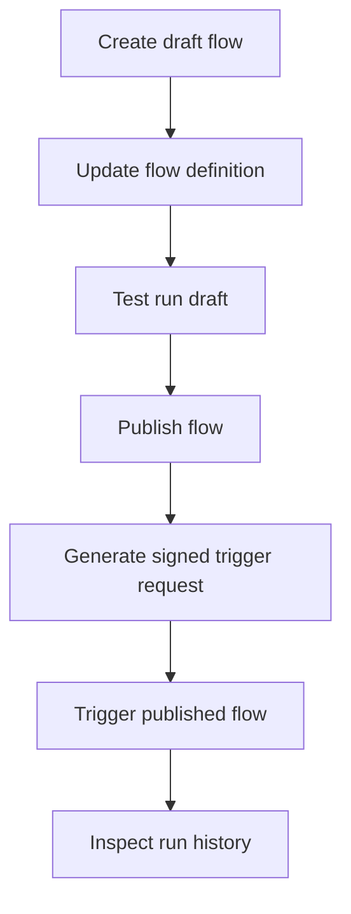

## TurboFlow endpoints

TurboFlow lets you create visual workflows, publish immutable versions, and trigger published flows from your app or voice assistant. Most endpoints use session cookie authentication from the Talkturo app, while the trigger endpoint uses HMAC authentication so external systems can invoke a published flow securely.

<Callout kind="alert">

`POST /api/flow/{flowId}/trigger` does **not** use session auth. Sign the raw request body with SHA-256 HMAC using the published flow version's `trigger_secret`, then send the digest in the `X-Talkturo-Secret` header.

</Callout>

<Callout kind="info">

Use **async mode** for production workloads that may run longer than a few seconds. Add `?sync=true` only when you need the final output inline and the flow can complete within about 30 seconds.

</Callout>

## Endpoint summary

| Method | Path | Auth | Purpose |
| --- | --- | --- | --- |
| GET | `/api/flow` | Session cookie | List flows |
| POST | `/api/flow` | Session cookie | Create a flow |
| GET | `/api/flow/manifest` | None (public) | Get connector manifest |
| GET | `/api/flow/{flowId}` | Session cookie | Get a flow |
| PATCH | `/api/flow/{flowId}` | Session cookie | Update a flow |
| DELETE | `/api/flow/{flowId}` | Session cookie | Archive a flow |
| POST | `/api/flow/{flowId}/publish` | Session cookie | Publish a new flow version |
| GET | `/api/flow/{flowId}/runs` | Session cookie | List flow runs |
| POST | `/api/flow/{flowId}/test-run` | Session cookie | Run a flow in test mode |
| POST | `/api/flow/{flowId}/test-run/node` | Session cookie | Run a single node in test mode |
| GET | `/api/flow/{flowId}/tool-schema` | Session cookie | Get tool schema for a flow |
| POST | `/api/flow/{flowId}/trigger` | HMAC | Trigger a published flow |
| GET | `/api/flow/{flowId}/webhook-test` | Session cookie | Get webhook test details |
| POST | `/api/flow/{flowId}/webhook-test` | Session cookie | Send a webhook test |
| GET | `/api/flow/integrations` | Session cookie | List integrations |
| POST | `/api/flow/integrations` | Session cookie | Connect an integration |
| DELETE | `/api/flow/integrations` | Session cookie | Disconnect an integration |
| GET | `/api/flow/integrations/{integrationId}` | Session cookie | Get an integration |
| DELETE | `/api/flow/integrations/{integrationId}` | Session cookie | Delete an integration |
| GET | `/api/flow/integrations/{integrationId}/options` | Session cookie | Get dynamic integration options |
| POST | `/api/flow/integrations/oauth/authorize` | Session cookie | Start OAuth authorization |
| GET | `/api/flow/integrations/oauth/callback` | OAuth state cookie | Complete OAuth authorization |
| POST | `/api/flow/integrations/webhooks/{provider}` | HMAC | Receive provider webhooks |
| GET | `/api/flow/integrations/webhooks/meta` | Meta verification | Verify Meta webhook |
| POST | `/api/flow/integrations/webhooks/meta` | HMAC | Receive Meta lead events |
| GET | `/api/flow/secrets` | Session cookie | List secrets |
| POST | `/api/flow/secrets` | Session cookie | Create a secret |
| DELETE | `/api/flow/secrets` | Session cookie | Delete a secret |
| GET | `/api/flow/secrets/{secretId}` | Session cookie | Get a secret |
| DELETE | `/api/flow/secrets/{secretId}` | Session cookie | Delete a secret by ID |
| GET | `/api/flow/secrets/providers` | Session cookie | List secret providers |
| GET | `/api/flow/tools` | Session cookie | List tools and connectors |
| GET | `/api/flow/ai/robert` | Session cookie | Open AI builder stream |
| POST | `/api/flow/ai/robert` | Session cookie | Send AI builder request |
| POST | `/api/flow/ai/robert-batch` | Session cookie | Send batch AI builder request |
| POST | `/api/flow/ai/describe-parameter` | Session cookie | Generate a parameter description |
| POST | `/api/flow/ai/describe-tool` | Session cookie | Generate a tool description |

## Authentication

Most TurboFlow endpoints are designed for in-product flow management. Call them from a browser session authenticated to Talkturo, or from a backend that can forward a valid session cookie.

### Session-authenticated endpoints

Use session auth for:

- Flow CRUD
- Publishing
- Test runs
- Run history
- Integrations
- Secrets
- Manifest and tools
- AI builder endpoints

If your request is not associated with a valid Talkturo session, these endpoints fail before business logic runs.

### HMAC-authenticated trigger endpoint

Use HMAC auth for `POST /api/flow/{flowId}/trigger`. This endpoint is meant for external callers and published runtime execution.

To build the signature:

<Steps>
  <Step title="Serialize the exact request body" icon="code">

  Create the JSON request body exactly as it will be sent over the wire. The signature must use the raw body bytes, not a re-serialized object.

  </Step>
  <Step title="Compute the SHA-256 HMAC digest" icon="shield">

  Use the published flow version's `trigger_secret` as the HMAC key and the raw request body as the message.

  </Step>
  <Step title="Send the digest in the header" icon="arrow-right">

  Add the computed digest to the `X-Talkturo-Secret` header, then send the request to `/api/flow/{flowId}/trigger`.

  </Step>
</Steps>

<CodeGroup tabs="Node.js,Python,cURL">

```javascript
import crypto from "crypto";

const flowId = "flow_72c9f2ab";
const triggerSecret = "tfsec_example_1k9n3d7s4h2m8q";
const body = JSON.stringify({
  params: {
    caller_name: "Jane Chen",
    booking_id: "bk_9d31a8f4",
    priority: "high"
  },
  context: {
    assistant_id: "asst_4f0c8b21"
  }
});

const signature = crypto
  .createHmac("sha256", triggerSecret)
  .update(body)
  .digest("hex");

const response = await fetch(
  `https://app.talkturo.com/api/flow/${flowId}/trigger?sync=true`,
  {
    method: "POST",
    headers: {
      "Content-Type": "application/json",
      "X-Talkturo-Secret": signature
    },
    body
  }
);

const data = await response.json();
console.log(response.status, data);
```

```python
import hashlib
import hmac
import json
import requests

flow_id = "flow_72c9f2ab"
trigger_secret = "tfsec_example_1k9n3d7s4h2m8q"

payload = {
    "params": {
        "caller_name": "Jane Chen",
        "booking_id": "bk_9d31a8f4",
        "priority": "high"
    },
    "context": {
        "assistant_id": "asst_4f0c8b21"
    }
}

body = json.dumps(payload, separators=(",", ":"))
signature = hmac.new(
    trigger_secret.encode("utf-8"),
    body.encode("utf-8"),
    hashlib.sha256
).hexdigest()

response = requests.post(
    f"https://app.talkturo.com/api/flow/{flow_id}/trigger?sync=true",
    headers={
        "Content-Type": "application/json",
        "X-Talkturo-Secret": signature,
    },
    data=body,
)

print(response.status_code, response.json())
```

```bash
BODY='{"params":{"caller_name":"Jane Chen","booking_id":"bk_9d31a8f4","priority":"high"},"context":{"assistant_id":"asst_4f0c8b21"}}'
SECRET='tfsec_example_1k9n3d7s4h2m8q'
SIGNATURE=$(printf '%s' "$BODY" | openssl dgst -sha256 -hmac "$SECRET" -hex | sed 's/^.* //')

curl -X POST "https://app.talkturo.com/api/flow/flow_72c9f2ab/trigger?sync=true" \
  -H "Content-Type: application/json" \
  -H "X-Talkturo-Secret: $SIGNATURE" \
  -d "$BODY"
```

</CodeGroup>

## Create and manage flows

Use these endpoints to create draft flows, retrieve existing definitions, update them, and archive them when they are no longer needed.

### List flows

`GET /api/flow`

Returns the flows available in the current authenticated session context.

<Response>
```json
{
  "flows": [
    {
      "id": "flow_72c9f2ab",
      "name": "Inbound booking qualification",
      "status": "draft"
    },
    {
      "id": "flow_a11c38de",
      "name": "Lead routing",
      "status": "published"
    }
  ]
}
```
</Response>

### Create a flow

`POST /api/flow`

Creates a new draft flow.

<Request>
```json
{
  "name": "Inbound booking qualification"
}
```
</Request>

<Response>
```json
{
  "id": "flow_72c9f2ab",
  "name": "Inbound booking qualification",
  "status": "draft"
}
```
</Response>

### Get, update, or archive a flow

`GET /api/flow/{flowId}` retrieves the current flow definition. `PATCH /api/flow/{flowId}` updates the draft. `DELETE /api/flow/{flowId}` archives the flow.

#### Path parameters

<ParamField path="flowId" param-type="string" required="true">
Unique identifier of the flow.
</ParamField>

#### Update behavior

Use `PATCH /api/flow/{flowId}` to modify draft metadata or structure. Publishing creates a runnable version; updating the draft does not affect already published versions until you publish again.

#### Archive behavior

Use `DELETE /api/flow/{flowId}` to archive a flow. Treat this as a management operation, not a runtime stop mechanism for previously completed runs.

## Publish a flow

`POST /api/flow/{flowId}/publish`

Publishing creates a new runnable version of the flow. Trigger requests execute against a published version, not against an unpublished draft.

#### Path parameters

<ParamField path="flowId" param-type="string" required="true">
Identifier of the flow to publish.
</ParamField>

#### What publishing changes

- Creates a versioned runtime snapshot
- Makes the flow triggerable through the trigger endpoint
- Associates runtime execution with the published version
- Enables HMAC-based external invocation through the version's `trigger_secret`

<Callout kind="info">

If you update a flow after publishing, publish again before expecting trigger calls to use the new logic.

</Callout>

## Trigger a published flow

`POST /api/flow/{flowId}/trigger`

This is the runtime entry point for TurboFlow. It executes a published flow with caller-supplied parameters and optional execution context.

### Query parameters

<ParamField query="sync" param-type="boolean" required="false">
Set to `true` to wait for the flow result inline. If omitted, the endpoint returns immediately with a `run_id` and processes the flow asynchronously.
</ParamField>

### Headers

<ParamField header="X-Talkturo-Secret" param-type="string" required="true">
SHA-256 HMAC digest of the raw request body using the published flow version's `trigger_secret`.
</ParamField>

<ParamField header="Content-Type" param-type="string" required="true">
Set to `application/json`.
</ParamField>

### Request body

<ParamField body="params" param-type="object" required="true">
Key-value input passed into the flow at runtime. The accepted keys depend on the flow design and any trigger or tool schema associated with the flow.
</ParamField>

<ParamField body="context" param-type="object" required="false">
Optional runtime context object.
</ParamField>

<ParamField body="assistant_id" param-type="string" required="false" show-location="false">
Optional assistant identifier inside `context`. Use it when the flow run should be associated with a specific assistant context.
</ParamField>

### Async trigger example

Async mode returns immediately with a run identifier. Use it when the caller can poll or observe results later.

<Request tabs="cURL" default-tab="1">
```bash
BODY='{"params":{"caller_name":"Jane Chen","booking_id":"bk_9d31a8f4","priority":"high"},"context":{"assistant_id":"asst_4f0c8b21"}}'
SECRET='tfsec_example_1k9n3d7s4h2m8q'
SIGNATURE=$(printf '%s' "$BODY" | openssl dgst -sha256 -hmac "$SECRET" -hex | sed 's/^.* //')

curl -i -X POST "https://app.talkturo.com/api/flow/flow_72c9f2ab/trigger" \
  -H "Content-Type: application/json" \
  -H "X-Talkturo-Secret: $SIGNATURE" \
  -d "$BODY"
```
</Request>

<Response tabs="202" default-tab="1">
```json
{
  "ok": true,
  "run_id": "3cc7b81c-4f11-4f20-a7d3-6181a93f4b65"
}
```
</Response>

#### Async response fields

<ResponseField name="ok" field-type="boolean" required="true">
Returns `true` when the trigger request is accepted for execution.
</ResponseField>

<ResponseField name="run_id" field-type="string" required="true">
Unique identifier for the created flow run.
</ResponseField>

### Sync trigger example

Sync mode waits up to about 30 seconds for the flow to complete and returns the final output inline.

<Request tabs="cURL" default-tab="1">
```bash
BODY='{"params":{"caller_name":"Jane Chen","booking_id":"bk_9d31a8f4","priority":"high"},"context":{"assistant_id":"asst_4f0c8b21"}}'
SECRET='tfsec_example_1k9n3d7s4h2m8q'
SIGNATURE=$(printf '%s' "$BODY" | openssl dgst -sha256 -hmac "$SECRET" -hex | sed 's/^.* //')

curl -i -X POST "https://app.talkturo.com/api/flow/flow_72c9f2ab/trigger?sync=true" \
  -H "Content-Type: application/json" \
  -H "X-Talkturo-Secret: $SIGNATURE" \
  -d "$BODY"
```
</Request>

<Response tabs="200,500" default-tab="1">
```json
{
  "ok": true,
  "run_id": "3cc7b81c-4f11-4f20-a7d3-6181a93f4b65",
  "output": {
    "qualification": "accepted",
    "scheduled_callback": true,
    "assigned_queue": "priority-bookings"
  }
}
```

```json
{
  "ok": false,
  "run_id": "3cc7b81c-4f11-4f20-a7d3-6181a93f4b65",
  "error": "Webhook node returned a 500 response",
  "failed_node": "notify_crm",
  "partial_output": {
    "qualification": "accepted"
  }
}
```
</Response>

#### Sync response fields

<ResponseField name="ok" field-type="boolean" required="true">
Indicates whether the flow completed successfully in sync mode.
</ResponseField>

<ResponseField name="run_id" field-type="string" required="true">
Unique identifier for the flow run.
</ResponseField>

<ResponseField name="output" field-type="object" required="false">
Final flow output when the run completes successfully within the sync wait window.
</ResponseField>

<ResponseField name="error" field-type="string" required="false">
Top-level execution error when sync execution fails.
</ResponseField>

<ResponseField name="failed_node" field-type="string" required="false">
Identifier of the node that failed during execution.
</ResponseField>

<ResponseField name="partial_output" field-type="object" required="false">
Any output produced before the failure occurred.
</ResponseField>

### Choose sync or async

<Tabs>
  <Tab title="Async mode" icon="zap">

  Async mode is the safer default for production callers. The API returns `202` with a `run_id`, which avoids tying your caller's timeout budget to flow runtime.

  Use async mode when:

  - The flow may call external systems
  - The caller can continue without the final result
  - You expect retries, batching, or queue-based orchestration

  </Tab>
  <Tab title="Sync mode" icon="terminal">

  Sync mode is useful when the caller needs the output immediately and the flow usually finishes within about 30 seconds.

  Use sync mode when:

  - You need the final `output` in the same request
  - The flow is short and predictable
  - The caller treats TurboFlow as a request-response service

  </Tab>
</Tabs>

## Test a flow before publishing

TurboFlow includes test endpoints for validating draft behavior without going through the published trigger path.

### Run the whole flow in test mode

`POST /api/flow/{flowId}/test-run`

Runs the flow in test mode. Use this while building a draft or validating changes before publishing.

#### Path parameters

<ParamField path="flowId" param-type="string" required="true">
Identifier of the flow to test.
</ParamField>

### Run a single node in test mode

`POST /api/flow/{flowId}/test-run/node`

Runs one node in isolation. Use it to debug tool configuration, input mapping, or branch logic without executing the entire graph.

#### Path parameters

<ParamField path="flowId" param-type="string" required="true">
Identifier of the flow that contains the node.
</ParamField>

<Callout kind="info">

Use test-run endpoints during flow development. Use the trigger endpoint only after publishing when you want runtime behavior that matches external production callers.

</Callout>

## Inspect run history

`GET /api/flow/{flowId}/runs`

Returns historical executions for a flow. Use run history to audit production triggers, inspect failures, and correlate external events with TurboFlow execution.

### Path parameters

<ParamField path="flowId" param-type="string" required="true">
Identifier of the flow whose runs you want to inspect.
</ParamField>

### What run history is for

- Verifying that async trigger requests were accepted and executed
- Investigating failed runs after sync or async execution
- Reviewing runtime behavior for a published flow version
- Correlating a `run_id` from the trigger response with stored execution records

## Manifest and tools

These endpoints help you discover what TurboFlow can connect to and how a specific flow exposes tool behavior.

### Get connector manifest

`GET /api/flow/manifest`

Returns the connector manifest used by the workflow builder. Use it to inspect available integration capabilities and tool definitions exposed by the platform.

### List available tools

`GET /api/flow/tools`

Returns the connectors and tools available to the current account and environment.

### Get a flow tool schema

`GET /api/flow/{flowId}/tool-schema`

Returns tool schema information for a specific flow.

<ParamField path="flowId" param-type="string" required="true">
Identifier of the flow whose tool schema you want to retrieve.
</ParamField>

## Manage integrations

TurboFlow integrations let flows connect to external providers and retrieve provider-specific configuration options.

### Integration endpoints

- `GET /api/flow/integrations`
- `POST /api/flow/integrations`
- `DELETE /api/flow/integrations`
- `GET /api/flow/integrations/{integrationId}`
- `DELETE /api/flow/integrations/{integrationId}`
- `GET /api/flow/integrations/{integrationId}/options`

### OAuth flow

Use the OAuth endpoints when an integration requires delegated access.

<Steps>
  <Step title="Start authorization" icon="external-link">

  Send `POST /api/flow/integrations/oauth/authorize` with the provider, a label, and the account slug.

  <ParamField body="provider" param-type="string" required="true">
  Integration provider identifier.
  </ParamField>

  <ParamField body="label" param-type="string" required="true">
  Human-readable label for the connection.
  </ParamField>

  <ParamField body="account_slug" param-type="string" required="true">
  Account slug that owns the integration.
  </ParamField>

  </Step>
  <Step title="Complete the provider consent flow" icon="check-circle">

  The authorization endpoint generates a random OAuth state, stores a SHA-256 hash of that state with request context in httpOnly cookies, and redirects into the provider's consent screen.

  </Step>
  <Step title="Handle the callback" icon="arrow-right">

  The provider returns to `GET /api/flow/integrations/oauth/callback`, where Talkturo validates the state cookie and exchanges the authorization code for tokens.

  </Step>
</Steps>

### Provider webhooks

TurboFlow also exposes inbound webhook handlers for supported providers.

- `POST /api/flow/integrations/webhooks/{provider}` receives provider webhook deliveries for supported integrations such as Cal.com, Calendly, and Slack.
- `GET /api/flow/integrations/webhooks/meta` handles verification for Meta webhook setup.
- `POST /api/flow/integrations/webhooks/meta` receives Meta lead ads webhook events.

## Manage secrets

Secrets store encrypted credentials and provider configuration used by flows and integrations.

### Secret endpoints

- `GET /api/flow/secrets`
- `POST /api/flow/secrets`
- `DELETE /api/flow/secrets`
- `GET /api/flow/secrets/{secretId}`
- `DELETE /api/flow/secrets/{secretId}`
- `GET /api/flow/secrets/providers`

### Path parameters

<ParamField path="secretId" param-type="string" required="true">
Identifier of the secret for detail or delete operations.
</ParamField>

### Secret providers

`GET /api/flow/secrets/providers` lists the available secret providers that TurboFlow can use for encrypted secret storage and connection management.

## Use the AI builder endpoints

The AI builder endpoints help generate or refine flow definitions from natural-language instructions.

### Streaming builder endpoint

`GET /api/flow/ai/robert` and `POST /api/flow/ai/robert`

Use these endpoints for AI-assisted flow building with streaming behavior. The route supports both `GET` and `POST`.

### Related AI endpoints

- `POST /api/flow/ai/robert-batch` for batch AI flow building
- `POST /api/flow/ai/describe-parameter` to generate a flow parameter description
- `POST /api/flow/ai/describe-tool` to generate a tool description

<ExpandableGroup>
  <Expandable title="When to use AI builder vs test-run endpoints" default-open="false">

  Use AI builder endpoints to generate or modify flow structure from instructions. Use test-run endpoints when the flow structure already exists and you need to validate execution behavior.

  </Expandable>
  <Expandable title="When to use manifest or tools endpoints" default-open="false">

  Use `/api/flow/manifest` when you need builder-level connector metadata. Use `/api/flow/tools` when you need the tools available to the current authenticated context. Use `/api/flow/{flowId}/tool-schema` when you need schema details for one specific flow.

  </Expandable>
</ExpandableGroup>

## Common workflow

This sequence shows how the main lifecycle fits together from draft creation to external execution.



## Related endpoints

<Columns cols={2}>
  <Card title="Assistants API" href="/en/api-reference/assistants" icon="users" cta="Open reference">
  Connect assistants to workflow-driven behavior.
  </Card>
  <Card title="Credits API" href="/en/api-reference/credits" icon="bar-chart" cta="Open reference">
  Review account credit usage that may affect runtime operations.
  </Card>
</Columns>