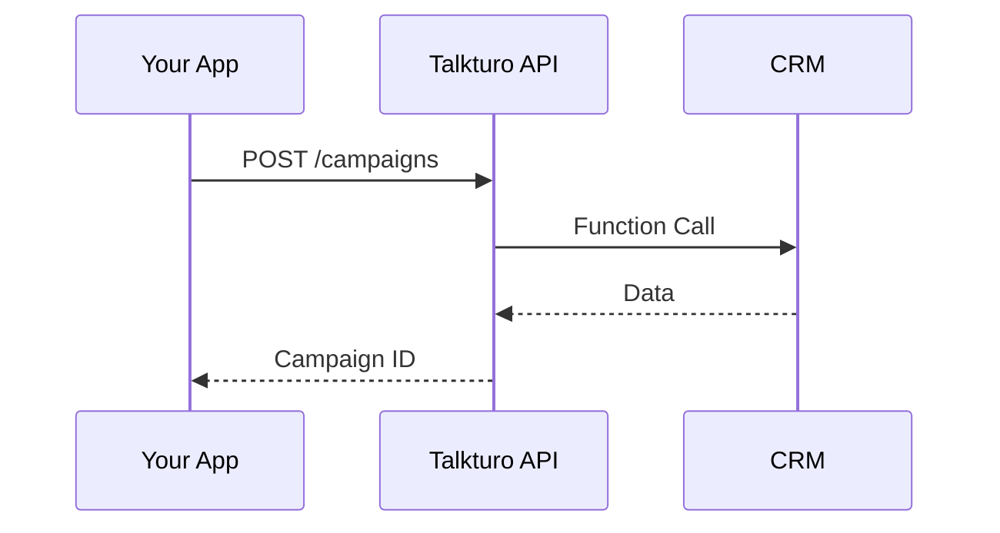

## Overview

Talkturo enables seamless integrations with your existing stack through custom functions, webhooks, and robust APIs. Use these tools to sync call data with CRMs, trigger actions in third-party services, and automate workflows for campaigns and analytics.

<Columns cols={3}>
  <Card title="Custom Functions" icon="code" href="#custom-functions">
    Execute third-party API calls directly from voice agents.
  </Card>
  <Card title="Webhooks" icon="zap" href="#webhooks">
    Receive real-time notifications for call events.
  </Card>
  <Card title="CRM Sync" icon="users" href="#crm-integration">
    Import contacts and extract call insights automatically.
  </Card>
</Columns>

## Custom Functions

Custom functions let your AI assistants interact with external services during calls. Define functions in your assistant configuration to fetch data or perform actions.

<Callout kind="tip">
  Start with simple HTTP requests. Test functions in the Talkturo dashboard before deploying.
</Callout>

### Define a Function

Use the functions panel to add a custom function. Here's an example that queries a CRM for customer details.

<CodeGroup tabs="JavaScript,Python">
  ```javascript
  async function getCustomerDetails(customerId) {
    const response = await fetch(`https://api.example.com/customers/${customerId}`, {
      headers: {
        'Authorization': `Bearer ${YOUR_API_KEY}`
      }
    });
    return await response.json();
  }
  ```
  ```python
  import requests

  def get_customer_details(customer_id):
      response = requests.get(
          f"https://api.example.com/customers/{customer_id}",
          headers={"Authorization": f"Bearer {YOUR_API_KEY}"}
      )
      return response.json()
  ```
</CodeGroup>

Invoke it in your prompt template like: `{getCustomerDetails(123)}`.

## Webhooks

Set up webhooks to receive events like call started, ended, or transcribed. Configure the webhook URL in your campaign or assistant settings.

### Setup Steps

<Steps>
  <Step title="Create Endpoint" icon="server">
    Expose a public HTTPS endpoint on your server to handle POST requests.
  </Step>
  <Step title="Configure Webhook" icon="settings">
    In Talkturo dashboard, navigate to Campaigns > Webhooks and add your URL.
  </Step>
  <Step title="Verify Payload" icon="check-circle">
    Test with sample events. Verify signature using the shared secret.
  </Step>
</Steps>

Example incoming payload:

````json
{
  "event": "call.ended",
  "call_id": "call_abc123",
  "duration": 245,
  "recording_url": "https://storage.example.com/call_abc123.mp3"
}
````

## CRM Integration

Sync contacts and companies bidirectionally. Import data via API or use functions to extract insights post-call.

<ParamField path="contacts" param-type="array" required="true">
  Array of contact objects with phone, name, and company_id.
</ParamField>

<ParamField header="X-Talkturo-Signature" param-type="string" required="true">
  HMAC SHA256 signature for webhook verification.
</ParamField>

### Data Import Example

```bash
curl -X POST https://api.example.com/v1/crm/contacts \
  -H "Authorization: Bearer YOUR_API_KEY" \
  -d '[{"phone": "+15551234567", "name": "John Doe"}]'
```

## API Usage

Access Talkturo programmatically for campaigns, analytics, and more. Base URL: `https://api.example.com/v1`.



<Expandable title="Advanced API Authentication" default-open="false">
  Use OAuth 2.0 for production. Generate tokens via `/auth/token` endpoint.

  <Tabs>
    <Tab title="cURL" icon="terminal">
    ````bash
    curl -X POST https://api.example.com/v1/auth/token \
      -d "grant_type=client_credentials&client_id=YOUR_CLIENT_ID&client_secret=YOUR_CLIENT_SECRET"
    ````
    </Tab>
    <Tab title="JavaScript" icon="code">
    ````javascript
    const token = await fetch('https://api.example.com/v1/auth/token', {
      method: 'POST',
      body: new URLSearchParams({
        grant_type: 'client_credentials',
        client_id: 'YOUR_CLIENT_ID',
        client_secret: 'YOUR_CLIENT_SECRET'
      })
    }).then(r => r.json());
    ````
    </Tab>
  </Tabs>
</Expandable>

<Callout kind="info">
  Monitor rate limits: `<1000` requests per minute. Check headers for `X-RateLimit-Remaining`.
</Callout>