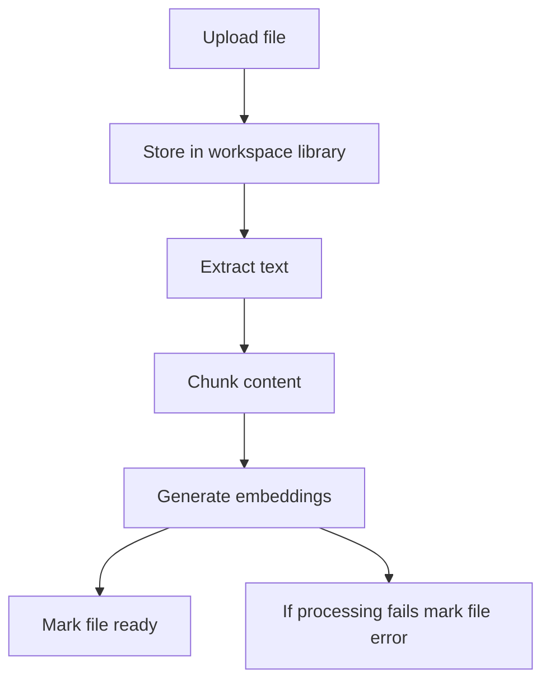

## Give assistants document-backed answers during calls

The knowledge base lets your assistants retrieve facts from uploaded documents while a call is in progress. Instead of forcing every pricing rule, refund policy, product detail, or FAQ into the system prompt, you store that information in documents and let the assistant fetch the relevant passages when needed.

Files live at the workspace level, so you can upload a document once and attach it to one or many assistants. That keeps shared information centralized while still letting each assistant use only the files you attach to it.

<Callout kind="info">

Assistants can only use files with a status of `ready`. Files in `processing` are still being chunked and embedded, and files in `error` need attention before they can answer questions during calls.

</Callout>

## Upload documents

Upload documents to the workspace library first, then attach the processed files to the assistants that should use them. Talkturo accepts PDF, DOCX, TXT, and other text-based file formats through the knowledge base upload API.

<Callout kind="alert">

Storage quota applies at the workspace level and depends on your plan. If uploads stop working or new files do not appear in the library, check your available storage before retrying.

</Callout>

<Steps>
  <Step title="Upload a file" icon="upload">

Send a multipart upload request to `POST /api/kb/files`.

```bash
curl -X POST "https://api.talkturo.com/api/kb/files" \
  -H "Authorization: Bearer tk_example_9xmk7q2r" \
  -F "file=@acme-pricing-guide.pdf"
```

A successful upload creates a workspace-scoped file record. The file is stored in your workspace library and can later be attached to multiple assistants.

  </Step>

  <Step title="Wait for processing to finish" icon="check-circle">

After upload, Talkturo processes the file in the background. During this stage, the system extracts text, splits it into chunks, and generates embeddings for semantic retrieval.

Check file status with `GET /api/kb/files` or `GET /api/kb/files/[fileId]`. Success looks like the file moving from `processing` to `ready`.

  </Step>

  <Step title="Attach the file to an assistant" icon="users">

Once the file is ready, attach it to the assistant that should use it during calls.

```bash
curl -X POST "https://api.talkturo.com/api/assistants/asst_7f3k2m/knowledge-base" \
  -H "Authorization: Bearer tk_example_9xmk7q2r" \
  -H "Content-Type: application/json" \
  -d '{
    "file_id": "kbfile_82a91d"
  }'
```

If the attachment succeeds, the assistant can retrieve relevant passages from that file during live conversations.

  </Step>
</Steps>

## Understand the processing pipeline

Every uploaded file goes through the same retrieval pipeline before assistants can use it. This pipeline prepares the document for semantic search rather than storing it as a raw attachment.



Background processing runs asynchronously through a cron-driven job. That means uploads usually return before the file is searchable, so status tracking matters in any production workflow.

### File statuses

A file moves through one of these statuses:

- **`processing`** — Talkturo is extracting text, chunking content, or generating embeddings.
- **`ready`** — The file has finished processing and assistants can use it during calls.
- **`error`** — Processing failed and the file is not usable until you reprocess or replace it.

### File metadata

Each file record includes operational details that help you verify processing health and retrieval readiness.

<ParamField body="filename" param-type="string" required="true" show-location="false">
The original file name as uploaded to the workspace library.
</ParamField>

<ParamField body="mime_type" param-type="string" required="true" show-location="false">
The detected MIME type for the uploaded file.
</ParamField>

<ParamField body="size" param-type="integer" required="true" show-location="false">
The file size in bytes.
</ParamField>

<ParamField body="status" param-type="string" required="true" show-location="false">
The current processing state. Expected values are `processing`, `ready`, or `error`.
</ParamField>

<ParamField body="character_count" param-type="integer" required="false" show-location="false">
The number of extracted characters from the document after processing.
</ParamField>

<ParamField body="chunk_count" param-type="integer" required="false" show-location="false">
The number of retrieval chunks created from the document.
</ParamField>

### Reprocess a file

Reprocess a file when the source content has changed or when a file ends in `error`. Reprocessing reruns chunking and embedding so semantic search reflects the latest document state.

<Request>
```bash
curl -X POST "https://api.talkturo.com/api/kb/files/kbfile_82a91d/reprocess" \
  -H "Authorization: Bearer tk_example_9xmk7q2r"
```
</Request>

<Response tabs="200,409" default-tab="1">
```json
{
  "id": "kbfile_82a91d",
  "status": "processing",
  "message": "File queued for reprocessing"
}
```

```json
{
  "error": "File is already processing"
}
```
</Response>

## Manage files in the workspace library

Use the workspace library to inspect, download, remove, and reprocess source documents. Deleting a file removes it from the shared library, not just from a single assistant.

### Available file management endpoints

<ParamField body="GET /api/kb/files" param-type="endpoint" required="true" show-location="false">
Lists knowledge base files in the current workspace.
</ParamField>

<ParamField body="GET /api/kb/files/[fileId]" param-type="endpoint" required="true" show-location="false">
Returns details for a single knowledge base file.
</ParamField>

<ParamField body="GET /api/kb/files/[fileId]/download" param-type="endpoint" required="true" show-location="false">
Downloads the original uploaded file.
</ParamField>

<ParamField body="DELETE /api/kb/files/[fileId]" param-type="endpoint" required="true" show-location="false">
Deletes a file from the workspace library.
</ParamField>

<ParamField body="POST /api/kb/files/[fileId]/reprocess" param-type="endpoint" required="true" show-location="false">
Queues the file for another processing pass.
</ParamField>

### Check a single file

Use the file detail endpoint when you need to verify status, character count, or chunk count for one document.

<Request>
```bash
curl -X GET "https://api.talkturo.com/api/kb/files/kbfile_82a91d" \
  -H "Authorization: Bearer tk_example_9xmk7q2r"
```
</Request>

<Response>
```json
{
  "id": "kbfile_82a91d",
  "filename": "acme-pricing-guide.pdf",
  "mime_type": "application/pdf",
  "size": 248193,
  "status": "ready",
  "character_count": 18342,
  "chunk_count": 27
}
```
</Response>

## Search documents semantically

Semantic search lets Talkturo find relevant passages even when the caller's wording does not exactly match the source document. This is the retrieval layer assistants rely on for RAG-based answers during calls.

Use `GET /api/kb/search` to test what the system is likely to retrieve for a question. This is useful when validating document quality before attaching files to production assistants.

<Request>
```bash
curl -G "https://api.talkturo.com/api/kb/search" \
  -H "Authorization: Bearer tk_example_9xmk7q2r" \
  --data-urlencode "q=What is the annual plan discount?" \
  --data-urlencode "limit=3"
```
</Request>

<Response>
```json
{
  "results": [
    {
      "file_id": "kbfile_82a91d",
      "filename": "acme-pricing-guide.pdf",
      "content": "Customers who choose annual billing receive a 12 percent discount compared to month-to-month pricing.",
      "score": 0.92
    },
    {
      "file_id": "kbfile_17db44",
      "filename": "billing-faq.txt",
      "content": "Annual subscriptions are billed upfront and include a discounted rate.",
      "score": 0.87
    }
  ]
}
```
</Response>

### What good search results look like

Strong search results usually have three traits:

- They come from the document you expected.
- The returned chunk contains the exact fact the assistant should cite or paraphrase.
- The top few results are consistent rather than contradictory.

If search results are vague or irrelevant, tighten the source documents before relying on them in calls. Smaller, more focused files usually retrieve better than one large file covering many unrelated topics.

## Attach documents to assistants

Attaching a file gives one assistant access to that file's processed content. The underlying file stays in the workspace library, so detaching it from one assistant does not remove it from other assistants or delete it from storage.

### Attach a ready file

Use `POST /api/assistants/[id]/knowledge-base` with a `file_id` in the request body.

<Request>
```bash
curl -X POST "https://api.talkturo.com/api/assistants/asst_7f3k2m/knowledge-base" \
  -H "Authorization: Bearer tk_example_9xmk7q2r" \
  -H "Content-Type: application/json" \
  -d '{
    "file_id": "kbfile_82a91d"
  }'
```
</Request>

<Response tabs="200,400" default-tab="1">
```json
{
  "assistant_id": "asst_7f3k2m",
  "file_id": "kbfile_82a91d",
  "attached": true
}
```

```json
{
  "error": "File is not ready"
}
```
</Response>

Attaching is idempotent. If you send the same file again for the same assistant, Talkturo returns success without creating a duplicate attachment.

### List attached files

Use `GET /api/assistants/[id]/knowledge-base` to see which documents an assistant can access during calls.

<Request>
```bash
curl -X GET "https://api.talkturo.com/api/assistants/asst_7f3k2m/knowledge-base" \
  -H "Authorization: Bearer tk_example_9xmk7q2r"
```
</Request>

<Response>
```json
{
  "assistant_id": "asst_7f3k2m",
  "files": [
    {
      "file_id": "kbfile_82a91d",
      "filename": "acme-pricing-guide.pdf",
      "status": "ready"
    },
    {
      "file_id": "kbfile_17db44",
      "filename": "billing-faq.txt",
      "status": "ready"
    }
  ]
}
```
</Response>

### Detach a file

Use `DELETE /api/assistants/[id]/knowledge-base/[fileId]` to remove one file from one assistant.

<Request>
```bash
curl -X DELETE "https://api.talkturo.com/api/assistants/asst_7f3k2m/knowledge-base/kbfile_82a91d" \
  -H "Authorization: Bearer tk_example_9xmk7q2r"
```
</Request>

<Response>
```json
{
  "assistant_id": "asst_7f3k2m",
  "file_id": "kbfile_82a91d",
  "detached": true
}
```
</Response>

<Callout kind="tip">

Detach a file when an assistant should stop using it, but delete the file only when no assistant in the workspace needs it anymore.

</Callout>

## Best practices for better call answers

Good retrieval starts with good source material. The assistant can only quote or summarize what your documents actually contain.

- **Upload focused documents.** Separate pricing, policy, implementation, and FAQ content instead of combining everything into one long file.
- **Keep documents current.** If a policy or pricing rule changes, upload the new version and reprocess it before relying on the assistant in production.
- **Use the knowledge base for facts.** Store factual reference material such as pricing, eligibility rules, refund policies, and objection-handling facts here. Keep tone, conversation style, and persona instructions in the assistant configuration.
- **Check status before going live.** Confirm attached files are `ready` before routing real calls to the assistant.
- **Test retrieval with search.** Run a few real customer questions through `GET /api/kb/search` and inspect the returned chunks.

## Related pages

<Columns cols={2}>
  <Card
    title="Assistant overview"
    href="/en/assistants/overview"
    icon="users"
    cta="Open page"
  />
  <Card
    title="Assistant configuration"
    href="/en/assistants/configuration"
    icon="settings"
    cta="Open page"
  />
</Columns>