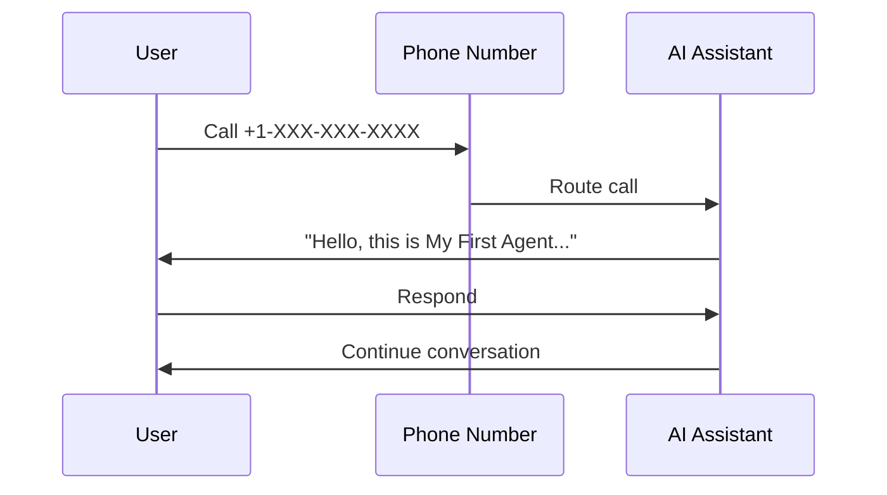

## Prerequisites

<Callout kind="info">

Before starting, ensure you have:
- A Talkturo account (free trial available)
- Access to a credit card for phone number purchase
- Basic familiarity with APIs or the Talkturo dashboard at `https://dashboard.talkturo.ai`

</Callout>

Talkturo enables you to deploy enterprise AI voice agents for real phone calls. Follow these steps to create your first agent and make a test call.

## Create and Verify Your Account

Sign up at `https://talkturo.ai` to get started.

<Steps>
  <Step title="Sign Up" icon="user-plus">

    Visit `https://dashboard.talkturo.ai/signup` and create an account with your email.

  </Step>
  <Step title="Verify Email" icon="mail">

    Check your inbox for a verification email from Talkturo and click the link.

  </Step>
  <Step title="Set API Key" icon="key">

    Navigate to Account Settings. Generate an API key named `my-first-agent-key`.

    Copy it securely as `YOUR_API_KEY`.

  </Step>
</Steps>

## Build Your First AI Assistant

Create an AI assistant via the dashboard or API. This agent handles voice conversations for CRM, campaigns, or analytics.

<Tabs>
  <Tab title="Dashboard" icon="monitor">

    1. Go to `https://dashboard.talkturo.ai/assistants`.
    2. Click **New Assistant**.
    3. Enter name: `My First Agent`.
    4. Add instructions: `You are a helpful sales assistant. Greet callers and offer product demos.`
    5. Save and note the assistant ID.

  </Tab>
  <Tab title="API" icon="code">

    Use your `YOUR_API_KEY` to create the assistant.

    <CodeGroup tabs="cURL,JavaScript">
      ````bash
      curl -X POST https://api.talkturo.ai/v1/assistants \
        -H "Authorization: Bearer YOUR_API_KEY" \
        -H "Content-Type: application/json" \
        -d '{
          "name": "My First Agent",
          "instructions": "You are a helpful sales assistant. Greet callers and offer product demos."
        }'
      ````

      ````javascript
      const response = await fetch('https://api.talkturo.ai/v1/assistants', {
        method: 'POST',
        headers: {
          'Authorization': 'Bearer YOUR_API_KEY',
          'Content-Type': 'application/json'
        },
        body: JSON.stringify({
          name: 'My First Agent',
          instructions: 'You are a helpful sales assistant. Greet callers and offer product demos.'
        })
      });
      const assistant = await response.json();
      console.log(assistant.id);
      ````
    </CodeGroup>

  </Tab>
</Tabs>

<ParamField path="name" param-type="string" required="true">
  Assistant display name.
</ParamField>

<ParamField path="instructions" param-type="string" required="true">
  System prompt defining agent behavior.
</ParamField>

## Purchase and Assign a Phone Number

Assign a phone number to your assistant for inbound/outbound calls.

<Steps>
  <Step title="Buy Number" icon="phone">

    In the dashboard, go to Phone Numbers > Purchase.
    Select a US or international number (starts at $1/month).

  </Step>
  <Step title="Assign Assistant" icon="link">

    Edit the number and assign `My First Agent`.
    Set as inbound for incoming calls.

  </Step>
</Steps>

## Test Your First Call

<Callout kind="tip">

  Test inbound: Call your assigned number. The AI agent answers automatically.

  For outbound, use the dashboard's Call Tester or API.

</Callout>



## Next Steps

Explore more features to scale your voice AI agents.

<Columns cols={2}>
  <Card title="AI Assistants" icon="bot" href="/assistants/overview">
    Customize voice, prompts, and functions.
  </Card>
  <Card title="Campaigns" icon="megaphone" href="/campaigns/overview">
    Launch outbound calling campaigns.
  </Card>
  <Card title="CRM Integration" icon="users" href="/crm/contacts">
    Manage contacts and companies.
  </Card>
  <Card title="Key Concepts" icon="book-open" href="/key-concepts">
    Learn core architecture.
  </Card>
</Columns>