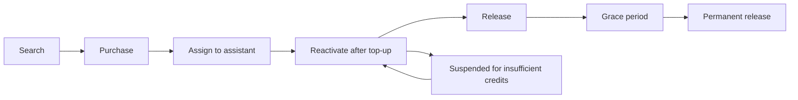

## Connect assistants to the phone network

Talkturo connects AI voice agents to real phone networks through carrier-backed telephony providers. Phone numbers are the bridge between your assistants and the public telephone system, so you manage them at the workspace level before assigning them to individual assistants.

Within each workspace, you can search for available numbers, purchase them, assign them to assistants, and release them when you no longer need them. You also control whether an assistant can answer inbound calls, place outbound calls, and which telephony region handles those calls.

<Callout kind="info">

Telephony availability, number types, and regulatory requirements vary by country. A number that is available in one region or account type may not be available in another.

</Callout>

## Choose a telephony provider

Talkturo supports managed telephony through Telnyx and Twilio, and it can also work with your own connected telephony account. Telnyx is the primary provider for number purchasing, SIP trunking, and compliance workflows.

| Provider | Role in Talkturo | Best fit | Notes |
|---|---|---|---|
| Telnyx | Primary provider for SIP trunking, number purchasing, and regulatory compliance workflows | Most workspaces using managed telephony | Supports number purchasing, SIP trunking, regulatory bundles, and account-level connection options |
| Twilio | Secondary provider for number purchasing and SIP trunking | Teams that prefer Twilio as an alternative carrier | Used as an alternative managed carrier for phone infrastructure |
| Bring your own account | Connect your own telephony account instead of using a managed account | Teams with existing carrier contracts or custom telephony requirements | Purchase behavior, billing, and trial eligibility can differ from managed accounts |

### Managed accounts and bring your own account

A managed account keeps phone number search, purchase, and assignment inside Talkturo. This is the simplest setup if you want Talkturo to handle the main telephony workflow for your workspace.

Bring your own account is better when you already operate your own carrier account and want Talkturo to use that existing setup. In that model, some managed-account benefits, including new-number trial behavior, do not apply.

## Search and purchase phone numbers

Phone number management starts with search. You can look for available numbers by country, area code, and number type so you can match your coverage and caller identity to the markets you serve.

Supported number search filters include:

- **Country** for the market where you need a number
- **Area code** when you want a local presence in a specific region
- **Number type** such as local, toll-free, or mobile

After you find a number, you can purchase it into the current workspace and make it available for assistant assignment. New numbers on managed accounts include a 14-day free trial, while numbers purchased through bring your own account setups do not.

<Callout kind="tip">

Phone numbers consume monthly credits after purchase. Review active numbers regularly so you do not keep unused inventory assigned to your workspace.

</Callout>

### Number types

The best number type depends on how you expect customers to interact with your assistant.

- **Local** numbers help you establish a geographic presence in a city or region.
- **Toll-free** numbers work well for broad inbound access where local identity matters less.
- **Mobile** numbers may be available in some markets for workflows that need a mobile-style number presence.

## Assign numbers to assistants

Each assistant can have one or more phone numbers. This lets you support different campaigns, regions, or call flows without creating a separate assistant for every number.

A phone number assignment controls whether the assistant can use that telephony setup for:

- **Inbound calling** so the assistant answers incoming calls
- **Outbound calling** so the assistant can place outgoing calls
- **Regional handling** so Talkturo routes calls through the selected SIP destination country

### Destination countries for outbound handling

When you enable outbound calling, you select the handling region that acts as the LiveKit SIP trunk destination country.

| Country code | Country |
|---|---|
| US | United States |
| GB | United Kingdom |
| DE | Germany |
| FR | France |
| AU | Australia |
| BR | Brazil |
| CH | Switzerland |
| IL | Israel |
| IN | India |
| JP | Japan |
| SA | Saudi Arabia |
| SG | Singapore |
| AE | United Arab Emirates |
| ZA | South Africa |

<Callout kind="info">

Choose the destination country that matches the telephony region you intend to use for outbound calling. Country selection affects how calls are routed and which telephony resources the assistant uses.

</Callout>

## Configure telephony on an assistant

Assistant telephony settings control how an assistant behaves once you have numbers available in the workspace. These settings combine number assignment, routing, voicemail behavior, and provider-specific connection options.

### Inbound settings

Use inbound settings when you want an assistant to receive calls from purchased or assigned numbers.

<ParamField body="inbound calling" param-type="boolean" required="false" show-location="false">
Enable this setting to let the assistant answer incoming calls.
</ParamField>

<ParamField body="inbound company selection" param-type="string" required="false" show-location="false">
Select the company or telephony entity the assistant should use for inbound calling when that choice is available in your workspace.
</ParamField>

### Outbound settings

Use outbound settings when you want an assistant to place calls to prospects or customers.

<ParamField body="outbound calling" param-type="boolean" required="false" show-location="false">
Enable this setting to let the assistant place outgoing calls.
</ParamField>

<ParamField body="destination country" param-type="string" required="false" show-location="false" enum="US,GB,DE,FR,AU,BR,CH,IL,IN,JP,SA,SG,AE,ZA">
Select the LiveKit SIP trunk destination country used to handle outbound calls.
</ParamField>

<ParamField body="test call" param-type="action" required="false" show-location="false">
Run an outbound test call to verify that the assistant, routing, and phone configuration work as expected before using the assistant in production.
</ParamField>

### Voicemail detection

Voicemail detection is enabled by default for outbound calling. This helps the assistant decide what to do when a call reaches an answering machine instead of a live person.

<ParamField body="voicemail detection" param-type="boolean" required="false" show-location="false">
Enabled by default. Detects when an outbound call reaches voicemail.
</ParamField>

<ParamField body="voicemail action" param-type="string" required="false" show-location="false" enum="leave message,hang up">
Choose whether the assistant leaves a voicemail message or hangs up when voicemail is detected.
</ParamField>

### Provider connection settings

Some telephony settings depend on the provider account connected to your workspace.

<ParamField body="SIP trunk or FQDN connection" param-type="string" required="false" show-location="false">
Select the SIP trunk or FQDN connection used by the assistant. This is available for Telnyx-based account configurations.
</ParamField>

## Meet compliance and KYC requirements

Telephony rules depend on the countries where you buy numbers and place calls. Some regions require identity verification, regulatory bundles, or specific call disclosures before a number can be activated and used.

<Callout kind="alert">

Certain regions require regulatory compliance verification before you can purchase or use phone numbers. If a market is regulated, complete the required verification steps before expecting numbers to become usable.

</Callout>

### KYC and regulated markets

Know Your Customer verification is required for phone number purchases in some regulated markets. This verification typically applies when local telecom rules require proof of business identity, address, or intended use.

If a purchase is blocked or delayed, the most common cause is incomplete compliance information for the target region. Complete the required KYC or regulatory bundle steps first, then retry the purchase.

### Regulatory bundles and renewal

Talkturo supports regulatory bundle management for markets that require ongoing compliance records. These bundles can renew automatically so existing numbers remain in good standing without manual intervention for every renewal cycle.

That automation reduces the chance of a number becoming unusable because a required bundle expired. You should still review compliance status when expanding into a new market.

### Compliance briefings on assistants

Assistants can include a compliance briefing before or during a call flow when disclosures are required. These settings help you standardize legally required language across multiple assistants.

<ParamField body="compliance briefing enabled" param-type="boolean" required="false" show-location="false">
Turns compliance briefing behavior on or off for the assistant.
</ParamField>

<ParamField body="template" param-type="string" required="false" show-location="false">
Select a disclosure template when your workspace uses standardized compliance language for regulated calls.
</ParamField>

<ParamField body="custom text" param-type="string" required="false" show-location="false">
Provide assistant-specific disclosure text when the standard template does not fit the call flow.
</ParamField>

<ParamField body="require acknowledgement" param-type="boolean" required="false" show-location="false">
Require the called party to acknowledge the disclosure before the assistant continues.
</ParamField>

<ParamField body="fallback policy" param-type="string" required="false" show-location="false" enum="continue,retry,block">
Define how the assistant behaves when the compliance briefing cannot be completed successfully.
</ParamField>

<Callout kind="danger">

Compliance requirements are jurisdiction-specific. Review your calling flows, disclosure language, and acknowledgement requirements with your legal or compliance team before launching in a regulated market.

</Callout>

## Follow the phone number lifecycle

Phone numbers move through a predictable lifecycle inside Talkturo. Understanding that lifecycle makes it easier to manage cost, avoid interruptions, and release unused numbers safely.

### Search

Start by searching for a number that matches your target country, area code, and number type. Availability depends on provider inventory and regional regulations.

### Purchase

Purchase the selected number into the workspace. On managed accounts, eligible new numbers start with a 14-day free trial, but monthly credit usage still matters once the trial ends.

### Assign to assistant

After purchase, assign the number to one or more assistants depending on your call flow design. Assignment is also where you decide whether the assistant uses the number for inbound, outbound, or both.

### Active use

An active number is available for live inbound and outbound telephony based on the assistant configuration. At this stage, monitor usage and workspace credits so active numbers do not become interrupted.

### Suspension and reactivation

If the workspace does not have enough credits, numbers can be suspended. Suspended numbers can return to service after you top up the workspace and resolve the credit shortfall.

### Release and grace period

When you no longer need a number, release it instead of leaving it active indefinitely. Released numbers enter a grace period before they are permanently given up, which gives you a short window to avoid accidental loss.

<Callout kind="info">

A released number is not always gone immediately. The grace period exists to protect against accidental release, but once the permanent release happens, you should assume the number may no longer be recoverable.

</Callout>

## Plan your setup

A practical telephony setup usually follows the same pattern: choose a provider model, purchase the numbers you need for each region, assign them to assistants, and then validate inbound and outbound behavior with test calls.

<Steps>
  <Step title="Choose your telephony model" icon="settings">

  Decide whether you want a managed provider setup or bring your own account. Managed accounts keep number purchasing and compliance workflows inside Talkturo.

  </Step>
  <Step title="Purchase numbers for each market" icon="phone">

  Search by country, area code, and number type, then purchase the numbers that match your coverage plan. If you operate in regulated markets, complete compliance steps before buying.

  </Step>
  <Step title="Assign numbers to assistants" icon="users">

  Connect each number to the assistant that should answer or place calls with it. Enable inbound, outbound, or both based on the workflow you are building.

  </Step>
  <Step title="Test routing and voicemail behavior" icon="play-circle">

  Run a test call before launching a campaign. Confirm that outbound routing, inbound answering, voicemail detection, and any compliance briefing behave as expected.

  </Step>
</Steps>

## Related pages

<Columns cols={2}>
  <Card
    title="Assistant configuration"
    href="/en/assistants/configuration"
    icon="settings"
    cta="Open guide"
  />
  <Card
    title="Billing"
    href="/en/billing"
    icon="credit-card"
    cta="Review credits"
  />
</Columns>