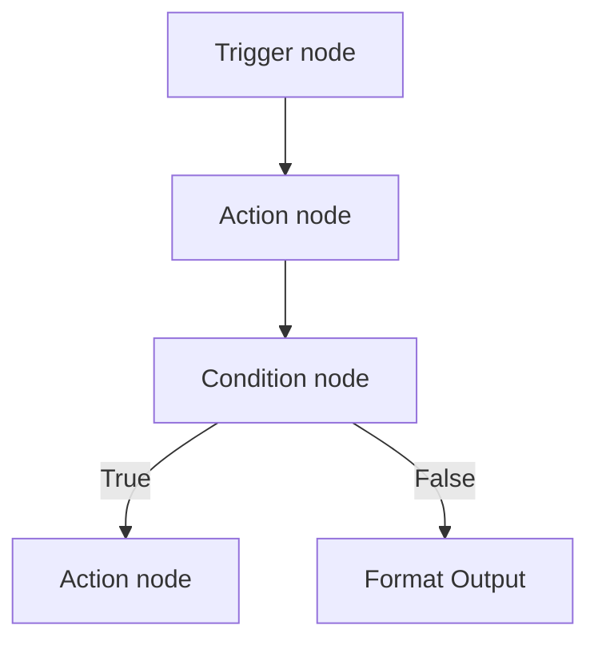

## Build automations on a visual canvas

TurboFlow is Talkturo's workflow automation engine for connecting voice assistants to external services. You build flows on a drag-and-drop canvas, publish them when they are ready, and run them from webhooks, integration events, or live assistant conversations.

A TurboFlow flow starts with one trigger and continues through action and logic nodes. Each node receives data from earlier steps, processes it, and passes output to the next part of the flow.

<Callout kind="info">

Published flows are active. Unpublished flows stay in draft mode, so you can change structure, settings, and expressions without affecting production traffic.

</Callout>

## How TurboFlow works

TurboFlow models automation as a node graph. You place nodes on the canvas, connect them with edges, configure each node, then test the flow with sample data before publishing.

The engine executes nodes in dependency order. That means TurboFlow always resolves upstream inputs before it runs downstream steps, which lets later nodes reference outputs from earlier nodes through expression templates such as `{{trigger.body.email}}` or `{{http_request.response.status}}`.

### What you do in the builder

- **Add nodes** for triggers, actions, and logic
- **Connect nodes** to define execution order
- **Configure settings** on each node
- **Map data** with `{{ }}` expressions that reference previous node outputs
- **Test run** the flow with sample payloads
- **Publish** the flow to make it callable

### Where flows can start

TurboFlow supports three entry paths:

- **External webhooks** sent to a flow endpoint
- **Integration events** from connected services such as Cal.com, Calendly, Slack, or Meta lead ads
- **Assistant tool calls** triggered by an AI assistant during a live conversation

<Callout kind="tip">

Test runs are the fastest way to verify expressions, branching, and downstream actions before you publish a flow.

</Callout>

## Understand the flow structure

A TurboFlow flow is a directed acyclic graph, or DAG. In practice, that means the flow moves forward through connected nodes and does not rely on circular execution.

### Every flow starts with one trigger

Each flow has exactly one trigger node. The trigger is the entry point for incoming data and defines how the workflow begins.

After the trigger, you add action and logic nodes to transform data, call external systems, or branch execution. TurboFlow calculates execution order from the graph itself rather than from node position on the canvas.

### Execution follows dependencies, not layout

TurboFlow uses topological sort to determine run order. If one node depends on another node's output, TurboFlow runs the upstream node first even if the nodes are placed differently on the canvas.

This model keeps data references predictable. When you use an expression like `{{condition.result}}`, TurboFlow already knows that the condition node must complete before any dependent node can run.

### Condition nodes create live and dead branches

Condition nodes split the graph into true and false paths. Only the path that matches the condition stays live during execution.

Downstream nodes on the non-matching branch are skipped. If a condition evaluates to false, every node that depends only on the true branch becomes inactive for that run.

## Node types

TurboFlow groups nodes into three categories. Each category serves a different role in the flow.

<Columns cols={3}>
  <Card title="Trigger nodes" href="/en/turboflow/triggers-actions" icon="zap" cta="View trigger details">
    Start a flow from a webhook, integration event, or assistant tool call.
  </Card>
  <Card title="Action nodes" href="/en/turboflow/triggers-actions" icon="play-circle" cta="View action details">
    Send requests, update records, call contacts, and shape output for downstream steps.
  </Card>
  <Card title="Logic nodes" href="/en/turboflow/triggers-actions" icon="settings" cta="View logic details">
    Evaluate conditions and branch execution based on comparisons.
  </Card>
</Columns>

### Trigger nodes

Trigger nodes start the flow and provide the initial input payload.

- **`webhook_trigger`** — universal entry point for external requests and assistant tool calls
- **Integration triggers** — event-based triggers for connected services such as Cal.com, Calendly, Slack, and Meta

The `webhook_trigger` node is the most flexible option. It can receive external payloads and also act as the callable interface when you attach a published flow to an assistant.

### Action nodes

Action nodes do the work after the flow starts.

- **HTTP request** — call external APIs
- **Upsert CRM Contact** — create or update a contact record
- **Call Contact** — start an outbound contact call
- **Format Output** — shape data returned by the flow

Action nodes usually consume data from earlier nodes and produce structured output for later steps. That output becomes available to expressions throughout the rest of the graph.

### Logic nodes

Logic nodes control which path the flow follows.

- **Condition** — run if or else branching with comparison operators

A condition evaluates an expression and sends execution down the true or false path. This is how you route new leads, handle missing data, or run different actions based on event type.

## Integrations and connections

TurboFlow uses workspace-level connections for OAuth-based integrations. You manage these connections in the Connections Manager, then select them from nodes that need access to external services.

<Columns cols={3}>
  <Card title="Cal.com" href="/en/integrations" icon="calendar" cta="View integrations">
    Receive booking events and run scheduling actions.
  </Card>
  <Card title="Calendly" href="/en/integrations" icon="calendar" cta="View integrations">
    Start flows from invitee events and create scheduling automations.
  </Card>
  <Card title="Gmail" href="/en/integrations" icon="mail" cta="View integrations">
    Send email from workflow steps.
  </Card>
  <Card title="HubSpot" href="/en/integrations" icon="database" cta="View integrations">
    Create contacts and deals from workflow data.
  </Card>
  <Card title="Slack" href="/en/integrations" icon="messages-square" cta="View integrations">
    Send messages and receive event-based triggers.
  </Card>
  <Card title="Meta" href="/en/integrations" icon="users" cta="View integrations">
    Trigger flows from Facebook and Instagram lead ads.
  </Card>
</Columns>

### How connections are used

A connection stores the authorization TurboFlow needs to act on your behalf. Nodes reference that saved connection instead of asking you to enter credentials each time.

This keeps flows easier to maintain. When an integration token changes, you update the connection once at the workspace level rather than editing every flow that uses it.

<Callout kind="info">

Integration triggers depend on an active connection. If the connected account is removed or authorization expires, related flows cannot receive or send data until the connection is restored.

</Callout>

## Build with Robert AI Assistant

Robert is the AI assistant built into the workflow builder. You describe the automation in natural language, and Robert helps translate that request into flow steps.

Robert can:

- suggest which tools and nodes to use
- explain expected parameters
- propose a flow structure
- help refine an existing workflow

This is most useful when you know the outcome you want but do not want to configure every node manually. Robert helps assemble the flow faster, then you can review and adjust the result on the canvas before publishing.

## Keep credentials in Secrets Manager

Secrets Manager stores encrypted credentials at the workspace level. TurboFlow uses these secrets for HTTP request nodes and integration connections.

Store API keys, tokens, and similar credentials in Secrets Manager instead of hardcoding them into node settings. That keeps sensitive values out of flow definitions and makes credential rotation easier.

<Callout kind="alert">

Do not place raw API keys directly in expressions or node text fields when a secret or managed connection is available.

</Callout>

## Attach flows to assistants

Published flows can be attached to assistants as callable tools. This lets an AI assistant trigger automation during a live conversation and use the result immediately.

### How assistant tool calls work

When you attach a published flow to an assistant, the flow's `webhook_trigger` becomes an LLM-callable tool. The tool exposes a defined name, description, and parameter set that the assistant can use during a conversation.

When the assistant calls that tool, TurboFlow runs the workflow and returns the result back to the assistant. That result can then be used to answer a question, update a system, or continue the conversation with fresh data.

<Callout kind="success">

Use assistant-connected flows when the assistant needs to fetch data or perform an action in real time, such as creating a CRM contact or sending a follow-up message.

</Callout>

## Know the flow limits

TurboFlow enforces graph and execution limits to keep workflows predictable and safe to run.

| Limit | Value |
|---|---:|
| Max nodes per flow | 100 |
| Max edges per flow | 200 |
| Max loop iterations | 100 |
| Max graph depth | 50 |

These limits matter most when you build large branching automations or reuse a single flow for many related tasks. If a workflow starts getting hard to reason about, split it into smaller flows with clearer responsibilities.

## Related pages

<Columns cols={3}>
  <Card title="Triggers and actions" href="/en/turboflow/triggers-actions" icon="code" cta="Open reference">
    Review available trigger, action, and logic nodes in more detail.
  </Card>
  <Card title="Integrations" href="/en/integrations" icon="cloud" cta="Manage connections">
    Connect external services and configure workspace integrations.
  </Card>
  <Card title="Assistant configuration" href="/en/assistants/configuration" icon="settings" cta="Configure assistants">
    Attach published flows as callable tools for live assistant use.
  </Card>
</Columns>